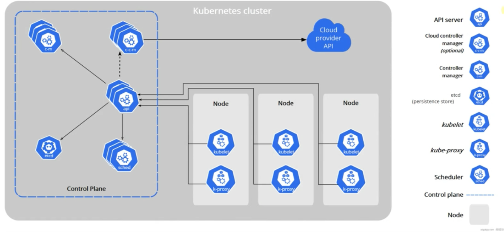
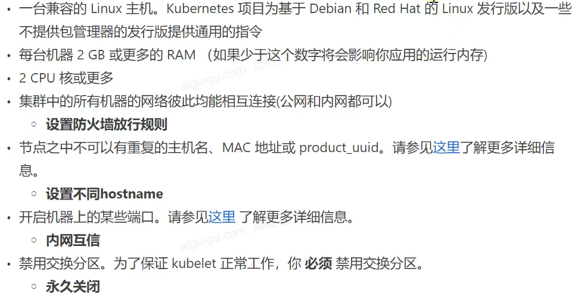

# Kubernetes 

> 学习目标：对于开发来说会使用 K8S 部署项目即可，对于运维，这篇文章并不适合

## 基础概念

### 简介

> 项目部署不同阶段的演变


1. 多个应用一起部署在一个服务器上，由于没有做隔离，可能就会导致一个崩其他几个也崩
2. 虚拟化部署：在一个物理机上，通过虚拟化技术开多个虚拟机，不同应用部署在不同虚拟机上，可惜的是 **虚拟机也太笨重了ba**
3. 容器化：在物理机上安装容器化运行环境(也就是 **Docker**)，之后将应用以容器化的方式运行就好了

容器化存在的问题：微服务 + 容器化部署，一旦微服务模块多起来，而且使用分布式部署在不同服务上，同时一个微服务模块启动多个组成集群，这样如果只是 `docker run` 效率太低

为了解决上述问题 -> **容器编排系统：**  Docker Swarm / Kubernetes  前者适合在服务器不多(例如就五六台)的情况下使用，而后者就适合服务器超过10台以上的环境中使用

- 编：将多个相同微服务容器集中管理
- 排：可以动态的扩缩容(例如使用一个命令就可以多启动一个相同的微服务模块容器)

### 特性

- 服务发现和负载均衡(类似于 SpringCloud OpenFeign)

- 存储编排

  Kubernetes 允许你自动挂载/卸载你选择的存储系统(本地存储，公共云提供商)；例如：启动一个容器会消耗对于的硬盘空间，当关闭这个容器时并不会自动删除相关存储数据，而 Kubernetes 可以自动的管理存储

- 自动部署和回滚功能

  可以自动化 Kubernetes 来为你的部署创建新容器 / 删除现有的容器并将它们的资源用于新容器 / 一键回滚容器的版本 等等

- 自动完成装箱计算

  Kubernetes 允许你指定每个容器所需要的 CPU 和 RAM(内存)。当容器指定了资源请求时，Kubernetes 可以做出更好的决策来管理容器的资源

- 自我修复(很恐怖，如果一个服务器挂了，可以自动的将上面的容器在别的服务器上启动)

- 密钥与配置管理(类似于 SpringCloud 配置中心)

总结：Kubernetes 提供了一个**可弹性运行**的分布式系统框架，Kubernetes 会满足你扩展的要求 / 故障转移 / 部署模式 等。例如 Kuberntes 可以轻松管理系统的 Canary(金丝雀，也成为灰度) 部署

### 架构

> 工作方式

Kubernes Clutser = N 个 Master Node + N 个 Worker Node

Master Node：管理节点，负责对 Worker Node 发号施令，通常开启奇数个 Master Node，然后选中一个作为 ”老大“，由老大统一控制，当老大挂了，就会重新从里面选取

Worker Node：工作节点，负责工作，只听 ”老大“ 的话

> 组件架构 



- Node：就是一个 Kubernetes 节点，在上图中 **Control Plane** 是 Master Node，而 Node 是 Worker Node
- Control Plane：控制中心
- Controller manager: 上层的管理者，负责发号施令
- Etcd：数据库，负责存储整个 Kubernertes 集群运行过程中的核心数据
- Api Server：暴露接口，提供不同角色的服务
- Scheduler：调度者，负责给 Node 节点分配任务
- Kubelet: 一个 Node 节点的管理者
- Kube-Proxy：负责记录所有 Kubernetes Node 节点运行的任务情况，一般一个 Node 节点会配置一个，但它们会组成一个集群，保证数据同步
- Cloud Controller Manager & Cloud Provider API：外部的管理者和外部提供的服务接口

注意：

- 如上图中的箭头所示，大部分的角色(组件)之间并不会直接交互，而是通过 **Api Server** 暴露的接口调用相关服务
- 集群中的网络访问都是通过 **Kube-Proxy** 控制的
- 所有的任务都是基于 **容器化** 运行的，所以每个节点都需要一个 **容器运行时环境** 也就是 Docker
- 是否开始执行哪个项目其实是由我们通过 **Kubectl** 命令决定

### 集群部署


> 开通三台云服务器


> 安装 Docker 容器运行时环境

注意，这里的学习 k8s 需要控制了 Docker 的版本，所以安装时需要煮一下

```shell
yum install docker-ce-20.10.7 docker-ce-cli-20.10.7 containerd.io-1.4.6
```

Docker 学习笔记：TODO

> 服务器环境准备



```bash
# 设置服务器的名字
hostnamectl set-hostname xxx

# 禁用 SELinux
sudo setenforce 0
sudo sed -i 's/^SELINUX=enforcing$/SELINUX=permissive/' /etc/selinux/config

# 关闭 Swap
swapoff -a  
sed -ri 's/.*swap.*/#&/' /etc/fstab

# 允许 iptables 检查桥接流量
cat <<EOF | sudo tee /etc/modules-load.d/k8s.conf
br_netfilter
EOF

cat <<EOF | sudo tee /etc/sysctl.d/k8s.conf
net.bridge.bridge-nf-call-ip6tables = 1
net.bridge.bridge-nf-call-iptables = 1
EOF
sudo sysctl --system 
```

> 安装 kubelet & Kubeadm & kubectl

```bash
cat << EOF | sudo tee /etc/yum.repos.d/kubernetes.repo
[kubernetes]
name=Kubernetes
baseurl=http://mirrors.aliyun.com/kubernetes/yum/repos/kubernetes-el7-x86_64
enabled=1
gpgcheck=0
repo_gpgcheck=0
gpgkey=http://mirrors.aliyun.com/kubernetes/yum/doc/yum-key.gpg
   http://mirrors.aliyun.com/kubernetes/yum/doc/rpm-package-key.gpg
exclude=kubelet kubeadm kubectl
EOF

sudo yum install -y kubelet-1.20.9 kubeadm-1.20.9 kubectl-1.20.9 --disableexcludes=kubernetes

sudo systemctl enable --now kubelet
```

注意：这个使用的 kubelet 的运行状态是关开关开的，属于正常现象，它需要等待 **Kubeadm** 的指令

> 使用 Kubeadm 初始化节点

1. 下载需要使用的镜像 -> 在所有节点上

   ```bash
   # 定义一个 sh 脚本
   sudo tee ./images.sh <<-'EOF'
   #!/bin/bash
   images=(
   kube-apiserver:v1.20.9
   kube-proxy:v1.20.9
   kube-controller-manager:v1.20.9
   kube-scheduler:v1.20.9
   coredns:1.7.0
   etcd:3.4.13-0
   pause:3.2
   )
   for imageName in ${images[@]} ; do
   docker pull registry.cn-hangzhou.aliyuncs.com/lfy_k8s_images/$imageName
   done
   EOF
   
   # 修改权限并执行对应的脚本
   chmod +x ./images.sh && ./images.sh
   ```

   按道理来说 worker node 应该安装 kube-proxy 组件，但为了不出意外还是一起安装好了

2. 初始化 Master 节点 

   ```shell
   # 所有机器添加 master 域名映射，以下需要修改为自己的 
   echo "172.31.0.3  cluster-endpoint" >> /etc/hosts
   
   # 只用在 Master 节点执行
   # --apiserver-advertise-address 为 Master Node IP 地址
   kubeadm init \
   --apiserver-advertise-address=172.31.0.3 \
   --control-plane-endpoint=cluster-endpoint \
   --image-repository registry.cn-hangzhou.aliyuncs.com/lfy_k8s_images \
   --kubernetes-version v1.20.9 \
   --service-cidr=10.96.0.0/16 \
   --pod-network-cidr=192.168.0.0/16
   
   mkdir -p $HOME/.kube
   sudo cp -i /etc/kubernetes/admin.conf $HOME/.kube/config
   sudo chown $(id -u):$(id -g) $HOME/.kube/config
   
   # 查看集群的节点
   kubectl get nodes
   ```

   需要保存以下两条命令

   ```bash
   # 以 Master Node 节点的身份加入到 K8S 的集群中
   You can now join any number of control-plane nodes by copying certificate authorities
   and service account keys on each node and then running the following as root:
   
   kubeadm join cluster-endpoint:6443 --token ppr195.e0mz16jg232y4wdr \
   --discovery-token-ca-cert-hash sha256:d3f5eb8a3391ae4e13899c4e5f0768ec1d1236886075375fd7a87f0269724f49 \
   --control-plane 
   
   # 以 Worker Node 节点的身份加入到 Kubernertes 集群中
   Then you can join any number of worker nodes by running the following on each as root:
   
   kubeadm join cluster-endpoint:6443 --token ppr195.e0mz16jg232y4wdr \
   --discovery-token-ca-cert-hash sha256:d3f5eb8a3391ae4e13899c4e5f0768ec1d1236886075375fd7a87f0269724f49
   ```

3. 在 Master 节点上安装网络插件

   ```shell
   curl https://docs.projectcalico.org/manifests/calico.yaml -O
   
   # 为 Kubernetes 添加插件
   kubectl apply -f calico.yaml
   ```

4. 查看 Kubernertes 已经部署的有用

   ```bash
   kubectl get pod -A
   
   # 补充一个小概念：在 Docker 中运行的应用称为容器；而 Kubernetes 中称为 Pod
   ```

   

5. 在 Node 节点上通过 token 以相应身份加入到 Kubernertes 集群中

   ```shell
   # 通过第2部获取的令牌
   kubeadm join cluster-endpoint:6443 --token ppr195.e0mz16jg232y4wdr \
   --discovery-token-ca-cert-hash sha256:d3f5eb8a3391ae4e13899c4e5f0768ec1d1236886075375fd7a87f0269724f49
   
   # 在 Master 节点上查看集群节点状态(可能会有点延迟，等等就好了)
   kubectl get nodes
   ```

补充：

1. 对于 K8S 集群，所有的查看和监控命令都只能在 Master Node 上运行，Worker Node 中不行
2. K8S 集群自带自我修复能力，直接关闭电脑，重启后仍可以自动运行集群

> Kubernetes 生成的令牌默认有 24 小时过期

重新生成令牌 -> 在 Master 节点上运行

```shell
kubeadm token create --print-join-command
```

就可以得到

```shell
kubeadm join cluster-endpoint:6443 --token j330zr.raqam8zrg44lungd     --discovery-token-ca-cert-hash sha256:d3f5eb8a3391ae4e13899c4e5f0768ec1d1236886075375fd7a87f0269724f49
```

> 部署 Kubernertes 可视化界面 -> Dashboard

1. 安装插件

   ```bash
   kubectl apply -f https://raw.githubusercontent.com/kubernetes/dashboard/v2.3.1/aio/deploy/recommended.yaml
   ```

2. 设置访问端口

   ```shell
   kubectl edit svc kubernetes-dashboard -n kubernetes-dashboard
   ```

   将内部的 `type:ClusterIP` 改为 `type:NodePort`
   
3. 查看开发的端口号

   ```bash
   [root@k8s-master ~]# kubectl get svc -A |grep kubernetes-dashboard
   kubernetes-dashboard   dashboard-metrics-scraper   ClusterIP   10.96.10.53    <none>        8000/TCP                 14h
   kubernetes-dashboard   kubernetes-dashboard        NodePort    10.96.147.62   <none>        443:31466/TCP            14h
   ```

   例如这里对外暴露的就是 `31466` 端口，前往对应的云服务器安全组进行开放

   

4. 访问  https://任意节点ip地址:31466 即可

   

5. 插件访问账号

   ```yaml
   #创建访问账号，准备一个yaml文件； vi dash-user.yaml
   apiVersion: v1
   kind: ServiceAccount
   metadata:
     name: admin-user
     namespace: kubernetes-dashboard
   ---
   apiVersion: rbac.authorization.k8s.io/v1
   kind: ClusterRoleBinding
   metadata:
     name: admin-user
   roleRef:
     apiGroup: rbac.authorization.k8s.io
     kind: ClusterRole
     name: cluster-admin
   subjects:
   - kind: ServiceAccount
     name: admin-user
     namespace: kubernetes-dashboard
   ```

   

   ```bash
   # 添加配置
   kubectl apply -f dash-user.yaml
   serviceaccount/admin-user created
   clusterrolebinding.rbac.authorization.k8s.io/admin-user created
   
   #获取访问令牌
   kubectl -n kubernetes-dashboard get secret $(kubectl -n kubernetes-dashboard get sa/admin-user -o jsonpath="{.secrets[0].name}") -o go-template="{{.data.token | base64decode}}"
   eyJhbGciOiJSUzI1NiIsImtpZCI6Im1aVVR6djFJOWowLUFrN2pSMjY0REdJSEE5c2pOZG13ZlZETC1SN3lEUkkifQ.eyJpc3MiOiJrdWJlcm5ldGVzL3NlcnZpY2VhY2NvdW50Iiwia3ViZXJuZXRlcy5pby9zZXJ2aWNlYWNjb3VudC9uYW1lc3BhY2UiOiJrdWJlcm5ldGVzLWRhc2hib2FyZCIsImt1YmVybmV0ZXMuaW8vc2VydmljZWFjY291bnQvc2VjcmV0Lm5hbWUiOiJhZG1pbi11c2VyLXRva2VuLXRrdnNtIiwia3ViZXJuZXRlcy5pby9zZXJ2aWNlYWNjb3VudC9zZXJ2aWNlLWFjY291bnQubmFtZSI6ImFkbWluLXVzZXIiLCJrdWJlcm5ldGVzLmlvL3NlcnZpY2VhY2NvdW50L3NlcnZpY2UtYWNjb3VudC51aWQiOiI1NGYwNTYzMC02Y2ZmLTQxMzEtYjgyMi00YTc5NDViNjBmYmEiLCJzdWIiOiJzeXN0ZW06c2VydmljZWFjY291bnQ6a3ViZXJuZXRlcy1kYXNoYm9hcmQ6YWRtaW4tdXNlciJ9.Qb3iwO0SxSu4famvJSzXbc90G9TOvsNjNeXDnCeqvElZYbcUN3WizkodyKSLRQxHD0USHWUISWiTqsT3gzRCpupIoH8P_PDLYMJlOXR2lFoSKf-G-HXBqNQLwEdHit1Y_XGbnnoxyJaLbfqMHYgzoAAmILO5ob0G7nmvjDr7EKp13WNZIZq1FfDe0R325wAmlqsoBkoXMXV4z-e9z25O8wgF72IPMXpOyet9Aj6bqY5oWQ_P0Lfhn04wkD-qtxLJc9zVCxGfoLB9lOYoPL2XCOaPzcYWV368-zkUS4QZnHeO5qa6pgTkUQEJxHZWiSagGDPWERZd91ARr66ILsqrsA
   ```

6. 拿令牌去登录

   

   

   

## 核心实战

## 部署项目

## 
