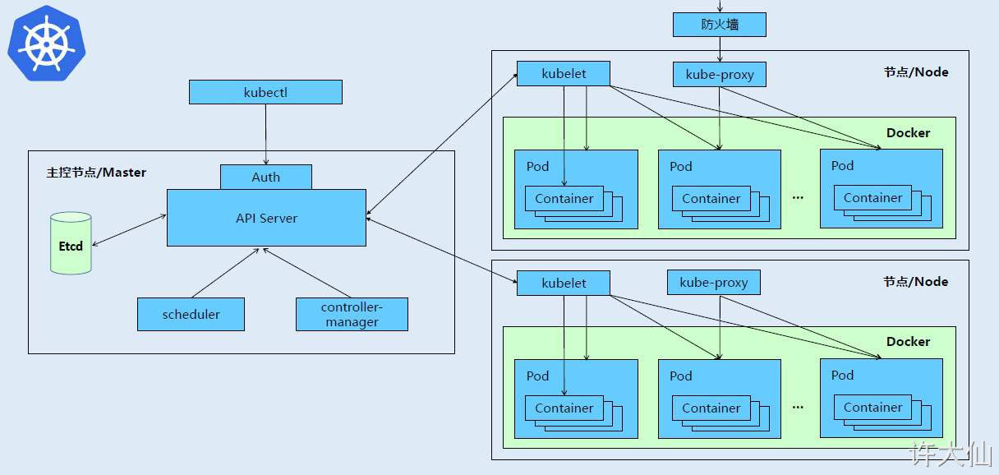
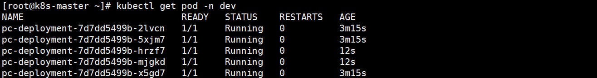
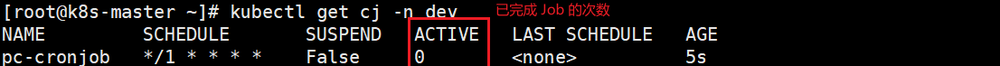
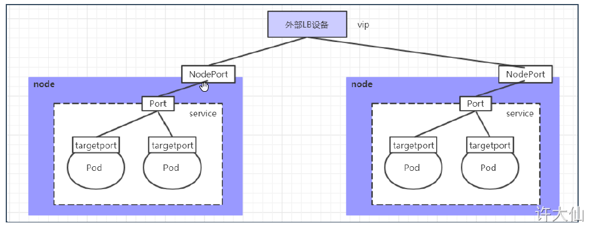
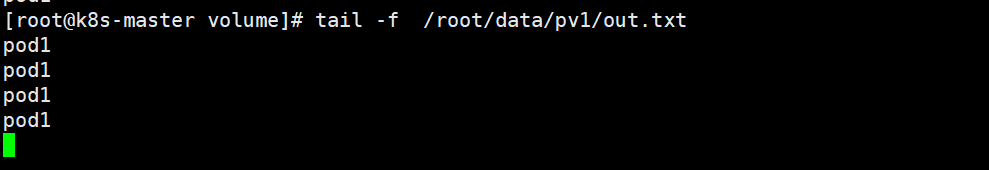
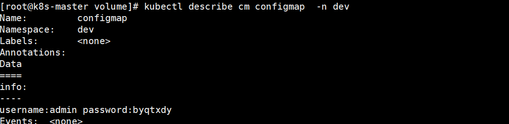
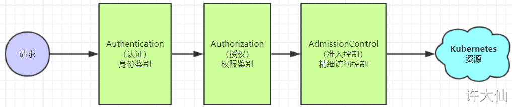

# Kubernetes 

> 学习目标：对于开发来说会使用 K8S 部署项目即可，对于运维，这篇文章并不适合
>
> 参考文档：https://www.yuque.com/fairy-era/yg511q/xyqxge
>
> 学习视频：https://www.bilibili.com/video/BV1Qv41167ck


## 介绍


### 项目部署不同阶段的演变


1. 传统部署：多个应用一起部署在一个服务器上，由于没有做隔离，可能就会导致一个崩其他几个也崩
2. 虚拟化部署
   - 在一个物理机上，通过虚拟化技术开多个虚拟机，不同应用部署在不同虚拟机上
   - 但每个虚拟机之间都是一个**操作系统**，浪费了部分资源

3. 容器化：
   - 与虚拟化类似，但是**共享了操作系统**
   - 可以保证每个容器拥有自己的文件系统，CPU，内存，进程空间等
   - 运行应用程序需要的资源被容器包装，并和底层基础结构解耦
   - ?容器化应用程序可以跨云服务商，跨 Linux 系统发行版进行部署

容器化存在的问题：

- 一个容器故障停机后，如何自动让另外一个容器启动实现替补停机的容器
- 当并发访问量大的时候，怎么样做到横向扩展容器数量

为了解决上述问题 -> **容器编排系统：** 

- Swarm: Docker 官方的编排工具
- Mesos: Apache 提供的，需要和 Marathon 使用
- K8S: Google 开源

Swarm / Kubernetes  前者适合在服务器不多(例如就五六台)的情况下使用，而后者就适合服务器超过10台以上的环境中使用

- 编：将多个相同微服务容器集中管理
- 排：可以动态的扩缩容(例如使用一个命令就可以多启动一个相同的微服务模块容器)

### 简介


- Kubernets 是本质是**一组服务器集群**，可以在集群的每个节点上运行时特定的程序，来对节点中的容器进行管理
- 目的就是实现**资源管理的自动化**
- 主要功能
  1. 自动修复：一旦某一个程序崩溃，能够迅速的启动新的容器
  2. 弹性伸缩：可以根据需求，自动对集群中正在运行的容器数量进行调整
  3. 服务发现：服务可以通过自动发现的形式找到它需要的依赖
  4. 负载均衡：如果一个服务启动了多个容器，能够自动实现请求的负载均衡
  5. 版本回退：如果新发布的程序版本有问题，可以立即回退到原来的版本
  6. 存储编排：根据容器自身的需求自动创建存储卷


总结：Kubernetes 提供了一个**可弹性运行**的分布式系统框架，Kubernetes 会满足你扩展的要求 / 故障转移 / 部署模式 等。例如 Kuberntes 可以轻松管理系统的 Canary(金丝雀，也成为灰度) 部署

### 组件

> 介绍

- 一个 Kubernetes 集群主要是由 **控制节点(master)** & **工作节点(worker)** 构成，每个节点上都会安装不同组件


- **master：集群的控制平面，负责集群的决策**

  - ApiServer：资源操作的唯一入口，接受用户输入的命令，提供认证，授权，API注册和发现等机制

  - Scheduler: 负责集群资源调度，按照预定的调度策略将 **Pod** 调度到相应的 node 节点上

  - ControllerManager: 负责维护集群的状态，比如：程序部署安排，故障检测，自动扩展和滚动更新等

  - Etcd：负责存储集群中各种资源对象的信息

- worker：集群的数据平面，负责为容器提供运行环境

  - Kubelet:  负责维护容器的生命周期，即通过 Docker，来创建，更新，销毁容器
  - KubeProxy：负责提供集群内部的服务发现和负载均衡
  - Docker：容器运行时环境




> 举个栗子：K8S 部署一个 Nginx

1. 首先需要明确，一旦 Kubernetes 环境启动之后，master 和 node 都会将自身的信息存储到 **etcd数据库** 中。
2. 一个 Nginx 服务的安装请求首先会被发送到 **master 节点上的 API Server** 组件。
3. API Server 组件会调用 **Scheduler** 组件来决定到底应该把这个服务安装到那个 node 节点上。此时，它会从 etcd 中读取各个 node 节点的信息，然后按照一定的算法进行选择，并将结果告知 API Server 。
4. API Server **调用 Controller-Manager 去调用 Node 节点安装 Nginx 服务**。
5. **kubelet 接收到指令**后，会通知 Docker ，然后由 **Docker 来启动一个 Nginx 的 Pod**（Pod 是 Kubernetes 的最小操作单元，容器必须跑在 Pod 中)
6. 一个 Nginx 服务就运行了，**如果需要访问 Nginx ，就需要通过 kube-proxy 来对 Pod 产生访问的代理**，这样，外界用户就可以访问集群中的 Nginx 服务了。

> 补充概念

- Master：集群控制节点，每个集群至少有一个 Master 节点来负责集群的管理
- Node：工作负载节点，由 Master 分配容器到这些 Node 工作节点上，然后 Node 节点上的 Docker 负责容器的运行
- Pod：**K8S 的最小控制单元，容器都是运行在 Pod 中的，一个 Pod 中可以有一个或多个容器**
- Controller：控制器，通过它来**实现对 Pod 的管理**，比如启动 Pod 、停止 Pod 、伸缩 Pod 的数量等等
- Service：**Pod 对外服务的统一入口**，其下面可以**维护同一类的多个 Pod**
- Label：标签，用于**对 Pod 进行分类**，同一类 P CCCod 会拥有相同的标签
- NameSpace：命名空间，用来**隔离 Pod 的运行环境。**

## 环境搭建

### 规划

#### 集群类型

Kubernetes 的集群一般分为两种：**一主多从** 和 **多主多从**

- 一主多从：一台 Master + N 台 Node 节点，搭建简单，但是有单机故障风险，适合用于测试环境
- 多主多从：多态 Master + 多态 Node 节点，搭建麻烦，安全性高，适合用于生产环境


tips：这里主要是面向开发人员，学习如何使用 K8S 部署项目，搭建的就选择一主多从就好了(运维的同学就需要自己找找其他的文档咯)

#### 安装方式

1. minikube：快速搭建单节点的 K8S
2. **kubeadm**：快速搭建集群的 K8S
3. 二进制包：从官网上下载每个组件的二进制包，依次去安装，此方式对于理解kubernetes组件更加有效(开发同学不需要管，运维同学可以在学完之后回来搞)

#### 主机规划

| 角色   | IP地址          | 操作系统                   | 配置                    |
| ------ | --------------- | -------------------------- | ----------------------- |
| Master | 192.168.102.100 | CentOS7.8+，基础设施服务器 | 2核CPU，2G内存，50G硬盘 |
| Node1  | 192.168.102.101 | CentOS7.8+，基础设施服务器 | 2核CPU，2G内存，50G硬盘 |
| Node2  | 192.168.102.102 | CentOS7.8+，基础设施服务器 | 2核CPU，2G内存，50G硬盘 |

需要在每台服务器上都安装 Docker（18.06.3）、kubeadm（1.18.0）、kubectl（1.18.0）和kubelet（1.18.0）。

### 环境初始化

> **三台机器都要**，先跟着操作，具体细节之后就懂了

1. 关闭防火墙(生产环境禁止)

   ```shell
   systemctl stop firewalld
   systemctl disable firewalld
   ```

2. 设置主机名

   ```shel
   hostnamectl set-hostname 主机名
   ```

3. 设置主机名解析(企业中推荐使用内部的 DNS 服务器)

   ```shell
   cat >> /etc/hosts << EOF
   192.168.18.100 k8s-master
   192.168.18.101 k8s-node1
   192.168.18.102 k8s-node2
   EOF
   ```

   ip 地址记得改

4. 时间同步

   ```shel
   yum install ntpdate -y
   ntpdate time.windows.com
   ```

5. 关闭 selinux

   ```shel
   setenforce 0
   sed -i 's/enforcing/disabled/' /etc/selinux/config
   ```

6. 关闭 Swap 分区(也可以不关闭，但需要额外配置，要自己查咯)

   ```shel
   sed -ri 's/.*swap.*/#&/' /etc/fstab
   ```

7. 将桥接的IPv4流量传递到iptables的链

   ```shel
   cat > /etc/sysctl.d/k8s.conf << EOF
   net.bridge.bridge-nf-call-ip6tables = 1
   net.bridge.bridge-nf-call-iptables = 1
   net.ipv4.ip_forward = 1
   vm.swappiness = 0
   EOF
   ```

   ```she
   # 加载br_netfilter模块
   modprobe br_netfilter
   ```

   ```shel
   # 查看是否加载
   lsmod | grep br_netfilter
   ```

   ```shel
   # 生效
   sysctl --system
   ```

8. 开启 ipvs：

   在 kubernetes 中 service 有两种代理模型，一种是基于 iptables，另一种是基于 ipvs 的。ipvs的性能要高于iptables的，但是如果要使用它，需要手动载入ipvs模块。

   ```shel
   yum -y install ipset ipvsadm
   ```

   ```shel
   cat > /etc/sysconfig/modules/ipvs.modules <<EOF
   #!/bin/bash
   modprobe -- ip_vs
   modprobe -- ip_vs_rr
   modprobe -- ip_vs_wrr
   modprobe -- ip_vs_sh
   modprobe -- nf_conntrack_ipv4
   EOF
   ```

   ```shel
   chmod 755 /etc/sysconfig/modules/ipvs.modules && bash /etc/sysconfig/modules/ipvs.modules
   ```

   ```shel
   lsmod | grep -e ip_vs -e nf_conntrack_ipv4
   ```

   

9. 重启

   ```shell
   reboot
   ```

### 准备基础环境

> 三台服务器都要

#### Docker

1. 使用镜像源下载 docker

   ```shel
   wget https://mirrors.aliyun.com/docker-ce/linux/centos/docker-ce.repo -O /etc/yum.repos.d/docker-ce.repo
   ```

2. 指定版本安装 Docker

   ```shel
   yum -y install docker-ce-18.06.3.ce-3.el7
   ```

3. 启动并设计开机自启

   ```shel
   systemctl enable docker && systemctl start docker
   ```

4. 设置 Docker 镜像加速器

   ```shel
   sudo mkdir -p /etc/docker
   sudo tee /etc/docker/daemon.json <<-'EOF'
   {
     "exec-opts": ["native.cgroupdriver=systemd"],	
     "registry-mirrors": ["https://du3ia00u.mirror.aliyuncs.com"],	
     "live-restore": true,
     "log-driver":"json-file",
     "log-opts": {"max-size":"500m", "max-file":"3"},
     "storage-driver": "overlay2"
   }
   EOF
   ```

5. 重启

   ```shel
   sudo systemctl daemon-reload
   ```

   ```she
   sudo systemctl restart docker
   ```

#### Kubeadm, Kubelet, Kubectl

1. 切换为阿里云的 YUM 软件源

   ```shell
   cat > /etc/yum.repos.d/kubernetes.repo << EOF
   [kubernetes]
   name=Kubernetes
   baseurl=https://mirrors.aliyun.com/kubernetes/yum/repos/kubernetes-el7-x86_64
   enabled=1
   gpgcheck=0
   repo_gpgcheck=0
   gpgkey=https://mirrors.aliyun.com/kubernetes/yum/doc/yum-key.gpg https://mirrors.aliyun.com/kubernetes/yum/doc/rpm-package-key.gpg
   EOF
   ```

2. 指定版本号安装

   ```shel
   yum install -y kubelet-1.18.0 kubeadm-1.18.0 kubectl-1.18.0
   ```

3. 为了实现 Docker 使用的 cgroup drvier 和 kubelet 使用的 cgroup drver 一致，建议修改"/etc/sysconfig/kubelet"文件的内容

   ```shel
   vim /etc/sysconfig/kubelet
   ```

   ```she
   KUBELET_EXTRA_ARGS="--cgroup-driver=systemd"
   KUBE_PROXY_MODE="ipvs"
   ```

4. 设置开启自启(先不用启动，由于没有生成配置文件，集群初始化后自动启动)

   ```shel
   systemctl enable kubelet
   ```

   ```shel
   kubeadm init \
     --apiserver-advertise-address=192.168.102.100 \
     --image-repository registry.aliyuncs.com/google_containers \
     --kubernetes-version v1.18.0 \
     --service-cidr=10.96.0.0/12 \
     --pod-network-cidr=10.244.0.0/16
   ```

### 部署 K8S 的 Master 节点

> 只需要在 Master 节点上运行

```shel
# 由于默认拉取镜像地址 k8s.gcr.io 国内无法访问，这里需要指定阿里云镜像仓库地址
kubeadm init \
  --apiserver-advertise-address=192.168.102.100 \
  --image-repository registry.aliyuncs.com/google_containers \
  --kubernetes-version v1.18.0 \
  --service-cidr=10.96.0.0/12 \
  --pod-network-cidr=10.244.0.0/16
```

其中 `--apiserver-advertise-address` 的值修改为当前 Master 服务器的 ip


根据提示消息。在 Master 节点上添加 **kubectl** 工具的配置文件

```shel
mkdir -p $HOME/.kube
sudo cp -i /etc/kubernetes/admin.conf $HOME/.kube/config
sudo chown $(id -u):$(id -g) $HOME/.kube/config
```

### 部署 K8S 的 Node 节点

将在 Master 节点上获取到的命令拿到 Node 节点上运行

```shel
kubeadm join 192.168.102.100:6443 --token mmeohm.z3l655i4ee1ufh6w \
    --discovery-token-ca-cert-hash sha256:9a2bf7f423194b9ddaf47c8b587af9b2abc654d808f3775ceb7ffef1fe7ae876
```

如果令牌过期了

```shel
kubeadm token create --print-join-command
```

在主节点上可以看到 K8S 集群信息

```shel
kubectl get nodes
```


### 网络环境搭建

> 只用在 Master 节点上操作

- K8S 支持多种网络插件(flannel/calico/canal等)，任选一种即可，这里使用 fiannel -> 获取[flannel配置文件](https://lark-assets-prod-aliyun.oss-cn-hangzhou.aliyuncs.com/yuque/0/2021/yml/513185/1609860138490-0ef90b45-9b0e-47e2-acfa-0c041f083bf9.yml?OSSAccessKeyId=LTAI4GGhPJmQ4HWCmhDAn4F5&Expires=1653204747&Signature=hrm8NMt2ECqBcVUv7C1xpf%2FWy6k%3D&response-content-disposition=attachment%3Bfilename*%3DUTF-8%27%27kube-flannel.yml)

- 使用配置文件启动 flannel

  ```shel
  kubectl apply -f kube-flannel.yml
  ```

- 查看部署 CNI 网络进度

  ```shel
  kubectl get pods -n kube-system
  ```

  

- 查看集群状态

  ```shell
  kubectl get nodes
  ```

   

- 查看 Master 节点组件健康状态

  ```shell
  kubectl get cs
  ```

  

- 查看集群健康状态

  ```shel
  kubectl cluster-info
  ```

  

### 环境测试

> 启动一个 Nginx

1. 部署 Nginx

   ```shell
   kubectl create deployment nginx --image=nginx:1.14-alpine
   ```

2. 暴漏端口

   ```shell
   kubectl expose deployment nginx --port=80 --type=NodePort
   ```

3. 查看服务状态

   ```shell
   kubectl get pods,service
   ```

   

4. 访问任意节点的 **32282** 端口

   

### Kubectl 命令自动补全

```shel
yum install -y bash-completion
source /usr/share/bash-completion/bash_completion
source <(kubectl completion bash)
echo “source <(kubectl completion bash)” >> ~/.bashrc
```

## 资源管理

> 在线 yaml to json：https://www.json2yaml.com/

### 简介

- 在 K8S 中，所有的内容都抽象为资源，用户需要**通过操作资源来管理K8S**
  - K8S 本质是一个集群系统，用户可以在集群中部署各种服务(就是在 K8S 集群中运行容器，并将指定的程序跑在容器中)
  - K8S 的最小管理单元**是 Pod 而不是容器**，所以只能将**容器放在 Pod 中**，而 K8S 一般也不会直接管理 Pod，而是通过 **Pod 控制器** 来管理 Pod
  - K8S 提供了 **Service** 来实现对 Pod 中的服务进行访问
  - 当然，如果 Pod 中程序的数据需要持久化，K8S 还提供了相关**存储系统**


学习 K8S 的核心，就是学习如何对集群中的 **Pod/Pod控制器/Service/存储** 等各种资源进行操作

### YAML

#### 介绍

- YAML是一个类似于 XML、JSON 的标记性语言。它强调的是以“数据”为中心，并不是以标记语言为重点。因而YAML本身的定义比较简单，号称是“一种人性化的数据格式语言”。
- YAML的语法比较简单，主要有下面的几个：
  - 大小写敏感。

  - 使用缩进表示层级关系。

  - 缩进不允许使用tab，只允许空格（低版本限制）。

  - 缩进的空格数不重要，只要相同层级的元素左对齐即可。

  - `# ` 表示注释。

- YAML支持以下几种数据类型：
  - 常量：单个的、不能再分的值。

  - 对象：键值对的集合，又称为映射/哈希/字典。
  - 数组：一组按次序排列的值，又称为序列/列表


#### 语法示例

常量

```yaml
#常量，就是指的是一个简单的值，字符串、布尔值、整数、浮点数、NUll、时间、日期
# 布尔类型
c1: true
# 整型
c2: 123456
# 浮点类型
c3: 3.14
# null类型
c4: ~ # 使用~表示null
# 日期类型
c5: 2019-11-11 # 日期类型必须使用ISO 8601格式，即yyyy-MM-dd
# 时间类型
c6: 2019-11-11T15:02:31+08.00 # 时间类型使用ISO 8601格式，时间和日期之间使用T连接，最后使用+代表时区
# 字符串类型
c7: haha # 简单写法，直接写值，如果字符串中间有特殊符号，必须使用双引号或单引号包裹
c8: line1
    line2 # 字符串过多的情况可以折成多行，每一行都会转换成一个空格
```

对象

```yaml
# 对象
# 形式一（推荐）：
xudaxian:	
	name: 许大仙
	age: 16
# 形式二（了解）：
xuxian: { name: 许仙, age: 18 }
```

数组

```yaml
# 数组
# 形式一（推荐）：
address:
	- 江苏
	- 北京
# 形式二（了解）：
address: [江苏,上海]
```

### 资源管理方式

#### 分类

1. 命令式对象管理：直接使用 **命令** 操作 K8S 的资源

   ```shell
   kubectl run nginx-pod --image=nginx:1.17.1 --port=80
   ```

2. 命令式对象配置：通过 **命令+配置文件** 的方式操作 K8S 的资源

   ```shell
   kubectl create -f nginx-pod.yaml
   ```

3. 声明式对象配置：通过 **apply命令+配置文件** 的方式操作 K8S 的资源(只能创建/更新pod)

   ```shell
   kubectl apply -f nginx-pod.yaml
   ```

| 类型           | 操作 | 适用场景 | 优点           | 缺点                               |
| -------------- | ---- | -------- | -------------- | ---------------------------------- |
| 命令式对象管理 | 对象 | 测试     | 简单           | 只能操作活动对象，无法审计、跟踪   |
| 命令式对象配置 | 文件 | 开发     | 可以审计、跟踪 | 项目大的时候，配置文件多，操作麻烦 |
| 声明式对象配置 | 目录 | 开发     | 支持目录操作   | 意外情况下难以调试                 |

#### 命令式对象管理 

##### Kubectl 命令

- Kubectl 是 K8S 集群的命令行工具，通过它能对集群本身进行管理，也能在集群上进行容器化应用的安装和部署

  ```shell
  kubectl [command] [type] [name] [flags]
  ```

  - `command`: 要对资源执行的操作(craete/get/delete等)
  - `type`: 指定资源的类型(deployment/pod/service等)
  - `name`: 指定资源的名称(大小写敏感)
  - `flags`: 额外的可选参数

- 示例：查看所有的 pod

  ```shell
  kubectl get pods
  ```

- 示例：查看一个具体的 pod

  ```shell
  kubectl get pod nginx-55f8fd7cfc-czf64
  ```

- 示例：查看某个 pod，以 yaml 格式显示其信息

  ```shell
  kubectl get pod nginx-55f8fd7cfc-czf64 -o yaml
  ```

##### 操作类型

K8S 允许你对资源进行多种操作，可以通过 `--help` 查看

经常使用的有：

- 基本命令

  | 命令    | 翻译 | 命令作用     |
  | ------- | ---- | ------------ |
  | create  | 创建 | 创建一个资源 |
  | edit    | 编辑 | 编辑一个资源 |
  | get     | 获取 | 获取一个资源 |
  | patch   | 更新 | 更新一个资源 |
  | delete  | 删除 | 删除一个资源 |
  | explain | 解释 | 展示资源文档 |

- 运行和调试

  | 命令      | 翻译     | 命令作用                   |
  | --------- | -------- | -------------------------- |
  | run       | 运行     | 在集群中运行一个指定的镜像 |
  | expose    | 暴露     | 暴露资源为Service          |
  | describe  | 描述     | 显示资源内部信息           |
  | logs      | 日志     | 输出容器在Pod中的日志      |
  | attach    | 缠绕     | 进入运行中的容器           |
  | exec      | 执行     | 执行容器中的一个命令       |
  | cp        | 复制     | 在Pod内外复制文件          |
  | rollout   | 首次展示 | 管理资源的发布             |
  | scale     | 规模     | 扩（缩）容Pod的数量        |
  | autoscale | 自动调整 | 自动调整Pod的数量          |

- 高级命令

  | 命令  | 翻译 | 命令作用               |
  | ----- | ---- | ---------------------- |
  | apply | 应用 | 通过文件对资源进行配置 |
  | label | 标签 | 更新资源上的标签       |

- 其他命令

  | 命令         | 翻译     | 命令作用                     |
  | ------------ | -------- | ---------------------------- |
  | cluster-info | 集群信息 | 显示集群信息                 |
  | version      | 版本     | 显示当前Client和Server的版本 |

##### 资源类型

- K8S 中的所有内容都抽象为资源，可以通过 `api-resources` 查看

- 经常使用的资源：

  - 集群级别资源

    | 资源名称   | 缩写 | 资源作用     |
    | ---------- | ---- | ------------ |
    | nodes      | no   | 集群组成部分 |
    | namespaces | ns   | 隔离Pod      |

  - Pod 资源

    | 资源名称 | 缩写 | 资源作用 |
    | -------- | ---- | -------- |
    | Pods     | po   | 装载容器 |

  - Pod 资源控制器

    | 资源名称                 | 缩写   | 资源作用    |
    | ------------------------ | ------ | ----------- |
    | replicationcontrollers   | rc     | 控制Pod资源 |
    | replicasets              | rs     | 控制Pod资源 |
    | deployments              | deploy | 控制Pod资源 |
    | daemonsets               | ds     | 控制Pod资源 |
    | jobs                     |        | 控制Pod资源 |
    | cronjobs                 | cj     | 控制Pod资源 |
    | horizontalpodautoscalers | hpa    | 控制Pod资源 |
    | statefulsets             | sts    | 控制Pod资源 |

  - 服务发现资源

    | 资源名称 | 缩写 | 资源作用        |
    | -------- | ---- | --------------- |
    | services | svc  | 统一Pod对外接口 |
    | ingress  | ing  | 统一Pod对外接口 |

  - 存储资源

    | 资源名称   | 缩写 | 资源作用 |
    | ---------- | ---- | -------- |
    | configmaps | cm   | 配置     |
    | secrets    |      | 配置     |

##### 应用实例

> 创建&删除 namespace&pod

1. 创建一个 `namespace`

   ```shell
   kubectl create ns dev
   ```

2. 查看一个 `ns(namesapce)` 

   ```shell
   kubectl get ns dev
   ```

3. 在刚刚创建的 `ns` 中创建一个 `pod`

   ```shell
   kubectl run nginx --image=nginx:1.14-alpine -n dev
   ```

4. 查看 `ns` 中 `pod` 的信息

   ```shell
   kubectl get pod nginx -n dev
   ```

5. 删除 `ns` 中的 `pod`

   ```shell
   kubectl delete pod nginx -n dev
   ```

6. 删除 `ns`

   ```shell
   kubectl delete ns dev
   ```

#### 命令式对象配置

- 命令式对象配置：通过 **命令+配置文件** 的方式操作 K8S 的资源

> 应用示例：创建&查看&删除 ns&pod

1. 创建一个 `nginx-pod.yaml`(先用着，里面的配置后面都会学)

   ```yaml
   apiVersion: v1
   kind: Namespace
   metadata:
     name: dev
   ---
   apiVersion: v1
   kind: Pod
   metadata:
     name: nginxpod
     namespace: dev
   spec:
     containers:
       - name: nginx-containers
         image: nginx:1.14-alpine
   ```

2. 执行 `craete` 命令，创建资源(命令+配置文件)

   ```shell
   kubectl create -f nginx-pod.yaml
   ```

3. 执行 `get` 命令，查看配置文件中声明的资源

   ```shell
   kubectl get -f nginx-pod.yaml
   ```

4. 执行 `delete` 命令。删除配置文件中声明的资源

   ```shell
   kubectl delete -f nginx-pod.yaml
   ```

配置文件中就是声明命令需要的各种参数

#### 声明式对象配置

##### 概述

- 通过 `apply`命令+配置文件去操作 K8S 的资源
- 和命令式对象配置类似，只不过它只有一个 `apply` 命令
- `apply` = `create`/`patch`

##### 应用示例

````shell
kubectl apply -f nginx-pod.yaml
````


#### 使用方式推荐

- 创建/更新资源 - 声明式对象配置 - `kubectl apply -f xxx.yaml`
- 删除资源 - 命令式对象管理 - `kubectl delete -f xxx.yaml`
- 查询资源 - 命令式对象管理 - `kubectl get(describe) 资源 `

#### 扩展：在 Node 节点上运行 Kubectl

kubectl的运行需要进行配置，它的配置文件是$HOME/.kube，如果想要在Node节点上运行此命令，需要将Master节点的.kube文件夹复制到Node节点上，即在Master节点上执行下面的操作：

```shell
scp -r $HOME/.kube node节点ip:$HOME
```

## 实战入门

### NameSpace

#### 概述

- 主要作用：实现 `多套系统的资源隔离` / `多租户的资源隔离`
- 默认情况下，K8S 的集群中所有的 Pod 都是可以相互访问的，但我们可以通过将不同的 Pod(资源) 划分到不同的 NameSpace 中，形成逻辑上的"组"，以方便不同的组的资源进行隔离使用和管理
- 可以通过 K8S 的授权机制，将不同的 NS 交给不同的租户进行管理，实现多租户的资源隔离，此时还能结合 **K8S 的资源配额机制**，限定不同租户能占用的资源(CPU,内容使用量等)，来实现对租户可用资源的管理


- K8S 集群在启动之后，会默认创建几个 namesapce

  ```shell
  kubectl get ns
  ```

  

  > default： 所有未指定 NS 的资源都会被分配到该 NS 中
  >
  > kube-node-lease: 集群节点之间的心跳维护(1.13中引入)
  >
  > kube-public: 此命名空间的资源可以被所有用户访问(包括未认证)
  >
  > kube-system: 所有由 K8S系统 创建的资源都处于这个命名空间

#### 使用

- 查看所有的命名空间

  ```shell
  kubectl get namesapce
  ```

   

- 查看指定的命名空间

  ```shell
  kubectl get namespace default
  ```

   

- 指定命名空间的输出格式

  ```shell
  kubectl get namespace default -o yaml/json/wide
  ```

  

- 查看命名空间的详情

  ```shell
  kubectl describe namespace default
  ```

  ```shell
  [root@k8s-master ~]# kubectl describe namespace default
  Name:         default
  Labels:       <none>
  Annotations:  <none>
  Status:       Active  #Active: 命名空间正在使用; Terminating: 正在删除命名空间
  
  No resource quota.	  #针对命名空间做的资源限制
  
  No LimitRange resource. #针对命名空间的每个组件做的资源限制
  ```

- 创建命名空间

  ```shell
  kubectl create namesapce dev
  ```

- 删除命名空间

  ```shell
  kubectl delete ns dev
  ```

- 使用命令式对象配置

  - 新建一个 `ns-dev.yaml`

    ```yaml
    apiVersion: v1
    kind: Namespace
    metadata:
      name: dev
    ```

  - 创建命名空间

    ```shell
    kubectl craete -f ns-dev.yaml
    ```

  - 删除命名空间

    ```shell
    kubectl delete -f ns-dev.yaml
    ```

### Pod

#### 概述

- Pod 是 K8S 集群管理的**最小单元**，程序必须部署到容器中，而容器必须部署在 Pod 中

- Pod 可以认为对容器的封装，一个 Pod 中可以存在一个或多个容器

   

- K8S 在集群启动之后，集群中的各个组件也是以 Pod 方式运行的

  ```shell
  kubectl get pods -n kube-system
  ```

   

#### 使用

- 语法：创建并运行 Pod

  ```shell
  kubectl run (Pod的名称) [参数]
  # --image 指定Pod的镜像
  # --port 指定端口
  # --namespace 指定namespace
  ```

- 在名称为 `dev` 的 namesapce 下创建一个 Nginx 的 Pod

  ```shell
  kubectl run nginx --image=nginx:1.14-alpine --port=80 --namespace=dev
  ```

- 查看指定命名空间下的所有的 Pod

  ```shell
  kubectl get pod -n dev
  ```

   

- 查看 Pod 的详细信息

  ```shell
  kubectl describe pod pod的名称 [-n 命名空间名称]
  ```

  ```shell
  kubectl describe pod nginx -n dev
  ```

  

- 访问 Pod 中的容器

  ```shell
  # 获取 pod 的 ip(现在只能对内范围且不是固定的)
  kubectl get pod -n dev -o wide
  ```

  

  ```shell
  # 访问 pod 中的容器
  curl 10.244.1.9:80
  ```

  

- 删除指定的 Pod

  ```shell
  kubectl detele pod nginx -n dev
  ```

- 命令式对象配置

  - 新建一个 `pod-nginx.yaml`

    ```yaml
    apiVersion: v1
    kind: Pod
    metadata:
      name: nginx
      namespace: dev
    spec:
      containers:
      - image: nginx:1.14-alpine
        name: pod
        ports: 
        - name: nginx-port
          containerPort: 80
          protocol: TCP
    ```

  - 创建一个 Pod

    ```shell
    kubectl create -f pod-nginx.yaml
    ```

  - 删除一个 Pod

    ```shell
    kubectl delete -f pod-nginx.yaml
    ```

### Label

#### 概述

- 作用：为资源添加标识，用来对它们进行区分和选择

- 特点：

  1. 一个 Label 会以 key/value 键值的形式附加到各种对象上，如 Node/Pod/Service 等
  2. 一个资源对象可以定义任意数量的 Label，同一个 Label 也可以被添加到任意数量的资源对象上去
  3. Label 通常在资源对象定义时确定，当然也可以在对象创建后动态的添加和删除

- 可以通过Label实现资源的多纬度分组，以便灵活、方便地进行资源分配、调度、配置和部署等管理工作

  > 一些常用的Label标签示例如下：
  >
  > - 版本标签：“version”:”release”,”version”:”stable”
  >
  > - 环境标签：“environment”:”dev”,“environment”:”test”,“environment”:”pro”
  >
  > - 架构标签：“tier”:”frontend”,”tier”:”backend”

- 需要通过 Label Selector 对标签进行选择：
  - Label 用于对某个资源定义标识
  - Label Selector 用于查询和筛选拥有某些标签的资源对象
- 当前有两种Label Selector

- - 基于**等式**的 Label Selector。
    - `name=slave`：选择所有包含 Label 中的 key=“name” 并且 value=“slave” 的对象。

- - - `env!=production`：选择所有包含 Label 中的 key=“env” 并且 value!=“production” 的对象。

- - 基于**集合**的 Label Selector。

- - - `name in (master,slave)`：选择所有包含 Label 中的 key=“name” 并且 value=“master” 或 value=“slave” 的对象。

- - - `name not in (master,slave)`：选择所有包含 Label 中的 key=“name” 并且 value!=“master” 和 value!=“slave” 的对象。

- 标签的选择条件可以使用多个，此时将多个Label Selector进行组合，使用**逗号（,）**进行分隔即可。

- - name=salve,env!=production。

- - name not in (master,slave),env!=production。

#### 使用

- 为资源动态添加标签

  ```shell
  kubectl label 资源类型 具体资源 [-n 命名空间] label.key=lavbel.value
  ```

  ```shell
  kubectl label pod nginx -n dev version=1.0
  ```

- 查看资源的标签

  ```shell
  kubectl get pod nginxpod -n dev --show-labels
  ```

   

- 更新资源的标签(一个资源不允许拥有两个 key 相同的 label)

  ```shell
  kubectl label pod nginxpod -n dev version=2.0 --overwrite
  ```

  

- 筛选标签

  ```shell
  kubectl get 资源类型 -l 筛选条件 [-n 命名空间] --show-labels
  ```

  ```shell
  kubectl get pod nginxpod -n dev --show-labels
  ```

  

- 删除标签

  ```shell
  kubectl label 资源类型 具体资源 [-n 命名空间] label.key-
  ```

  ```shell
  kubectl label pod nginx -n dev version-
  ```

   

- xl使用命令式对象配置

  - 修改 `pod-nginx.yaml`

    ```yaml
    apiVersion: v1
    kind: Pod
    metadata:
      name: nginx
      namespace: dev
      # 设置标签
      labels:
        version: "3.0"
        env: "test"        
    spec:
      containers:
      - image: nginx:1.17.1
        imagePullPolicy: IfNotPresent
        name: pod
        ports: 
        - name: nginx-port
          containerPort: 80
          protocol: TCP
    ```

  - 执行创建

    ```shell
    kubectl apply -f pod-nginx.yaml
    ```

  - 查看标签

    

### Deployment

#### 概述

- 在 K8S 中，Pod 是最小的控制单元，但一般 K8S 都是通过 **Pod控制器** 完成对 Pod 的控制

- Pod 控制器用于 Pod的管理，确保Pod资源符合预期的状态，当Pod的资源出现故障时，会尝试进行重启/重建Pod

- 在 K8S 中的 Pod控制器 种类有很多，这里先介绍一种：Deloyment

   

#### 使用

- 创建指定名称的 `deployment`

  ```shell
  kubectl create deployment 名称 [-n 命名空间]
  ```

  ```shell
  # 需要通过 --image 指定 pod 中需要运行的容器
  kubectl create deployment nginx-deploy --image=nginx:1.17.1 -n dev
  ```

- 对指定的 `deployment` 创建指定数量的 pod

  ```shell
  kubectl scale deployment xxx [--replicas=正整数] [-n 命名空间]
  ```

  ```shell
  kubectl scale deployment nginx-deploy --replicas=3 -n dev
  ```

- 查看 `deploy` && `pods`

  ```shell
  kubectl get deploy,pod -n dev
  ```

   

- 查看 `deploy` 的详细信息

  ```shell
  kubectl get deployment nginx-deplpy -n dev
  ```

   

  ```shell
  kubectl describe deploy nginx-deploy -n dev
  ```

  

- 删除 `deploy`

  ```shell
  kubectl delete deployment nginx-deploy -n dev
  ```

- 命令式对象配置

  - 创建一个 `deploy-nginx.yaml`

    ```yaml
    apiVersion: apps/v1
    kind: Deployment
    metadata:
      name: nginx
      namespace: dev
    spec:
      # pod 的数量
      replicas: 3
      selector:
        # 需要匹配的 pod 的 label
        matchLabels:
          run: nginx
      template:
        metadata:
          # 为生成的 pod 添加一个标签
          labels:
            run: nginx
        spec:
          # 指定 pod 中运行的容器
          containers:
          - image: nginx:1.17.1
            name: nginx
            ports:
            - containerPort: 80
              protocol: TCP
    ```

### Service

#### 概述

- 通过 Deploy 可以一组 Pod 来提供具体高可用性的服务，虽然每个 Pod 都会分配一个单独的 IP 地址，但是存在以下问题

  - Pod 的 IP 会随着 Pod 的重建产生变化

    

  - Pod 的 IP 仅仅是就请你内部可见的虚拟 IP，**外部无法访问**

    

- Service 可以看作是**一组同类的Pod**对外的访问接口，借助 Service，应用可以方便的实现**服务发现和负载均衡**

   

#### 使用

- 创建集群内部访问的 Service

  ```shell
  kubectl expose deploy xxx --name=服务名 --type=ClusterIP --port=对外暴漏端口 --target-port=指向集群中的Pod的端口 [-n 命名空间]
  ```

  ```shell
  kubectl expose deploy nginx --name=svc-deploy-nginx --type=ClusterI --port=80 --target-port=80 -n dev
  ```

- 查看 Service

  ```shell
  kubectl get svc -n dev
  ```

  

- 创建集群外部访问的 Service

  ```shell
  kubectl expose deployment nginx --name=svc-deploy-nginx2 --type=NodePort --port=80 --target-port=80  -n dev
  ```

  

  

- 删除 Service

  ```shell
  kubectl delete service svc-deploy-nginx -n dev
  ```

- 命令式对象配置

  - 新建一个 `svc-nginx.yaml`

    ```yaml
    apiVersion: v1
    kind: Service
    metadata:
      name: svc-nginx
      namespace: dev
    spec:
      clusterIP: 10.109.179.231
      ports:
      - port: 80
        protocol: TCP
        targetPort: 80
      selector:
        run: nginx
      type: ClusterIP
    ```

  - 创建

    ```shell
    kubectl create -f svc-nginx.yaml
    ```

  - 删除

    ```shell
    kubectl delete -f svc-nginx.yaml
    ```

## Pod 详解

### Pod 的介绍

#### Pod 的结构

Pod 的架构图

 

- 每个 Pod 中都包含一个/多个容器，这些容器可以分为两类

- **Pause** 容器：这是每个 Pod 都有会的一个**根容器**，主要作用：

  1. 可以以它为依赖，评估整个 Pod 的健康状况

  2. 可以在根容器上设置IP地址，**其它容器都共享此IP（Pod的IP）**，以实现**Pod内部的网络通信**

     (这里是Pod内部的通讯，**Pod之间的通讯采用虚拟二层网络技术来实现，我们当前环境使用的是Flannel**)。

#### Pod 的定义

- Pod 的配置(yaml)的资源清单

  ```yaml
  apiVersion: v1     #必选，版本号，例如v1
  kind: Pod       　 #必选，资源类型，例如 Pod
  metadata:       　 #必选，元数据
    name: string     #必选，Pod名称
    namespace: string  #Pod所属的命名空间,默认为"default"
    labels:       　　  #自定义标签列表
      - name: string      　          
  spec:  #必选，Pod中容器的详细定义
    containers:  #必选，Pod中容器列表
    - name: string   #必选，容器名称
      image: string  #必选，容器的镜像名称
      imagePullPolicy: [ Always|Never|IfNotPresent ]  #获取镜像的策略 
      command: [string]   #容器的启动命令列表，如不指定，使用打包时使用的启动命令
      args: [string]      #容器的启动命令参数列表
      workingDir: string  #容器的工作目录
      volumeMounts:       #挂载到容器内部的存储卷配置
      - name: string      #引用pod定义的共享存储卷的名称，需用volumes[]部分定义的的卷名
        mountPath: string #存储卷在容器内mount的绝对路径，应少于512字符
        readOnly: boolean #是否为只读模式
      ports: #需要暴露的端口库号列表
      - name: string        #端口的名称
        containerPort: int  #容器需要监听的端口号
        hostPort: int       #容器所在主机需要监听的端口号，默认与Container相同
        protocol: string    #端口协议，支持TCP和UDP，默认TCP
      env:   #容器运行前需设置的环境变量列表
      - name: string  #环境变量名称
        value: string #环境变量的值
      resources: #资源限制和请求的设置
        limits:  #资源限制的设置
          cpu: string     #Cpu的限制，单位为core数，将用于docker run --cpu-shares参数
          memory: string  #内存限制，单位可以为Mib/Gib，将用于docker run --memory参数
        requests: #资源请求的设置
          cpu: string    #Cpu请求，容器启动的初始可用数量
          memory: string #内存请求,容器启动的初始可用数量
      lifecycle: #生命周期钩子
  		postStart: #容器启动后立即执行此钩子,如果执行失败,会根据重启策略进行重启
  		preStop: #容器终止前执行此钩子,无论结果如何,容器都会终止
      livenessProbe:  #对Pod内各容器健康检查的设置，当探测无响应几次后将自动重启该容器
        exec:       　 #对Pod容器内检查方式设置为exec方式
          command: [string]  #exec方式需要制定的命令或脚本
        httpGet:       #对Pod内个容器健康检查方法设置为HttpGet，需要制定Path、port
          path: string
          port: number
          host: string
          scheme: string
          HttpHeaders:
          - name: string
            value: string
        tcpSocket:     #对Pod内个容器健康检查方式设置为tcpSocket方式
           port: number
         initialDelaySeconds: 0       #容器启动完成后首次探测的时间，单位为秒
         timeoutSeconds: 0    　　    #对容器健康检查探测等待响应的超时时间，单位秒，默认1秒
         periodSeconds: 0     　　    #对容器监控检查的定期探测时间设置，单位秒，默认10秒一次
         successThreshold: 0
         failureThreshold: 0
         securityContext:
           privileged: false
    restartPolicy: [Always | Never | OnFailure]  #Pod的重启策略
    nodeName: <string> #设置NodeName表示将该Pod调度到指定到名称的node节点上
    nodeSelector: obeject #设置NodeSelector表示将该Pod调度到包含这个label的node上
    imagePullSecrets: #Pull镜像时使用的secret名称，以key：secretkey格式指定
    - name: string
    hostNetwork: false   #是否使用主机网络模式，默认为false，如果设置为true，表示使用宿主机网络
    volumes:   #在该pod上定义共享存储卷列表
    - name: string    #共享存储卷名称 （volumes类型有很多种）
      emptyDir: {}       #类型为emtyDir的存储卷，与Pod同生命周期的一个临时目录。为空值
      hostPath: string   #类型为hostPath的存储卷，表示挂载Pod所在宿主机的目录
        path: string      　　        #Pod所在宿主机的目录，将被用于同期中mount的目录
      secret:       　　　#类型为secret的存储卷，挂载集群与定义的secret对象到容器内部
        scretname: string  
        items:     
        - key: string
          path: string
      configMap:         #类型为configMap的存储卷，挂载预定义的configMap对象到容器内部
        name: string
        items:
        - key: string
          path: string
  ```

- 查看各种资源的配置项

  ```shell
  kubectl explain 资源类型[.属性]
  ```

  ```shell
  kubectl explain pod
  ```

  

  

> 在kubernetes中基本所有资源的一级属性都是一样的，主要包含5个部分：
>
> - apiVersion  \<string>：版本，有 kubernetes 内部定义，版本号必须用`kubectl api-versions`查询。
>
> - kind \<string>：类型，有 kubernetes 内部定义，类型必须用`kubectl api-resources`查询。
>
> - metadata  \<Object>：元数据，主要是资源标识和说明，常用的有 `name、namespace、labels` 等。
>
> - **spec** \<Object>：描述，这是配置中最重要的一部分，里面是对各种资源配置的详细描述。
>
> - status  \<Object>：状态信息，里面的内容**不需要定义，由kubernetes自动生成。**
>
> 在上面的属性中，spec是接下来研究的重点，继续看下它的常见子属性：
>
> - containers  <[]Object>：容器列表，用于定义容器的详细信息。
>
> - nodeName \<String>：根据 nodeName 的值将Pod调度到**指定的Node节点**上(也可以不配置，让Schedule配置)。
>
> - nodeSelector  <map[]> ：根据 NodeSelector 中定义的信息选择该 Pod 调度到**包含这些 Label 的 Node 上**。
>
> - hostNetwork  \<boolean>：是否使用主机网络模式，默认为false，如果设置为true，表示使用宿主机网络(如果使用这个，注意端口冲突)
>
> - volumes    <[]Object> ：存储卷，用于定义Pod上面挂载的存储信息。
>
> - restartPolicy	\<string>：重启策略，表示Pod在遇到故障的时候的处理策略。

### Pod 的配置

#### 概述

- 这里主要先研究 `pod.spec.containers` 属性的配置，也是 Pod 配置中**最关键**的一项配置

- 查看 `pod.spec.containers` 的可选配置项

  ```shell
  kubectl explain pod.spec.containers
  ```

  ```shell
  # 比较常用的属性
  KIND:     Pod
  VERSION:  v1
  RESOURCE: containers <[]Object>   # 数组，代表可以有多个容器FIELDS:
    name  <string>     # 容器名称
    image <string>     # 容器需要的镜像地址
    imagePullPolicy  <string> # 镜像拉取策略 
    command  <[]string> # 容器的启动命令列表，如不指定，使用打包时使用的启动命令
    args   <[]string> # 容器的启动命令需要的参数列表 
    env    <[]Object> # 容器环境变量的配置
    ports  <[]Object>  # 容器需要暴露的端口号列表
    resources <Object> # 资源限制和资源请求的设置
  ```

#### 基本配置

- 创建 `pod-base.yaml` 文件

  ```yaml
  apiVersion: v1		# 固定值
  kind: Pod			# 资源名称
  metadata:
    name: pod-base	# pod name
    namespace: dev	# pod 隶属的 namesapce
    labels:
      user: xudaxian  # 打上 label
  spec:
    containers:
      - name: nginx # 容器名称
        image: nginx:1.17.1 # 容器需要的镜像地址
      - name: busybox # 容器名称
        image: busybox:1.30 # 容器需要的镜像地址
  ```

- 使用声明式对象配置使用该文件

  ```shell
  kubectl apply -f pod-base.yaml
  ```

  

- 通过 `describe` 查看一个 pod 的详情

  ```shell
  kubectl describe pod pod-base -n dev
  ```

  

#### 镜像拉取

- 创建 `pod-imagepullpolicy.yaml` 

  ```yaml
  apiVersion: v1
  kind: Pod
  metadata:
    name: pod-imagepullpolicy
    namespace: dev
    labels:
      user: xudaxian
  spec:
    containers:
      - name: nginx # 容器名称
        image: nginx:1.17.1 # 容器需要的镜像地址
        imagePullPolicy: Always # 用于设置镜像的拉取策略
      - name: busybox # 容器名称
        image: busybox:1.30 # 容器需要的镜像地址
  ```

  - **imagePullPolicy**：用于设置镜像**拉取的策略**，K8S 支持三种拉取策略：
    - Always：总是从远程仓库拉取镜像（一直远程下载）。
    - IfNotPresent：本地有则使用本地镜像，本地没有则从远程仓库拉取镜像（本地有就用本地，本地没有就使用远程下载）
    - Never：只使用本地镜像，从不去远程仓库拉取，本地没有就报错（一直使用本地，没有就报错）
  - 默认情况下：
    - 如果镜像的 `tag` 为具体的版本号，默认使用 **IfNotPresent**
    - 如果镜像的 `tag` 为 **latest**，默认使用 **Always**

- 创建 pod

  ```shell
  kubectl apply -f pod-imagepullpolicy.yaml
  ```

#### 启动命令

- 在前面的案例中由于 `busybox` 并不是一个程序，在被启动之后就会自动关闭，可以使用 `command` 配置解决

- `command`：在 Pod 中的容器初始化后执行的一个命令

- 创建一个 `pod-command.yaml`

  ```yaml
  apiVersion: v1
  kind: Pod
  metadata:
    name: pod-command
    namespace: dev
    labels:
      user: xudaxian
  spec:
    containers:
      - name: nginx # 容器名称
        image: nginx:1.17.1 # 容器需要的镜像地址
        imagePullPolicy: IfNotPresent # 设置镜像拉取策略
      - name: busybox # 容器名称
        image: busybox:1.30 # 容器需要的镜像地址
        command: ["/bin/sh","-c","touch /tmp/hello.txt;while true;do /bin/echo $(date +%T) >> /tmp/hello.txt;sleep 3;done;"]
  ```

- 启动 pod

  ```shell
  kubectl apply -f pod-command.yaml
  ```

- 查看 pod 运行状态

   

- 进入到容器中查看运行详情

  ```shell
  kubectl exec -it pod名称 [-n 命名空间] -c 容器名 /bin/sh
  ```

  ```shell
  kubectl exec -it pod-command -n dev -c busybox /bin/sh
  ```

  

- 注意：和 **command** 配置相似的还有一个 **args** 配置
  - 如果 command & args 都没有配置：使用容器 Dockerfile 的配置(ENTRYPOINT)
  - 如果 command 有，args 没有：Dockerfile 的配置会被忽略，使用 command
  - 如果 command 没有, args 有，Dockerfile 配置的 ENTRYPOINT 会被执行，使用当前的 args 作为参数
  - 如果 command & args 都有，Dockerfile 的配置会被忽略，执行 command 并追加 args

#### 环境变量(不推荐)

- 创建 `pod-env.yaml`

  ```yaml
  apiVersion: v1
  kind: Pod
  metadata:
    name: pod-env
    namespace: dev
    labels:
      user: xudaxian
  spec:
    containers:
      - name: nginx # 容器名称
        image: nginx:1.17.1 # 容器需要的镜像地址
        imagePullPolicy: IfNotPresent # 设置镜像拉取策略
      - name: busybox # 容器名称
        image: busybox:1.30 # 容器需要的镜像地址
        command: ["/bin/sh","-c","touch /tmp/hello.txt;while true;do /bin/echo $(date +%T) >> /tmp/hello.txt;sleep 3;done;"]
        env:
          - name: "username"
            value: "admin"
          - name: "password"
            value: "123456"
  ```

- 执行

  ```shell
  kubectl apply -f pod-env.yaml
  ```

- 进入到容器内部

  ```shell
  kubectl exec -it pod-env -n dev -c busybox /bin/sh
  ```

- 查看环境变量

  ```shell
  / # echo $username
  admin
  ```

> 此种方式不推荐，推荐将这些配置单独存储在配置文件中，后面介绍。

#### 端口设置

- 关于 `ports` 的子配置

  ```shell
  kubectl explain pod.spec.containers.ports
  ```

  

  ```yaml
  KIND:     Pod
  VERSION:  v1
  RESOURCE: ports <[]Object>
  FIELDS:
    name <string> # 端口名称，如果指定，必须保证 name 在pod中是唯一的
    containerPort <integer> # 容器要监听的端口(0<x<65536)
    hostPort <integer> # 容器要在主机上公开的端口，如果设置，主机上只能运行容器的一个副本(一般省略）
    hostIP <string>  # 要将外部端口绑定到的主机IP(一般省略)
    protocol <string>  # 端口协议。必须是UDP、TCP或SCTP。默认为“TCP”
  ```

- 创建 `pod-ports.yaml`

  ```yaml
  apiVersion: v1
  kind: Pod
  metadata:
    name: pod-ports
    namespace: dev
    labels:
      user: xudaxian
  spec:
    containers:
      - name: nginx # 容器名称
        image: nginx:1.17.1 # 容器需要的镜像地址
        imagePullPolicy: IfNotPresent # 设置镜像拉取策略
        ports:
          - name: nginx-port # 端口名称，如果执行，必须保证name在Pod中是唯一的
            containerPort: 80 # 容器要监听的端口 （0~65536）
            protocol: TCP # 端口协议
  ```

- 执行

  ```yaml
  kubectl apply -f pod-ports.yaml
  ```

- 查看 pod 的详细信息

  

  可以通过 **PodIP:ContainerPort** 访问对应的容器

#### 资源配额

- K8S 提供了容器对**内存和CPU**的限额机制，避免某个容器吃掉大量的资源，导致其他容器无法进行

  - `limits`: 用于限制运行的容器的最大占用资源，当容器占用资源超过limits时会被终止，并进行重启。
  - `requests`: 用于设置容器需要的最小资源，如果环境资源不够，容器将无法启动。
  - 可以通过 limits + requests 设置资源的上下限

- 创建 `pod-resources.yaml`

  ```yaml
  apiVersion: v1
  kind: Pod
  metadata:
    name: pod-resoures
    namespace: dev
    labels:
      user: xudaxian
  spec:
    containers:
      - name: nginx # 容器名称
        image: nginx:1.17.1 # 容器需要的镜像地址
        imagePullPolicy: IfNotPresent # 设置镜像拉取策略
        ports: # 端口设置
          - name: nginx-port # 端口名称，如果执行，必须保证name在Pod中是唯一的
            containerPort: 80 # 容器要监听的端口 （0~65536）
            protocol: TCP # 端口协议
        resources: # 资源配额
          limits: # 限制资源的上限
            cpu: "2" # CPU限制，单位是core数
            memory: "10Gi" # 内存限制
          requests: # 限制资源的下限
            cpu: "1" # CPU限制，单位是core数 
            memory: "10G" # 内存限制
  ```

  cpu：core数，可以为整数或小数。

  memory：内存大小，可以使用Gi、Mi、G、M等形式。

- 执行

  ```shell
  kubectl apply -f pod-resources.yaml
  ```

- 查看 pod 状态

  ```shell
  kubectl describe pod pod-resoures -n dev
  ```

  

### Pod 的生命周期

- 我们一般将 Pod 对象从**创建到终止**这段时间范围称为 Pod 的生命周期：
  1. Pod 创建过程
  2. 运行**初始化容器过程**
  3. 运行**主容器**
     - 容器启动后钩子，容器终止前钩子
     - 容器的存活性探测，就绪性探测
  4. Pod 的终止过程


- 在整个生命周期中，Pod 会出现5中**状态(相位)**：
  - 挂起(Pending): Api Server 已经创建了 Pod 资源对象，但其尚未被调度/处于下载镜像的过程中
  - 运行中(Running): Pod 已经被调度到某节点上，并且所有的容器都已经创建完成
  - 成功(Succeeded): Pod 的所有容器都已经成功终止并且不会被重启
  - 失败(Failed): 所有容器都已经终止，但至少有一个容器终止失败(即容器返回了非 0 值的退出状态)
  - 未知(Unkown): Api Server 无法正常获取到 Pod 对象的状态信息(通常是由于网络通信失败所导致的)

#### 创建和终止


##### Pod 的创建过程

1. 用户通过 `kubectl` 或其他api客户端提交需要创建的 Pod 给 ApiServer
2. Api Server 开始生成 Pod 对象的信息，并将信息存入到 **etcd**，然后返回确认信息到客户端
3. Api Server 开始对外暴露 etch 中 Pod 对象的变化，其他组件使用 **watch机制** 跟踪检查 Api Server 上的变动
4. **Scheduler** 发现有新的 Pod 对象要创建，开始**为 Pod 分配主机并将结果信息更新到 Api Server**
5. Node 节点上的 kubelet 发现有 Pod 要调度过来，通过 Docker 启动容器并将结果信息更新到 Api Server
6. Api Server 将接收到的 Pod 状态信息存入到 etcd 中

##### Pod 的终止过程

1. 用户向 Api Server 发送删除 Pod 对象的命令

2. Api Server 中的 Pod 对象信息会随着的推移而更新，在宽限期内(默认 30s)，Pod 视为 dead

3. 将 Pod 标记为 “Terminating” 状态。

4. （与第3步同时运行）kubelet 在监控到 Pod 对象转为 “Terminating” 状态的同时**启动 Pod 关闭程序**。

5. （与第3步同时运行）**端点控制器**监控到 Pod 对象的关闭行为时将其从所有匹配到此端点的 **Service 资源的端点列表中移除。**(关闭对外访问)

6. 如果当前 Pod 对象定义了 preStop 钩子处理器，则在其标记为 “terminating” 后即会以同步的方式启动执行；

   如若宽限期(30s)结束后，preStop 仍未执行结束，则第2步会被重新执行并额外获取一个时长为2秒的小宽限期。

7. Pod 对象中的容器**进程收到停止信号**。

8. 宽限期结束后，若存在任何一个仍在运行的进程，那么 Pod 对象即会收到 SIGKILL 信号。

9. kubelet 请求 API Server 将此 Pod 资源的宽限期设置为0从而完成删除操作，它变得对用户不在可见。

> 默认情况下，所有删除操作的宽限期都是30秒，不过，kubectl delete 命令可以使用“--grace-period=”选项自定义其时长，若使用0值则表示直接强制删除指定的资源，不过，此时需要同时为命令使用 “--force” 选项。

#### 初始化容器

- 初始化容器是在 **Pod 的主容器启动之前要运行的容器**，主要是做一些主容器的前置工作，具体两大特征：

  1. 初始化容器必须运行完成直至结束，如果某个初始化容器运行失败，那么 K8S 需要重启它直至功能完成
  2. 初始化容器必须按照定义的顺序执行，当且仅当前一个成功之后，后面的一个才能运行

- 应用场景

  1. 提供主容器镜像中**不具备**的工具程序或自定义代码
  2. 应用容器的启动可能需要某些依赖的条件，可以在初始化容器中先于应用容器串行启动并运行完成，保证应用容器的运行依赖条件得到满足

- 模拟下场景2：假设主容器运行需要 Nginx，但是在 Nginx 运行之前需要连接上其他两台的服务器

  1. 创建 `pod-initcontainer.yaml` 文件

     ```yaml
     apiVersion: v1
     kind: Pod
     metadata:
       name: pod-initcontainer
       namespace: dev
       labels:
         user: xudaxian
     spec:
       containers: # 容器配置
         - name: nginx
           image: nginx:1.17.1
           imagePullPolicy: IfNotPresent
           ports:
             - name: nginx-port
               containerPort: 80
               protocol: TCP
           resources:
             limits:
               cpu: "2"
               memory: "10Gi"
             requests:
               cpu: "1"
               memory: "10Mi"
       initContainers: # 初始化容器配置
         - name: test-mysql
           image: busybox:1.30
           command: ["sh","-c","until ping 192.168.102.104 -c 1;do echo waiting for mysql ...;sleep 2;done;"]
           securityContext:
             privileged: true # 使用特权模式运行容器
         - name: test-redis
           image: busybox:1.30
           command: ["sh","-c","until ping 192.168.102.105 -c 1;do echo waiting for redis ...;sleep 2;done;"]
     ```

     注意修改下 ip 地址为当前网段内的没有使用过的 ip

  2. 执行

     ```shell
     kubectl apply -f pod-initcontainer.yaml
     ```

  3. 查看容器状态

     ```shell
     kubectl get pods -n dev
     ```

      

  4. 动态监视 pod

     ```shell
     kubectl get pod pod-initcontainer -n dev -w
     ```

  5. 打开一个新窗口，依次输入以下命令

     ```shell
     ifconfig ens33:1 192.168.102.104 netmask 255.255.255.0 up
     ```

     ```shell
     ifconfig ens33:1 192.168.102.105 netmask 255.255.255.0 up
     ```

  6. 观察原窗口的变化

     

#### 钩子函数

- 钩子函数能在指定的时刻到来时运行用户指定的程序代码

- K8S 在主容器启动之后和停止之前提供了两个钩子函数

  - post start: 在容器创建后运行，如果失败会重启容器
  - pre  stop:  在容器终止前执行，执行完成之后容器将成功终止，在其完成之前会**阻塞删除容器的操作**

- 钩子处理器支持三种方式定义动作

  1. `exec`: 在容器内执行一次命令

     ```yaml
     ……
       lifecycle:
          postStart: 
             exec:
                command:
                  - cat
                  - /tmp/healthy
     ……
     ```

  2. `tcpSocket`: 在当前容器尝试访问指定的 socket

     ```yaml
     …… 
        lifecycle:
           postStart:
              tcpSocket:
                 port: 8080
     ……
     ```

  3. `httpGet`: 在当前容器中向某 url 发起 HTTP 请求

     ```yaml
     …… 
        lifecycle:
           postStart:
              httpGet:
                 path: / #URI地址
                 port: 80 #端口号
                 host: 192.168.109.100 #主机地址  
                 scheme: HTTP #支持的协议，http或者https
     ……
     ```

- 创建一个 `pod-hook-exec.yaml` 文件

  ```yaml
  apiVersion: v1
  kind: Pod
  metadata:
    name: pod-hook-exec
    namespace: dev
    labels:
      user: xudaxian
  spec:
    containers: # 容器配置
      - name: nginx
        image: nginx:1.17.1
        imagePullPolicy: IfNotPresent
        ports:
          - name: nginx-port
            containerPort: 80
            protocol: TCP
        resources:
          limits:
            cpu: "2"
            memory: "10Gi"
          requests:
            cpu: "1"
            memory: "10Mi"
        lifecycle: # 生命周期配置
          postStart: # 容器创建之后执行，如果失败会重启容器
            exec: # 在容器启动的时候，执行一条命令，修改掉Nginx的首页内容
              command: ["/bin/sh","-c","echo postStart ... > /usr/share/nginx/html/index.html"]
          preStop: # 容器终止之前执行，执行完成之后容器将成功终止，在其完成之前会阻塞删除容器的操作
            exec: # 在容器停止之前停止Nginx的服务
              command: ["/usr/sbin/nginx","-s","quit"]
  ```

- 执行

  ```shell
  kubectl apply -f pod-hook-exec.yaml
  ```

- 查看 Pod Ip

  ```shell
  kubectl get pods pod-hook-exec -n dev -o wide
  ```

  

- 访问对应的 80 端口查看其输出内容

  ```shell
  [root@k8s-master pod]# curl 10.244.2.13:80
  postStart ...
  ```

#### 容器探测

##### 概述

- 作用：检测容器中的应用示例是否正常工作，是保障业务可用性的一种传统机制；经过探测后，如果实例的状态不符合预期，那么 K8S 就会把该问题实例 **"摘除"，不承担业务流量**

- 分类

  1. liveness probes: 存活性探测，决定是否重启容器，用于检测应用实例当前是否处于正常运行状态，如果不是，**k8s 会重启容器**。
  2. readiness probes：就绪性探测，决定是否将请求转发个给容器，用于检测应用实例是否可以接受请求，如果不能，**k8s不会转发流量**。
  3. startup probes(v1.16+)：判断容器内的应用是否已经启动成功，如果配置了其就会**先禁止其他的探针**，直到其探针成功为止，一旦成功后不在进行探测

- 第1和第2中探针目前支持三种探测方式：

  1. exec: 在容器内执行一次命令，如果命令执行的退出码为 0，则认为程序正常，否则不正常

     ```yaml
     ……
       livenessProbe:
          exec:
             command:
               -	cat
               -	/tmp/healthy
     ……
     ```

  2. tcpSocket：将会禅师访问一个用户容器的端口，如果可以建议连接，则认为程序正常，否则不正常

     ```yaml
     ……
        livenessProbe:
           tcpSocket:
              port: 8080
     ……
     ```

  3. httpGet：调用 web url，如果返回的转发码为 200 和 399 之间，则认为程序正常，否则不正常

     ```yaml
     ……
        livenessProbe:
           httpGet:
              path: / #URI地址
              port: 80 #端口号
              host: 127.0.0.1 #主机地址
              scheme: HTTP #支持的协议，http或者https
     ……
     ```

##### exec 方式

- 创建 `pod-liveness-exec.yaml`

  ```yaml
  apiVersion: v1
  kind: Pod
  metadata:
    name: pod-liveness-exec
    namespace: dev
    labels:
      user: xudaxian
  spec:
    containers: # 容器配置
      - name: nginx
        image: nginx:1.17.1
        imagePullPolicy: IfNotPresent
        ports:
          - name: nginx-port
            containerPort: 80
            protocol: TCP
        livenessProbe: # 存活性探针
          exec:
            command: ["/bin/cat","/tmp/hello.txt"] # 执行一个查看文件的命令，必须失败，因为根本没有这个文件
  ```

- 执行

  ```shell
  kubectl apply -f pod-liveness-exec.yaml
  ```

- 等待一会查看 pod 的详情信息

  ```shell
  kubectl describe pod pod-liveness-exec -n dev
  ```

  

##### tcpSocket 方式

- 创建 `pod-liveness-tcpsocket.yaml`

  ```yaml
  apiVersion: v1
  kind: Pod
  metadata:
    name: pod-liveness-tcpsocket
    namespace: dev
    labels:
      user: xudaxian
  spec:
    containers: # 容器配置
      - name: nginx
        image: nginx:1.17.1
        imagePullPolicy: IfNotPresent
        ports:
          - name: nginx-port
            containerPort: 80
            protocol: TCP
        livenessProbe: # 存活性探针
          tcpSocket:
            port: 8080 # 尝试访问8080端口，必须失败，因为Pod内部只有一个Nginx容器，而且只是监听了80端口
  ```

- 执行

  ```shell
  kubectl apply -f pod-liveness-tcpsocket.yaml
  ```

- 查看 pod 状态

  

##### httpGet方式

- 创建 `pod-liveness-httpget.yaml`

  ```yaml
  apiVersion: v1
  kind: Pod
  metadata:
    name: pod-liveness-httpget
    namespace: dev
    labels:
      user: xudaxian
  spec:
    containers: # 容器配置
      - name: nginx
        image: nginx:1.17.1
        imagePullPolicy: IfNotPresent
        ports:
          - name: nginx-port
            containerPort: 80
            protocol: TCP
        livenessProbe: # 存活性探针
          httpGet: # 其实就是访问http://127.0.0.1:80/hello
            port: 80 # 端口号
            scheme: HTTP # 支持的协议，HTTP或HTTPS
            path: /hello # URI地址
            host: 127.0.0.1 # 主机地址
  ```

- 执行

  ```shell
  kubectl apply -f pod-liveness-httpget.yaml
  ```

- 等待一会，查看 pod 的运行详情

  ```shell
  kubectl describe pod pod-liveness-httpget -n dev
  ```

  


##### 补充

`livenessProbe` 的其他子属性

```shell
FIELDS:
livenessProbe
    initialDelaySeconds    # 容器启动后等待多少秒执行第一次探测
    timeoutSeconds      # 探测超时时间。默认1秒，最小1秒
    periodSeconds       # 执行探测的频率。默认是10秒，最小1秒
    failureThreshold    # 连续探测失败多少次才被认定为失败。默认是3。最小值是1
    successThreshold    # 连续探测成功多少次才被认定为成功。默认是1
```

#### 重启策略

- 在容器探测的过程中，一旦发现了问题，K8S 就会对容器所在的 Pod 进行重启，重启的策略分为 3 种

  - Always：容器失效时，自动重启该容器，默认值
  - OnFailure：容器终止运行且**退出码不为0**时重启
  - Never：不论状态如何，都不重启该容器。

- 重启策略适用于 Pod 对象中的**所有容器**，首次需要重启的容器，将在其需要的时候立即进行重启，随后再次重启的操作将由 kubelet 延迟一段时间后进行，其反复的重启操作的延迟时间以此为 10s、20s、40s、80s、160s和300s(最大的延迟时长)

- 创建 `pod-restart-policy.yaml`

  ```yaml
  apiVersion: v1
  kind: Pod
  metadata:
    name: pod-restart-policy
    namespace: dev
    labels:
      user: xudaxian
  spec:
    containers: # 容器配置
      - name: nginx
        image: nginx:1.17.1
        imagePullPolicy: IfNotPresent
        ports:
          - name: nginx-port
            containerPort: 80
            protocol: TCP
        livenessProbe: # 存活性探测
          httpGet:
            port: 80
            path: /hello
            host: 127.0.0.1
            scheme: HTTP
    restartPolicy: Never # 重启策略
  ```

- 执行

  ```yaml
  kubectl apply -f pod-restart-policy.yaml
  ```

- 查看容器运行状态

  ```shell
  kubectl describe pod pod-restart-policy  -n dev
  ```

  

  ```shell
  kubectl get pod -n dev
  ```

  

### Pod 的调度

#### 概述

- 在默认情况下，一个 Pod 的调度在哪个 Node 节点上运行，是由 **Scheduler** 组件采用相应算法计算出来的

- 但在实际开发中，我们都会向控制某些 Pod 达到指定的节点上，就需要学习 K8S 的调度方式

  - 自动调度：运行在哪个Node节点上完全由Scheduler经过一系列的算法计算得出。

  - 定向调度：NodeName、NodeSelector。

  - 亲和性调度：NodeAffinity、PodAffinity、PodAntiAffinity。

  - 污点（容忍）调度：Taints、Toleration。

#### 定向调度

##### 概述

- 使用在 Pod 上声明的 `nodeName`/`nodeSelector`，以此将 Pod 调度到期望的 Node 节点上
- 注意: 定向调度是强制的，这就意味着即使要调度的目标 Node 不存在。也会向上面进行调度，只不过 Pod 运行失败而已

##### NodeName

- 用于将 Pod 调度到指定 **name** 的 Node 节点上，会直接跳过 Scheduler 的调度逻辑

- 创建 `pod-nodename.yaml`

  ```yaml
  apiVersion: v1
  kind: Pod
  metadata:
    name: pod-nodename
    namespace: dev
    labels:
      user: xudaxian
  spec:
    containers: # 容器配置
      - name: nginx
        image: nginx:1.17.1
        imagePullPolicy: IfNotPresent
        ports:
          - name: nginx-port
            containerPort: 80
            protocol: TCP
    nodeName: k8s-node1 # 指定调度到k8s-node1节点上
  ```

- 执行 

  ```shell
  kubectl apply -f pod-nodename.yaml
  ```

- 查看 Pod 运行状态

  ```shell
  kubectl get pod -n dev -o wide
  ```

  

  

##### NodeSelector

- 用于将 Pod 调度到添加了**指定标签的 Node 节点上**，通过 K8S 的 `label-selector` 机制实现的

- 在 Pod 创建之前，会有 Scheduler 使用 MatchNodeSelector 调度策略进行 label 匹配，找出目标 node，然后将 Pod 调度到目标节点

- 为 node 节点添加 label

  ```shell
  [root@k8s-master pod]# kubectl label node k8s-node1 env=test
  node/k8s-node1 labeled
  [root@k8s-master pod]# kubectl label node k8s-node2 env=prod
  node/k8s-node2 labeled
  ```

- 创建 `pod-nodeselector.yaml`

  ```yaml
  apiVersion: v1
  kind: Pod
  metadata:
    name: pod-nodeselector
    namespace: dev
  spec:
    containers: # 容器配置
      - name: nginx
        image: nginx:1.17.1
        imagePullPolicy: IfNotPresent
        ports:
          - name: nginx-port
            containerPort: 80
            protocol: TCP
    nodeSelector:
      env: test # 指定调度到具有nodeenv=pro的Node节点上
  ```

- 执行

  ```shell
  kubectl apply -f pod-nodeselector.yaml
  ```

- 查看 pod 运行状态

  ```shell
  kubectl get pod -n dev -o wide
  ```

  

#### 亲和性调度

##### 概述

- 定向调度的缺点：如果没有满足条件的 Node，那么 Pod 将不会被运行(即使集群中还有可用的 Node 节点也不行)
- 而**亲和性调度**是在 nodeSelector 的基础上进行了扩展，现优先选择满足条件的 Node 进行调度，如果没有，也可以调度到不满足条件的节点上，使得调度更加灵活。
- 分类
  1. nodeAffinity(node亲和性)
  2. podAffinity(pod亲和性)
  3. podAntiAffinity(pod反亲和性)
- 关于**亲和性**和**反亲和性**的使用场景说明：
  - 亲和性：如果两个应用**频繁交互**，那么就有必要利用亲和性让两个应用尽可能的靠近，这样可以较少因网络通信而带来的性能损耗
  - 反亲和性：当应用采用**多副本部署**的时候，那么就有必要利用反亲和性让各个应用实例打散分布在各个Node上，这样可以**提高服务的高可用性。**

##### Node 亲和性

- 优选选择符合条件的 Node 节点

- 查看 nodeAffinity 的可选配置项

  ```yaml
  pod.spec.affinity.nodeAffinity
    requiredDuringSchedulingIgnoredDuringExecution  Node节点必须满足指定的所有规则才可以，相当于硬限制
      nodeSelectorTerms  节点选择列表
        matchFields   按节点字段列出的节点选择器要求列表  
        matchExpressions   按节点标签列出的节点选择器要求列表(推荐)
          key    键
          values 值
          operator 关系符 支持Exists, DoesNotExist, In, NotIn, Gt, Lt
    preferredDuringSchedulingIgnoredDuringExecution 优先调度到满足指定的规则的Node，相当于软限制 (倾向)
      preference   一个节点选择器项，与相应的权重相关联
        matchFields 按节点字段列出的节点选择器要求列表
        matchExpressions   按节点标签列出的节点选择器要求列表(推荐)
          key 键
          values 值
          operator 关系符 支持In, NotIn, Exists, DoesNotExist, Gt, Lt  
      weight 倾向权重，在范围1-100。
  ```

  关系符使用说明：

  ```yaml
  - matchExpressions:
  	- key: nodeenv # 匹配存在标签的key为nodeenv的节点
  	  operator: Exists   
  	- key: nodeenv # 匹配标签的key为nodeenv,且value是"xxx"或"yyy"的节点
  	  operator: In    
        values: ["xxx","yyy"]
      - key: nodeenv # 匹配标签的key为nodeenv,且value大于"xxx"的节点
        operator: Gt   
        values: "xxx"
  ```

- 硬限制：只能选择满足了所有条件的 Node，如果没有 Pod 就会运行失败(这个是特殊的，和 NodeSelector 一样，但配置多一点)

  1. 创建 `pod-nodeaffinity-required.yaml`

     ```yaml
     apiVersion: v1
     kind: Pod
     metadata:
       name: pod-nodeaffinity-required
       namespace: dev
     spec:
       containers: # 容器配置
         - name: nginx
           image: nginx:1.17.1
           imagePullPolicy: IfNotPresent
           ports:
             - name: nginx-port
               containerPort: 80
               protocol: TCP
       affinity: # 亲和性配置
         nodeAffinity: # node亲和性配置
           requiredDuringSchedulingIgnoredDuringExecution: # Node节点必须满足指定的所有规则才可以，相当于硬规则，类似于定向调度
             nodeSelectorTerms: # 节点选择列表
               - matchExpressions:
                   - key: nodeenv # 匹配存在标签的key为nodeenv的节点，并且value是"xxx"或"yyy"的节点
                     operator: In
                     values:
                       - "xxx"
                       - "yyy"
     ```

  2. 执行

     ```shell
     kubectl apply -f pod-nodeaffinity-required.yaml
     ```

  3. 查看节点运行状态

     ```shell
     kubectl get pod pod-nodeaffinity-required  -n dev -o wide
     ```

     

- 软限制：优先调度到满足条件的 Node 节点，如果没有会调度到可用的 Node 节点上

  1. 创建 `pod-nodeaffinity-preferred.yaml`

     ```yaml
     apiVersion: v1
     kind: Pod
     metadata:
       name: pod-nodeaffinity-preferred
       namespace: dev
     spec:
       containers: # 容器配置
         - name: nginx
           image: nginx:1.17.1
           imagePullPolicy: IfNotPresent
           ports:
             - name: nginx-port
               containerPort: 80
               protocol: TCP
       affinity: # 亲和性配置
         nodeAffinity: # node亲和性配置
           preferredDuringSchedulingIgnoredDuringExecution: # 优先调度到满足指定的规则的Node，相当于软限制 (倾向)
             - preference: # 一个节点选择器项，与相应的权重相关联
                 matchExpressions:
                   - key: nodeenv
                     operator: In
                     values:
                       - "xxx"
                       - "yyy"
               weight: 1
     ```

  2. 执行

     ```shell
     kubectl apply -f pod-nodeaffinity-preferred.yaml
     ```

  3. 查看 Pod 运行状态

     ```shell
     kubectl get pod -n dev -o wide
     ```

     

- nodeAffinity 的注意事项：
  - (软硬限制)如果同时定义了nodeSelector和nodeAffinity，那么必须两个条件都满足，Pod才能运行在**指定的Node**上。
  - (硬限制)如果nodeAffinity指定了多个**nodeSelectorTerms**，那么只需要其中一个能够匹配成功即可。
  - (软硬限制)如果一个**nodeSelectorTerms/preference**中有多个matchExpressions，则一个节点必须满足所有的才能匹配成功。
  - 如果一个Pod所在的Node在Pod运行期间其标签发生了改变，不再符合该Pod的nodeAffinity的要求，则系统将忽略此变化。(亲和度配置只在调度时生效)

##### Pod 亲和性

- 以运行的 Pod 为参照，实现让新创建的 Pod 和参照的 Pod 在一个区域的功能

- PodAffinity 的可选配置项

  ```yaml
  pod.spec.affinity.podAffinity
    requiredDuringSchedulingIgnoredDuringExecution  硬限制
      namespaces 指定参照pod的namespace
      topologyKey 指定调度作用域
      labelSelector 标签选择器
        matchExpressions  按节点标签列出的节点选择器要求列表(推荐)
          key    键
          values 值
          operator 关系符 支持In, NotIn, Exists, DoesNotExist.
        matchLabels    指多个matchExpressions映射的内容  
    preferredDuringSchedulingIgnoredDuringExecution 软限制    
      podAffinityTerm  选项
        namespaces
        topologyKey
        labelSelector
           matchExpressions 
              key    键  
              values 值  
              operator
           matchLabels 
      weight 倾向权重，在范围1-1
  ```

  topologyKey：用于指定调度的作用域：

  - 如果指定为 `kubernetes.io/hostname`，那就是以Node节点为区分范围。
  - 如果指定为 `beta.kubernetes.io/os`，则以 Node节点的操作系统类型来区分。

- 软限制和硬限制的区别已经讲过，这里就以 **requiredDuringSchedulingIgnoredDuringExecution(硬限制)** 为栗子

  1. 创建一个参照的 Pod `pod-podaffinity-target.yaml`

     ```yaml
     apiVersion: v1
     kind: Pod
     metadata:
       name: pod-podaffinity-target
       namespace: dev
       labels:
         podenv: pro # 设置标签
     spec:
       containers: # 容器配置
         - name: nginx
           image: nginx:1.17.1
           imagePullPolicy: IfNotPresent
           ports:
             - name: nginx-port
               containerPort: 80
               protocol: TCP
       nodeName: k8s-node1 # 将目标pod定向调度到k8s-node1
     ```

  2. 执行

     ```shell
     kubectl apply -f pod-podaffinity-target.yaml
     ```

  3. 查看参照 Pod 的运行状态

     ```shell
     kubectl get pod -n dev -o wide
     ```

     

  4. 创建 Pod `pod-podaffinity-requred.yaml`

     ```yaml
     apiVersion: v1
     kind: Pod
     metadata:
       name: pod-podaffinity-requred
       namespace: dev
     spec:
       containers: # 容器配置
         - name: nginx
           image: nginx:1.17.1
           imagePullPolicy: IfNotPresent
           ports:
             - name: nginx-port
               containerPort: 80
               protocol: TCP
       affinity: # 亲和性配置
         podAffinity: # Pod亲和性
           requiredDuringSchedulingIgnoredDuringExecution: # 硬限制
             - topologyKey: kubernetes.io/hostname # 分到同一个 Node 上
               labelSelector:
                 matchExpressions: # 该Pod必须和拥有标签podenv=xxx或者podenv=yyy的Pod在同一个Node上，显然没有这样的Pod
                   - key: podenv
                     operator: In
                     values:
                       - "pro"
               
     ```

  5. 执行

     ```yaml
     kubectl apply -f pod-podaffinity-requred.yaml
     ```

  6. 查看 Pod 状态

     ```shell
     kubectl get pod -n dev -o wide
     ```

     

##### Pod 反亲和度

- PodAntiAffinity 主要实现以运行的 Pod 为参照，**让新创建的 Pod 和参照的 Pod 不在一个区域的功能**

- 配置方式和 podAffinity 一样

- 使用上个案例中的目标 Pod

- 创建 `pod-podantiaffinity-requred.yaml`

  ```yaml
  apiVersion: v1
  kind: Pod
  metadata:
    name: pod-podantiaffinity-requred
    namespace: dev
  spec:
    containers: # 容器配置
      - name: nginx
        image: nginx:1.17.1
        imagePullPolicy: IfNotPresent
        ports:
          - name: nginx-port
            containerPort: 80
            protocol: TCP
    affinity: # 亲和性配置
      podAntiAffinity: # Pod反亲和性
        requiredDuringSchedulingIgnoredDuringExecution: # 硬限制
          - labelSelector:
              matchExpressions:
                - key: podenv
                  operator: In
                  values:
                    - "pro"
            topologyKey: kubernetes.io/hostname
  ```

- 执行

  ```yaml
  vim pod-podantiaffinity-requred.yaml
  ```

- 查看 Pod 运行状况

  ```shell
  kubectl get pod -n dev -o wide
  ```

  

#### 污点和容忍

##### 污点

- 可以通过为 `Node` 节点添加 **污点属性**，来决定是否运行 Pod 调度过来
- Node 被设置了污点之后就和 Pod 存在一个互斥的关系，进而拒绝 Pod 调度进来，甚至可以将已经存在的 Pod 驱逐出去
- 污点的格式为 `key=value:effect`, key 和 value 是污点的标签，effect 是对污点的描述，支持三个选项
  1. PrefreNoSchedule: kubernetes 将尽量避免把 Pod 调度到具有该污点的Node上，除非没有其他节点可以调度。
  2. NoSchedule：kubernetes 将不会把 Pod 调度到具有该污点的 Node 上，但是不会影响当前 Node上 已经存在的 Pod。
  3. NoExecute: kubernetes 将不会把 Pod 调度到具有该污点的 Node 上，同时也会将 Node 上已经存在的 Pod 驱逐。


- 语法

  - 设置污点

    ```shell
    kubectl taint node xx key=value:effect
    ```

  - 去除污点

    ```shell
    kubectl taint node xx key:effect-
    ```

  - 去除所有污点

    ```shell
    kubectl taint node xxx key-
    ```

- 示例

  1. 准备节点k8s-node1（为了演示效果更加明显，暂时停止k8s-node2节点）

  2. 为 k8s-node2 节点设置一个 `byq=txdy:PreferNoSchedule` 污点

     ```shell
     kubectl taint node k8s-node1 byq=txdy:PreferNoSchedule
     ```

  3. 查看指定节点的污点

     ```shell
     kubectl describe nodes k8s-node1
     ```

     

  4. 创建 Pod1

     ```shell
     kubectl run pod1 --image=nginx:1.17.1 -n dev
     ```

  5. 查看 Pod 情况

     ```shell
     kubectl get pod -n dev
     ```

     

  6. 删除 node1 上的污点并重启设置(NoSchedule)

     ```shell
     kubectl taint node k8s-node1 byq:PreferNoSchedule-
     ```

     ```shelll
     kubectl taint node k8s-node1 byq=txdy:NoSchedule
     ```

  7. 创建 Pod2

     ```shell
     kubectl run pod2 --image=nginx:1.17.1 -n dev
     ```

  8. 查看 Pod 状况

     ```shell
     kubectl get pod -n dev -o wide
     ```

     

  9. 删除 node1 上的污点并重启设置(NoExecute)

     ```shell
     kubectl taint node k8s-node1 byq:NoSchedule-
     ```

     ```shell
     kubectl taint node k8s-node1 byq=txdy:NoExecute
     ```

  10. 创建 Pod3

      ```shell
      kubectl run pod3 --image=nginx:1.17.1 -n dev
      ```

  11. 查看 Pod 状况

      ```shelll
      kubectl get pod -n dev -o wide
      ```

      

> 使用**kubeadm**搭建的集群，默认就会给 Master 节点添加一个污点标记，所以 Pod 就不会调度到 Master 节点上。

##### 容忍

- Node 可以通过**污点**来拒绝 Pod 调度上来，而 Pod 也可以通过设置 **容忍** 强制调度到 Pod 上去

- 容忍的详细配置

  ```yaml
  kubectl explain pod.spec.tolerations
  ......
  FIELDS:
    key       # 对应着要容忍的污点的键，空意味着匹配所有的键
    value     # 对应着要容忍的污点的值
    operator  # key-value的运算符，支持Equal和Exists（默认）
    effect    # 对应污点的effect，空意味着匹配所有影响
    tolerationSeconds   # 容忍时间, 当effect为NoExecute时生效，表示pod在Node上的停留时间
  ```

  当 `operator` 为 **Equal** 的时候，如果 Node 节点有多个 Taint，那么 Pod 必须容忍每个 Taint 才能部署上去

  当 `operator` 为 **Exists** 的时候，有如下的三种写法：

  - 容忍指定的污点，但只考虑指定的 **effect**

    ```yaml
      tolerations: # 容忍
        - key: "tag" # 要容忍的污点的key
          operator: Exists # 操作符
          effect: NoExecute # 添加容忍的规则，这里必须和标记的污点规则相同
    ```

  - 容忍指定的污点，不考虑 **effect**

    ```yaml
      tolerations: # 容忍
        - key: "tag" # 要容忍的污点的key
          operator: Exists # 操作符
    ```

  - 容忍一切污点

    ```shell
     tolerations: # 容忍
        - operator: Exists # 操作符
    ```

- 为 k8s-node1 打上  **NoExecute** 的污点，此时 Pod 是调度不上去的，此时可以通过在 Pod 中添加容忍，将 Pod 调度上去

  ```yaml
  apiVersion: v1
  kind: Pod
  metadata:
    name: pod-toleration
    namespace: dev
  spec:
    containers: # 容器配置
      - name: nginx
        image: nginx:1.17.1
        imagePullPolicy: IfNotPresent
        ports:
          - name: nginx-port
            containerPort: 80
            protocol: TCP
    tolerations: # 容忍
      - key: "tag" # 要容忍的污点的key
        operator: Equal # 操作符
        value: "xudaxian" # 要容忍的污点的value
        effect: NoExecute # 添加容忍的规则，这里必须和标记的污点规则相同
  ```

- 查看 Pod 状态

  ```shell
  kubectl get pod pod-toleration  -n dev -o wide
  ```

  

#### 临时容器

#### 服务质量 Qos

## Pod 控制器

### 介绍

- 在 K8S 中，按照 Pod 的创建方式可以将其分为两种

  1. 自主式 Pod： K8S 直接创建出来的 Pod，这种在 Pod 删除后就莫得了，也不会重建
  2. 控制器创建 Pod：通过 Pod 控制器创建的 Pod，在 Pod 被删除后还会自动重建

- 作用：是管理 Pod 的中间层，使用 Pod 控制器之后，我们只需要告诉 Pod 控制器需要多少个什么样的 Pod 即可，就会创建出满足条件的 Pod 并确保每一个 Pod 都处于用户期望的状态；如果 Pod 在运行中出现故障，控制器会基于策略重启/重建 Pod

- 分类：

  - ReplicationController：比较原始的Pod控制器，已经被废弃，由ReplicaSet替代。

  - ReplicaSet：保证指定数量的Pod运行，并支持Pod数量变更，镜像版本变更。

  - **Deployment**：通过控制ReplicaSet来控制Pod，并支持滚动升级、版本回退。

  - Horizontal Pod Autoscaler：可以根据集群负载自动调整Pod的数量，实现削峰填谷。

  - DaemonSet：在集群中的指定Node上都运行一个副本，一般用于守护进程类的任务。

  - Job：它创建出来的Pod只要完成任务就立即退出，用于执行一次性任务。

  - CronJob：它创建的Pod会周期性的执行，用于执行周期性的任务。

  - StatefulSet：管理有状态的应用

### ReplicaSet(RS)

#### 概述

- 作用：
  1. 保证一定数量的 Pod 能够正常运行
  2. 会持续监听这些 Pod 的运行状态，一旦 Pod 发生故障，就会重启/重建
  3. 支持对 Pod 的数量进行扩缩容和版本镜像的升级


- ReplicaSet 的资源清单文件

  ```yaml
  apiVersion: apps/v1 # 版本号 
  kind: ReplicaSet # 类型 
  metadata: # 元数据 
    name: # rs名称
    namespace: # 所属命名空间 
    labels: #标签 
      controller: rs 
      
  spec: # 详情描述 
    replicas: 3 # 副本数量 
    selector: # 选择器，通过它指定该控制器管理哪些po
      matchLabels: # Labels匹配规则 
        app: nginx-pod 
      matchExpressions: # Expressions匹配规则 
        - {key: app, operator: In, values: [nginx-pod]} 
        
  template: # 模板，当副本数量不足时，会根据下面的模板创建pod副本 
    metadata: 
      labels: # 标签
        app: nginx-pod 
    spec: 
      containers: 
        - name: nginx 
          image: nginx:1.17.1 
          ports: 
          - containerPort: 80
  ```

  - `replicas`: 指定副本数量，就是 rs 创建出来的 Pod 数量(默认为 1)
  - `selector`: 选择器，负责建立 Pod 与 rs 之间的联系，采用 Label Selector 机制
  - `template`: 模板，就是控制器创建 Pod 时使用的配置

#### 创建 RS

- 创建 `pc-replicaset.yaml`

  ```yaml
  apiVersion: apps/v1 # 版本号
  kind: ReplicaSet # 类型
  metadata: # 元数据
    name: pc-replicaset # rs名称
    namespace: dev # 命名类型
  spec: # 详细描述
    replicas: 3 # 副本数量
    selector: # 选择器，通过它指定该控制器可以管理哪些Pod
      matchLabels: # Labels匹配规则
        app: nginx-pod
    template: # 模块 当副本数据不足的时候，会根据下面的模板创建Pod副本
      metadata:
        labels:
          app: nginx-pod
      spec:
        containers:
          - name: nginx # 容器名称
            image: nginx:1.17.1 # 容器需要的镜像地址
            ports:
              - containerPort: 80 # 容器所监听的端口
  ```

- 执行

  ```shell
  kubectl apply -f pc-replicaset.yaml
  ```

- 查看 rs 状态

  ```shell
  kubectl get rs -n dev -o wide
  ```

  

  - desired: 期望运行的副本数量
  - corrent: 当前的副本数量
  - ready: 已经准保好提供的副本数量

- 查看 pod

  ```shell
  kubectl get pod -n dev
  ```

  

  由控制器创建的 Pod 都是基于 pc 的名称加上--随机码

#### 扩缩容

- 编辑文件

  ```shell
  kubectl edit rs pc-replicaset -n dev
  ```

  

  ```shell
  kubectl get pod -n dev
  ```

   

- 使用 `scale` 命令实现

  ```shell
  kubectl scale rs pc-replicaset --replicas=2 -n dev
  ```

  ```shell
  kubectl get pod -n dev
  ```

   

#### 镜像升级

- 编辑配置文件

  ```shell
  kubectl edit rs pc-replicaset -n dev
  ```

   

  ```shell
  kubectl get rs pc-replicaset -n dev -o wide
  ```

  

- 命令式

  ```shell
  kubectl set image rs pc-replicaser nginx=nginx:1.17.1 -n dev
  ```

  ```shell
  kubectl get rs pc-replicaser -n dev -o wide
  ```

  

> 注意：修改镜像后不会影响原有 Pod，只有新建 Pod 才能使用该配置

#### 删除 RS

> 在kubernetes删除ReplicaSet前，会将ReplicaSet的replicas调整为0，等到所有的Pod被删除后，再执行ReplicaSet对象的删除

1. 使用命令式对象管理

   ```shell
   kubectl delete rs pc-replicaser -n dev
   ```

   如果希望仅删除 RS 并保留 Pod，添加 `--cascade=false`

   ```shell
   kubectl delete rs pc-replicaser -n dev --cascade=false
   ```

2. 使用 yaml 直接删除(推荐√)

   ```shell
   kubectl delete -f pc-replicaset.yaml
   ```

### Deployment

#### 概述

- Deploy 不会直接管理 Pod，而是通过管理 **ReplicaSet** 来间接管理 Pod

   

- 主要功能：

  1. 支持 RS 的所有功能
  2. 支持发布的**停止，继续**
  3. 支持版本滚动更新和版本回退

- Deployment 的资源清单

  ```yaml
  apiVersion: apps/v1 # 版本号 
  kind: Deployment # 类型 
  metadata: # 元数据 
    name: # rs名称 
    namespace: # 所属命名空间 
    labels: #标签 
      controller: deploy 
  spec: # 详情描述 
    replicas: 3 # 副本数量 
    revisionHistoryLimit: 3 # 保留历史版本，默认为10 
    paused: false # 暂停部署，默认是false 
    progressDeadlineSeconds: 600 # 部署超时时间（s），默认是600 
    strategy: # 策略 
      type: RollingUpdate # 滚动更新策略 
      rollingUpdate: # 滚动更新 
        maxSurge: 30% # 最大额外可以存在的副本数，可以为百分比，也可以为整数 maxUnavailable: 30% # 最大不可用状态的    Pod 的最大值，可以为百分比，也可以为整数 
    selector: # 选择器，通过它指定该控制器管理哪些pod 
      matchLabels: # Labels匹配规则 
        app: nginx-pod 
      matchExpressions: # Expressions匹配规则 
        - {key: app, operator: In, values: [nginx-pod]} 
    template: # 模板，当副本数量不足时，会根据下面的模板创建pod副本 
      metadata: 
        labels: 
          app: nginx-pod 
      spec: 
        containers: 
        - name: nginx 
          image: nginx:1.17.1 
          ports: 
          - containerPort: 80
  ```

#### 创建 Deploy

- 创建 `pc-deployment.yaml`

  ```yaml
  apiVersion: apps/v1 # 版本号
  kind: Deployment # 类型
  metadata: # 元数据
    name: pc-deployment # deployment的名称
    namespace: dev # 命名类型
  spec: # 详细描述
    replicas: 3 # 副本数量
    selector: # 选择器，通过它指定该控制器可以管理哪些Pod
      matchLabels: # Labels 匹配规则
        app: nginx-pod
    template: # 模块 当副本数据不足的时候，会根据下面的模板创建Pod副本
      metadata:
        labels:
          app: nginx-pod
      spec:
        containers:
          - name: nginx # 容器名称
            image: nginx:1.17.1 # 容器需要的镜像地址
            ports:
              - containerPort: 80 # 容器所监听的端口
  ```

- 执行

  ```shell
  kubectl apply -f pc-deployment.yaml
  ```

- 查看对应的 Deploy,RS,Pod 的状态

  ```shell
  kubectl get deploy,rs,pod -n dev
  ```

  


#### 扩缩容

1. 使用 `scale` 实现扩缩容

   ```shell
   kubectl scale deploy pc-deployment --replicas=5 -n dev
   ```

   ```shell
   kubectl get pod -n dev
   ```

   

2. 编辑 deploy 配置文件

   ```shell
   kubectl edit deployment pc-deployment  -n dev
   ```

   

   ```shell
   kubectl get pod -n dev
   ```

   

#### 镜像更新

- 概述：Deploy 支持两种镜像更新的策略：`重建更新` 和 `滚动更新(默认)`，可以通过 `strategy` 进行配置

  ```yaml
  strategy: #指定新的Pod替代旧的Pod的策略，支持两个属性
    type: #指定策略类型，支持两种策略
      Recreate：# 在创建出新的Pod之前会先杀掉所有已经存在的Pod
      RollingUpdate：#滚动更新，就是杀死一部分，就启动一部分，在更新过程中，存在两个版本的Pod
    rollingUpdate：# 当type为RollingUpdate的时候生效，用于为rollingUpdate设置参数，支持两个属性：
      maxUnavailable：#用来指定在升级过程中不可用的Pod的最大数量，默认为25%。
      maxSurge： # 用来指定在升级过程中可以超过期望的Pod的最大数量，默认为25%。
  ```

- 重建更新：

  1. 编辑 `pc-deployment.yaml`

     ```yaml
     ...
     spec: # 详细描述
       replicas: 3 # 副本数量
       strategy: # 镜像更新策略
         type: Recreate # Recreate：在创建出新的Pod之前会先杀掉所有已经存在的Pod
     ...
     ```

  2. 执行

     ```shell
     kubectl apply -f pc-deployment.yaml
     ```

  3. 多打开一个窗口，监听 pod 的变化

     ```shell
     kubectl get pod -n dev -w
     ```

     

  4. 镜像升级

     ```shell
     kubectl set image deploy pc-deployment nginx=nginx:1.17.2  -n dev
     ```

     观察 pod 的变化

     

- 滚动更新：

  1. 编辑 `pc-deployment.yaml`

     ```yaml
     ...
     spec: # 详细描述
       ...
       strategy: # 镜像更新策略
         type: RollingUpdate # RollingUpdate：滚动更新，就是杀死一部分，就启动一部分，在更新过程中，存在两个版本的Pod
         rollingUpdate:
           maxUnavailable: 25%
           maxSurge: 25%
     ...
     ```

  2. 执行

  3. 打开一个窗口，监听 pod 的变化

  4. 更新镜像

     ```shell
     kubectl set image deploy pc-deployment nginx=nginx:1.17.3  -n dev
     ```

  5. 查看 Pod 的变化

     

     - 先启动一个新版本的 Pod，如果没有问题就删除一个老版本的 Pod
     - 在启动一个新版本的 Pod，如果没有问题就删除一个老版本的 Pod，以此类推，直到所有的 Pod 都完成升级

     

#### 版本回退

- 查看镜像更新后的 rs 状态

  ```shell
  kubectl get rs -n dev
  ```

  

  **原来的 rs 依然存在，只是 Pod 的数量变为 0，而后又产生一个 rs，Pod 数量为 3**(Deploy 完成**版本回退**的关键)

- Deploy 支持版本升级过程中的在**暂停，继续以及回退**等功能

  ```shell
  # 版本升级相关功能
  kubetl rollout 参数 deploy xx  # 支持下面的选择
  # status 显示当前升级的状态
  # history 显示升级历史记录
  # pause 暂停版本升级过程
  # resume 继续已经暂停的版本升级过程
  # restart 重启版本升级过程
  # undo 回滚到上一级版本 （可以使用--to-revision回滚到指定的版本）
  ```

- 查看当前升级版本的状态

  ```shell
  kubectl rollout status deployment pc-deployment -n dev
  ```

   

- 查看升级历史记录

  ```shell
  kubectl rollout history deploy pc-deployment -n dev
  ```

  

- 版本回退

  监听 rs 的变化

  ```shell
  kubectl get rs -n dev -w
  ```

  ```shell
  # 可以使用-to-revision=1回退到指定版本，如果省略这个选项，就是回退到上个版本
  kubectl rollout undo deployment pc-deployment --to-revision=2 -n dev
  ```

  

> Deploy 之所以能够实现版本降级的回退，主要是记录不同历史的 ReplicaSet 来实现的，只需要将当前版本的 Pod 数量降为 0，恢复目标版本的 Pod 数量即可

#### 金丝雀发布

- 灰度发布：在升级版本时先只升级小部分产品，让一些用户可以先访问新产品特性，如果没有问题，再将剩下的产品进行升级，如果有问题就及时回滚

- K8S Deploy 支持对更新过程的控制(暂停/继续)，当我们对一批 Pod 资源进行更新时通过及时暂停，来实现灰度发布

  ```shell
  kubectl set image deploy pc-deployment nginx=nginx:1.17.1  -n dev && kubectl rollout pause deployment pc-deployment -n dev
  ```

- 观察更新状态

  ```shell
  kubectl rollout status deployment pc-deployment  -n dev
  ```

  

- 恢复更新

  ```shell
  kubetl rollout resume deployment pc-deployment  -n dev
  ```

#### 删除 Deployment

```shell
kubectl delete -f pc-deployment.yaml
```

其中的 Rs 和 Pod 也会被一起删除


### Horizontal Pod Autoscaler (HPA)

#### 概述

- Deploy/RS 可以通过 `kuectl scale` 手动实现对 Pod 的扩缩容
- 但 K8S 还有另外一种实现扩缩容的方式：**通过检测的 Pod 的使用情况，实现 Pod 数量的自动调整** --> HPA
- HPA 可以获取每个 Pod 的利用率，然后和 HPA 中定义的指标进行对比，同时计算出需要伸缩的具体值，最后实现 Pod 数量的调整
- 其实 HPA 和 Deploy 一样，也是 K8S 的资源对象，通过**追踪分析目标的 Pod 的负载变化情况，来确定是否需要针对性的调整目标 Pod 的副本数**


#### 安装 metrics-server

- 作用：收集集群中资源使用情况

- 下载

  ```shell
  # 获取压缩包
  wget https://github.com/kubernetes-sigs/metrics-server/archive/v0.3.6.tar.gz
  # 解压
  tar -zxvf v0.3.6.tar.gz
  # 进入目录修改配置文件
  cd metrics-server-0.3.6/deploy/1.8+/
  vim metrics-server-deployment.yaml
  ```

  修改的内容

  ```yaml
  按图中添加下面选项
  hostNetwork: true
  image: registry.cn-hangzhou.aliyuncs.com/google_containers/metrics-server-amd64:v0.3.6 
  args:
    - --kubelet-insecure-tls 
    - --kubelet-preferred-address-types=InternalIP,Hostname,InternalDNS,ExternalDNS,ExternalIP
  ```

   

- 创建 `metrics-server`

  ```yaml
  kubectl apply -f ./
  ```

  

- 查看 `metrics-server` 生成的 Pod

  ```shell
  kubectl get pod -n kube-system
  ```

  

- 查看指定资源的使用情况

  ```shell
  kubectl top node
  ```

  

  ```shell
  kubectl top pod [-n 命名空间]
  ```

  

#### 准备 Deploy & Service

- 创建 `pc-hpa-deploy-nginx.yaml`

  ```yaml
  apiVersion: apps/v1 # 版本号
  kind: Deployment # 类型
  metadata: # 元数据
    name: pc-hpa-deploy-nginx # deployment的名称
    namespace: dev # 命名类型
  spec: # 详细描述
    selector: # 选择器，通过它指定该控制器可以管理哪些Pod
      matchLabels: # Labels匹配规则
        app: nginx-pod
    template: # 模块 当副本数据不足的时候，会根据下面的模板创建Pod副本
      metadata:
        labels:kubectl get svc -n dev
          app: nginx-pod
      spec:
        containers:
          - name: nginx # 容器名称
            image: nginx:1.17.1 # 容器需要的镜像地址
            ports:
              - containerPort: 80 # 容器所监听的端口
            resources: # 资源限制
              requests:
                cpu: "100m" # 100m表示100millicpu，即0.1个CPU
  ```

- 创建 `service`

  ```shell
  kubectl expose deployment pc-hpa-deploy-nginx --name=nginx --type=NodePort --port=80 --target-port=80 -n dev
  ```

  ```shell
  kubectl get svc -n dev
  ```

  


#### 创建  HPA

- 创建 `pc-hpa.yaml`

  ```yaml
  apiVersion: autoscaling/v1 # 版本号
  kind: HorizontalPodAutoscaler # 类型
  metadata: # 元数据
    name: pc-hpa # deployment的名称
    namespace: dev # 命名类型
  spec:
    minReplicas: 1 # 最小Pod数量
    maxReplicas: 10 # 最大Pod数量
    targetCPUUtilizationPercentage: 3 # CPU使用率指标,这里以 3% 只是为了方便测试
    scaleTargetRef:  # 指定要控制的 Deploy 的信息
      apiVersion: apps/v1
      kind: Deployment
      name: pc-hpa-deploy-nginx
  ```

- 创建 hpa

  ```yaml
  kubectl create -f pc-hpa.yaml
  ```

- 查看 hpa

  ```shell
  kubectl get hpa -n dev
  ```

  

#### 测试

- 使用 Jmeter/Postman 对 service 地址进行压测，通过控制器查看各资源的变化

- 监控 hpa,deploy,pod(

  ```shell
  kubectl get hpa -n dev -w
  ```

  

  ```shell
  #在 HPA 完成扩容后，即使压力变小了，也会等待一段时间(默认为5分组)再进行缩容
  kubectl get deploy -n dev -w
  ```

   

  ```shell
  kubectl get pod -n dev -w
  ```

  

### DaemonSet(DS)

#### 概述

- DS 类型的控制器可以确保集群中的每一台 Node 上都运行一个副本，一般适用于**日志收集，节点监控**等场景

  

- DaemonSet 控制器的特点：

  - 每项集群中添加一个节点的时候，指定的 Pod 副本你也将添加到该 Node 上
  - 当 Node 从集群中移除时，Pod 也会被垃圾回收

- DaemonSet 资源清单

  ```yaml
  apiVersion: apps/v1 # 版本号
  kind: DaemonSet # 类型
  metadata: # 元数据
    name: # 名称
    namespace: #命名空间
    labels: #标签
      controller: daemonset
      
  spec: # 详情描述
    revisionHistoryLimit: 3 # 保留历史版本
    updateStrategy: # 更新策略
      type: RollingUpdate # 滚动更新策略
      rollingUpdate: # 滚动更新
        maxUnavailable: 1 # 最大不可用状态的Pod的最大值，可用为百分比，也可以为整数
    selector: # 选择器，通过它指定该控制器管理那些Pod
      matchLabels: # Labels匹配规则
        app: nginx-pod
      matchExpressions: # Expressions匹配规则
        - key: app
          operator: In
          values:
            - nginx-pod
            
    template: # 模板，当副本数量不足时，会根据下面的模板创建Pod模板
       metadata:
         labels:
           app: nginx-pod
       spec:
         containers:
           - name: nginx
             image: nginx:1.17.1
             ports:
               - containerPort: 80
  ```

#### 使用 DaemonSet

- 创建 `pc-daemonset.yaml` 文件

  ```yaml
  apiVersion: apps/v1 # 版本号
  kind: DaemonSet # 类型
  metadata: # 元数据
    name: pc-daemonset # 名称
    namespace: dev #命名空间
    
  spec: # 详情描述
    selector: # 选择器，通过它指定该控制器管理那些Pod
      matchLabels: # Labels匹配规则
        app: nginx-pod
        
    template: # 模板，当副本数量不足时，会根据下面的模板创建Pod模板
       metadata:
         labels:
           app: nginx-pod
       spec:
         containers:
           - name: nginx
             image: nginx:1.17.1
             ports:
               - containerPort: 80
  ```

- 执行

- 查看 DaemonSet 运行状态

  ```shell
  kubectl get ds -n dev
  ```

  

- 查看对应的 Pod

  ```shell
  kubectl get pod -n dev
  ```

  

- 删除 DS

  ```shell
  kubectl delete -f pc-daemonset.yaml
  ```

### Job

#### 概述

- 作用：批量处理短暂的一次性任务
- 特点：
  - 当 Job 创建的 Pod 执行成功结束后，Job 将记录成功的 Pod 数量
  - 当成功结束的 Pod 达到指定的数量时，Job 将完成执行


- Job 的资源清单

  ```yaml
  apiVersion: batch/v1 # 版本号
  kind: Job # 类型
  metadata: # 元数据
    name:  # 名称
    namespace:  #命名空间
    labels: # 标签
      controller: job
      
  spec: # 详情描述
    completions: 1 # 指定Job需要成功运行Pod的总次数，默认为1
    parallelism: 1 # 指定Job在任一时刻应该并发运行Pod的数量，默认为1
    activeDeadlineSeconds: 30 # 指定Job可以运行的时间期限，超过时间还没结束，系统将会尝试进行终止
    backoffLimit: 6 # 指定Job失败后进行重试的次数，默认为6
    manualSelector: true # 是否可以使用selector选择器选择Pod，默认为false
    selector: # 选择器，通过它指定该控制器管理那些Pod
      matchLabels: # Labels匹配规则
        app: counter-pod
      matchExpressions: # Expressions匹配规则
        - key: app
          operator: In
          values:
            - counter-pod
            
    template: # 模板，当副本数量不足时，会根据下面的模板创建Pod模板
       metadata:
         labels:
           app: counter-pod
       spec:
         restartPolicy: Never # 重启策略只能设置为Never或OnFailure
         containers:
           - name: counter
             image: busybox:1.30
             command: ["/bin/sh","-c","for i in 9 8 7 6 5 4 3 2 1;do echo $i;sleep 20;done"]
  ```

  关于模板中 Pod 重启策略的说明

  - **OnFailure**: 则 Job 会在 Pod 出现故障的时候重启容器，而不是创建 Pod，failed 次数不变
  - **Never**: 则 Job 会在 Pod 出现故障的时候重新创建新的 Pod，并且故障 Pod 不会消失，也不会重启，failed + 1
  - **Always**：一直重启，表示 Pod 任务会重复执行，这和 Job 的定义冲突，所以不能设置为 Always

#### 使用

1. 编写 `pc-job.yaml` 文件

   ```yaml
   apiVersion: batch/v1 # 版本号
   kind: Job # 类型
   metadata: # 元数据
     name: pc-job # 名称
     namespace: dev #命名空间
     
   spec: # 详情描述
     manualSelector: true # 是否可以使用selector选择器选择Pod，默认为false
     selector: # 选择器，通过它指定该控制器管理那些Pod
       matchLabels: # Labels匹配规则
         app: counter-pod
         
     template: # 模板，当副本数量不足时，会根据下面的模板创建Pod模板
       metadata:
         labels:
           app: counter-pod
       spec:
         restartPolicy: Never # 重启策略只能设置为Never或OnFailure
         containers:
           - name: counter
             image: busybox:1.30
             command: [ "/bin/sh","-c","for i in 9 8 7 6 5 4 3 2 1;do echo $i;sleep 3;done" ]
   ```

2. 查看 Job

   ````shell
   kubectl get job -n dev
   ````

    

3. 查看 Pod

   ```shell
   kubectl get pod -n dev
   ```

   

   在 Pod 工作成功之后，Job 的 Completions 就会 + 1

4. 删除 Pod

   ```shell
   kubectl delete -f pc-job.yaml
   ```

### CronJob(CJ)

#### 概述

- CronJob 控制器以 **Job控制器为其管控对象**，并借助它管理 Pod 资源对象

- Job控制器定义的作业任务在其控制器资源创建之后便会立即执行，但 CronJob 可以类似于 Linux 操作系统的周期性任务作业计划的方式控制 Job 运行时间点以及重复运行的方式(CronJob 可以在特定的时间点去反复的执行 Job 任务)

   

- CronJob 的资源清单

  ```yaml
  apiVersion: batch/v1beta1 # 版本号
  kind: CronJob # 类型
  metadata: # 元数据
    name:  # 名称
    namespace:  #命名空间
    labels:
      controller: cronjob
      
  spec: # 详情描述
    schedule: # cron格式的作业调度运行时间点，用于控制任务任务时间执行
    concurrencyPolicy: # 并发执行策略
    failedJobsHistoryLimit: # 为失败的任务执行保留的历史记录数，默认为1
    successfulJobsHistoryLimit: # 为成功的任务执行保留的历史记录数，默认为3
    
    jobTemplate: # job控制器模板，用于为cronjob控制器生成job对象，下面其实就是job的定义
      metadata: {}
      spec:
        completions: 1 # 指定Job需要成功运行Pod的总次数，默认为1
        parallelism: 1 # 指定Job在任一时刻应该并发运行Pod的数量，默认为1
        activeDeadlineSeconds: 30 # 指定Job可以运行的时间期限，超过时间还没结束，系统将会尝试进行终止
        backoffLimit: 6 # 指定Job失败后进行重试的次数，默认为6
        template: # 模板，当副本数量不足时，会根据下面的模板创建Pod模板
          spec:
            restartPolicy: Never # 重启策略只能设置为Never或OnFailure
            containers:
              - name: counter
                image: busybox:1.30
                command: [ "/bin/sh","-c","for i in 9 8 7 6 5 4 3 2 1;do echo $i;sleep 20;done" ]
  ```

  - schedule：cron表达式，用于指定任务的执行时间。

    - */1  *  *  *  *：表示分钟  小时  日  月份  星期。

    - 分钟的值从0到59。

    - 小时的值从0到23。

    - 日的值从1到31。

    - 月的值从1到12。

    - 星期的值从0到6，0表示星期日。

    - 多个时间可以用逗号隔开，范围可以用连字符给出：* 可以作为通配符，/表示每...

  - concurrencyPolicy：并发执行策略

    - **Allow**：运行Job并发运行（默认）。

    - **Forbid**：禁止并发运行，如果上一次运行尚未完成，则跳过下一次运行。

    - **Replace**：替换，取消当前正在运行的作业并使用新作业替换它。

#### 使用

- 创建 `pc-cronjob.yaml`

  ```yaml
  apiVersion: batch/v1beta1 # 版本号
  kind: CronJob # 类型
  metadata: # 元数据
    name: pc-cronjob # 名称
    namespace: dev  #命名空间
    
  spec: # 详情描述
    schedule: "*/1 * * * * " # cron格式的作业调度运行时间点，用于控制任务任务时间执行
    
    jobTemplate: # job控制器模板，用于为cronjob控制器生成job对象，下面其实就是job的定义
      metadata: {}
      spec:
        template: # 模板，当副本数量不足时，会根据下面的模板创建Pod模板
          spec:
            restartPolicy: Never # 重启策略只能设置为Never或OnFailure
            containers:
              - name: counter
                image: busybox:1.30
                command: [ "/bin/sh","-c","for i in 9 8 7 6 5 4 3 2 1;do echo $i;sleep 2;done" ]
  ```

- 查看 CJ

  ```shell
  kubectl get cj -n dev
  ```

  

- 查看 Job

  ```shell
  kubectl get job -n dev
  ```

   

- 查看 Pod

  ```shell
  kubectl get pod -n dev
  ```

  

- 删除 CJ

  ```shell
  kubectl delete cj pc-cronjob  -n dev
  ```

### StatefulSet

#### 概述

- 无状态应用(Deployment)
  - 认为 Pod 都是一样的
  - 没有顺序要求
  - 不用考虑在哪个 Node 节点上运行
  - 随意的进行伸缩和扩展
- 有状态应用(StatefulSet)
  - 有顺序的要求
  - 每个 Pod 都是不一样
  - 需要考虑在哪个 Node 节点上运行
  - 需要按照顺序进行伸缩和扩展
  - 每个 Pod 都是独立的，保持 Pod 的启动顺序和唯一性
- StatefulSet 是 K8S 提供的**管理有状态应用的负载管理控制器**
- StatefulSet 部署需要 **HeadLinessService**(无头服务)
  - 在使用 Deloyment 时，每一个 Pod 名称都没有顺序，是随机字符串，因此 Pod 名称是无序的，但是在 StatefulSet 中要求是有序的，每一个 Pod 不能被随机取代(即使重建之后 Pod 名称也是一样的)
  - 但由于 Pod IP 是变化的，所以必须要用 Pod 名称来识别，Pod 名称是 Pod 唯一性的标识，必须持久稳定有效，而通过无头服务，就可以给一个 Pod 一个唯一的名称
- 一般 StatefulSet 可以用来部署 RabbitMQ/Zookeeper/Mysql/Eureka集群等

#### 使用

- 创建 `pc-stateful.yaml`

  ```yaml
  apiVersion: v1
  kind: Service
  metadata:
    name: service-headliness
    namespace: dev
  spec:
    selector:
      app: nginx-pod
    clusterIP: None # 将clusterIP设置为None，即可创建headliness Service
    type: ClusterIP
    ports:
      - port: 80 # Service的端口
        targetPort: 80 # Pod的端口
  ---
  
  apiVersion: apps/v1
  kind: StatefulSet
  metadata:
    name: pc-statefulset
    namespace: dev
  spec:
    replicas: 3
    serviceName: service-headliness
    selector:
      matchLabels:
        app: nginx-pod
    template:
      metadata:
        labels:
          app: nginx-pod
      spec:
        containers:
          - name: nginx
            image: nginx:1.17.1
            ports:
              - containerPort: 80
  ```

  通过将 **clusterIP** 设置为 **None** 即可实现 **HeadLinessService**（无头服务）

- 查看 statefulSet

  ```yaml
  kubectl get statefulset pc-statefulset -n dev -o wide
  ```

   

- 查看 Pod

  ```shell
  kubectl get pod -n dev
  ```

   

- 删除 statefulSet

  ```shell
  kubectl delete -f pc-stateful.yaml
  ```

## Service

### Service 介绍

- 在 K8S 中，Pod 是应用程序的载体，可以通过访问 Pod 的 IP 来访问应用程序，但由于 Pod 的 IP 地址不是固定的，所以需要使用 **Service**

- 作用：将同一个服务的多个 Pod 进行聚合，并提供一个**统一的入口地址**，通过访问 Service 的入口地址就能访问后面的 Pod 服务

   

- 原理：**kube-proxy 服务进程**; 在每个 Node 节点上都运行了一个 kube-proxy 的服务进程，当我们需要创建 Service 的时候会通过 Api Server 向 etcd 写入创建的 Service 的信息,而 kube-proxy 会**基于监听**的机制发现这种 Service 的变化，然后将**最新的 Service 信息转换对应的访问规则**

   

- kube-proxy 目前支持三种工作模式

  - userspace 模式：

    

    - userspace 模式下，kube-proxy 会为每一个 Service 创建一个监听端口；发向 Cluster IP 的请求会被 **iptables 规则重定向到 kube-proxy 监听的端口上**; kube-proxy 根据 LB 算法(负载均衡算法)选择一个提供服务的 Pod 并和其建立连接，以便将请求转发到 Pod 上
    - kube-proxy 会充当一个**四层负载均衡器**的角色，由于 kube-proxy 运行在 userspace 中，在进行转发处理的时候会**增加内核和用户空间之间的数据拷贝**，虽然比较稳定，但效率非常低下

  - iptables 模式

     

    - kube-proxy **为 Service 对应的 Pod 创建对应的 iptables 规则**，直接将发向 Cluster IP 的请求重定向到一个 Pod 的 IP 上
    - 该模式下 kube-proxy 不承担四层负载均衡角色，只**负责创建 iptables 规则**
    - 该模式的优点在于较于 userspace 模式效率更高，但是**不能提供灵活的 LB 策略，当后端 pod 不可用时也无法进行重试**

  - ipvs 模式

      

     - 和 iptabeles 类似，kube-proxy 监控 Pod 的变化并创建相应的 ipvs 规则(ipvs 相对 iptables 转发效率更高)，持此之外，ipvs 支持更多的 LB 算法

- 开启 ipvs(如果不开启，也可以使用，但会自动降级为 iptables)

   ```shell
   kubectl edit cm kube-proxy -n kube-system
   ```

    

   ```shell
   kubectl delete pod -l k8s-app=kube-proxy -n kube-system
   ```

   ```shell
   # 测试ipvs模块是否开启成功
   ipvsadm -Ln
   ```

    	

### Service 类型

- Service 资源清单

  ```yaml
  apiVersion: v1 # 版本
  kind: Service # 类型
  metadata: # 元数据
    name: # 资源名称
    namespace: # 命名空间
    
  spec:
    selector: # 标签选择器，用于确定当前Service代理那些Pod
      app: nginx
    type: NodePort # Service的类型，指定Service的访问方式
    clusterIP: # 虚拟服务的IP地址
    sessionAffinity: # session亲和性，支持ClientIP、None两个选项，默认值为None
    ports: # 端口信息
      - port: 8080 # Service端口
        protocol: TCP # 协议
        targetPort: 8080 # Pod端口
        nodePort: 80 # 主机端口
  ```

  spec.type的说明：

  - ClusterIP：默认值，它是 kubernetes 系统自动分配的虚拟IP，只能在集群内部访问。

  - NodePort：将 Service 通过指定的 Node 上的端口暴露给外部，通过此方法，就可以在集群外部访问服务。

  - LoadBalancer：使用外接负载均衡器完成到服务的负载分发，注意此模式需要外部云环境的支持。

  - ExternalName：把集群外部的服务引入集群内部，直接使用。

  spec.sessionAffinity: (ClusterIP)让同一个 Client 尽量访问同一个 Pod

### Service 使用

#### 实现环境准备

```yaml
apiVersion: apps/v1
kind: Deployment
metadata:
  name: pc-deployment
  namespace: dev
spec:
  replicas: 3
  selector:
    matchLabels:
      app: nginx-pod
  template:
    metadata:
      labels:
        app: nginx-pod
    spec:
      containers:
        - name: nginx
          image: nginx:1.17.1
          ports:
            - containerPort: 80
```

创建之后，修改其内部的文件

```shell
kubectl get pod -n dev -o wide
```


```shell
kubectl exec -it pod名称 -c 容器名称 -n dev /bin/sh
```

```shell
echo "10.244.2.65" > /usr/share/nginx/html/index.html
```

```shell
curl 10.244.2.64
```

 

重复三次，为三台机器的 nginx/index.html 内容修改为其 ip 地址

#### ClusterIP 类型的 Service

##### 创建 Service

```yaml
apiVersion: v1
kind: Service
metadata:
  name: service-clusterip
  namespace: dev
spec:
  selector: # 标签选择器
    app: nginx-pod
  clusterIP: 10.97.97.97 # service的IP地址，如果不写，默认会生成一个
  type: ClusterIP # 指定 type 为  ClusterIP
  ports:
    - port: 80 # Service的端口
      targetPort: 80 # Pod的端口
```

##### 查看 Service

```shell
kubectl get svc -n dev -o wide
```


```shell
kubectl describe svc service-clusterip  -n dev
```


##### 查看 ipvs 的映射规则

```shell
ipvsadm -Ln
```


##### 访问

```shell
curl 10.108.75.193
```

 

##### Endpoint(不常用)

- Endpoint 是 K8S 中的一个资源对象，存储在 etcd 中
- 作用：记录一个 Service 对应的所有的 Pod 的访问地址(根据 service 配置文件中的 selector 描述产生的)
- 一个 Service 由一组 Pod 组成，这些 Pod 通过 Endpoint 暴露出来的，**Endpoint 是实际服务的端点集合**(Service 和 Pod 之间的联系是通过 Endpoint 实现的)


- 查看 Endpoint

  ```shell
  kubectl get endpoints -n dev -o wide
  ```

   

##### 负载分发策略

- 对 Service 的访问会转发到对应的后端 Pod 上去，目前 K8S 提供了两种负载分发策略

  - 如果不定义，默认使用 kube-proxy 的策略(随机,轮询等)
  - 基于**客户端的会话保持模式**(SessionAffinity),同一个客户端发起的所有请求都会转发到固定的一个 Pod 上

- 修改分发策略

  ```shell
  ...
  spec:
    sessionAffinity: ClientIP # 修改分发策略为基于客户端地址的会话保持模式
    ...
  ```

- 重建 SVC 后查看 ipvs

  ```shell
  ipvsadm -Ln
  ```

  

- 测试

  ```shell
  while true;do curl 10.103.231.151:80; sleep 2; done;
  ```

  

##### 删除 Service

```shell
kubectl delete -f svc-type-clusterip.yaml
```

#### HeadLiness 类型的 Service

> TODO：主要用于 StatefulSet，看看以后能不能用上

##### 概述

在某些场景中，开发人员可能不想使用 Service 提供的负载均衡功能，而希望自己来控制负载均衡策略，针对这种情况，kubernetes 提供了 HeadLinesss Service，这类 Service 不会分配Cluster IP，如果想要访问Service，只能通过 Service 的域名进行查询。

##### 创建 Service

```yaml
apiVersion: v1
kind: Service
metadata:
  name: service-headliness
  namespace: dev
spec:
  selector:
    app: nginx-pod
  clusterIP: None # 将clusterIP设置为None，即可创建headliness Service
  type: ClusterIP
  ports:
    - port: 80 # Service的端口
      targetPort: 80 # Pod的端口
```

##### 查看 Service

```shell
kubectl get svc service-headliness -n dev -o wide
```


```shell
kubectl describe svc service-headliness  -n dev
```


##### 查看域名解析情况

- 进入到 Pod 中

  ```shell
  kubectl exec -it pod名 -n dev /bin/sh
  ```

- 查看域名

  ```shell
  cat /etc/resolv.conf
  ```

  

##### 通过 Service 的域名进行查询

```shell
dig @10.96.0.10 service资源名.命名空间.svc.cluster.local
```

```shell
dig @10.96.0.10 service-headliness.dev.svc.cluster.local
```


#### NodePort 类型的 Service

##### 概述

- 可以将 Service 暴露给集群外部使用
- 工作原理：将 Service 的端口映射到 Node 的一个端口上，通过访问 `NodeIp:NodePort` 就能访问对应的 Service 和 Pod


##### 创建 Service

```yaml
apiVersion: v1
kind: Service
metadata:
  name: service-nodeport
  namespace: dev
spec:
  selector:
    app: nginx-pod
  type: NodePort # Service类型为NodePort
  ports:
    - port: 80 # Service的端口
      targetPort: 80 # Pod的端口
      nodePort: 30002 # 指定绑定的node的端口（默认取值范围是30000~32767），如果不指定，会默认分配
```

##### 查看 Service

```shell
kubectl get svc service-nodeport -n dev -o wide
```


##### 访问

访问集群任意一台 Node + NodePort 即可

 

#### LoadBalancer 类型的 Service

和 NodePort 相似，目的都是向外暴露一个端口，区别在于 LoadBalancer 会**在集群的外部在实现一个负载均衡**, 这个设备(外部 LB 设备)需要外部环境的支持(不在当前集群的Node)，当请求发送到这个设备上时，会被设备负载均衡到不同节点上

 

#### ExternalName 类型的 Service

##### 概述

将外部服务引入到集群内部，这样集群内部可以**通过访问 Service 来访问外部的服务**

 

##### 创建 Service

```yaml
apiVersion: v1
kind: Service
metadata:
  name: service-externalname
  namespace: dev
spec:
  type: ExternalName # Service类型为ExternalName
  externalName: www.baidu.com # 外部服务的域名(改成IP地址也可以)
```

##### 域名解析

```shell
dig @10.96.0.10 service-externalname.dev.svc.cluster.local
```

### Ingress 介绍

- Service 对集群向外暴露的方式主要有两种：NodePort/LoadBelancer，但其存在一定的缺点
  - NodePort：占用很多集群机器的端口(特别是服务集群变多时)
  - LoadBalancer：每一个 Service 都需要一个 LB 设备
- 针对上述情况，K8S 提供了 Ingress 资源对象，可以实现用一个 NodePort/LB 满足暴露多个 Service 的需求


- 实际上，Ingress 相当于一个七层的负载均衡器，是 K8S 对反向代理的一个抽象，**工作原理类似于 Nginx**，可以理解为 Ingress 里建立了诸多**映射规则**，Ingress Controller 通过**监听这些配置规则并转换为 Nginx 的反向代理配置**，然后对外提供服务
  - Ingress：K8S 中的一个对象资源，作用是定义**请求如何转发到 Service 的规则**
  - Ingress Controller：具体**实现反向代理及负载均衡的程序**，对 Ingress 定义的规则进行解析，根据**配置的规则来实现请求转发**，实现的方式有很多种(Nginx/Haproxy等)
- Ingress 工作原理(IC使用Nginx)
  - 用户编写 Ingress 规则，指定 **Service 与域名的映射关系**
  - Ingress Controller 动态感知 Ingress 服务规则的变化，然后生成一段**对应的 Nginx 反向代理配置**
  - Ingress Controller 将生成的 Nginx 配置写入一个运行着的 Nginx 服务中，并动态更新
  - 实际上工作的就是 Nginx，内部配置了用户定义的请求规则


### Ingress 使用

#### 环境准备

##### 搭建 Ingress 环境

- 创建文件夹并进入

  ```shell
  mkdir ingress-controller
  ```

- 下载对应的 yaml 配置文件

  ```shell
  wget https://raw.githubusercontent.com/kubernetes/ingress-nginx/nginx-0.30.0/deploy/static/mandatory.yaml
  wget https://raw.githubusercontent.com/kubernetes/ingress-nginx/nginx-0.30.0/deploy/static/provider/baremetal/service-nodeport.yaml
  ```

  通过执行上面两个文件即可创建 `lngress-nginx`

- 查看 Pod,Service

  ```shell
  kubectl get svc,pods -n ingress-nginx
  ```

  

##### 准备 Service,Pod


创建 `tomcat-nginx.yaml`

```yaml
apiVersion: apps/v1
kind: Deployment
metadata:
  name: nginx-deployment
  namespace: dev
spec:
  replicas: 3
  selector:
    matchLabels:
      app: nginx-pod
  template:
    metadata:
      labels:
        app: nginx-pod
    spec:
      containers:
      - name: nginx
        image: nginx:1.17.1
        ports:
        - containerPort: 80

---

apiVersion: apps/v1
kind: Deployment
metadata:
  name: tomcat-deployment
  namespace: dev
spec:
  replicas: 3
  selector:
    matchLabels:
      app: tomcat-pod
  template:
    metadata:
      labels:
        app: tomcat-pod
    spec:
      containers:
      - name: tomcat
        image: tomcat:8.5-jre10-slim
        ports:
        - containerPort: 8080

---

apiVersion: v1
kind: Service
metadata:
  name: nginx-service
  namespace: dev
spec:
  selector:
    app: nginx-pod
  clusterIP: None
  type: ClusterIP
  ports:
  - port: 80
    targetPort: 80

---

apiVersion: v1
kind: Service
metadata:
  name: tomcat-service
  namespace: dev
spec:
  selector:
    app: tomcat-pod
  clusterIP: None
  type: ClusterIP
  ports:
  - port: 8080
    targetPort: 8080
```

#### http 代理

- 创建 

  ```yaml
  apiVersion: extensions/v1beta1
  kind: Ingress
  metadata:
    name: ingress-http
    namespace: dev
  spec:
    rules:
    - host: nginx.prover.com
      http:
        paths:
        - path: /
          backend:
            serviceName: nginx-service
            servicePort: 80
    - host: tomcat.xudaxian.com
      http:
        paths:
        - path: /
          backend:
            serviceName: tomcat-service
            servicePort: 8080
  ```

- 查看

  ```shell
  # 创建的 ingress 信息
  kubectl get ing ingress-http -n dev
  ```

  

  ```shell
  # 创建的 ingress 信息详情
  kubectl describe ing ingress-http -n dev
  ```

  

  ```shell
  # ingress 对外暴露的 http(s) 端口
  kubectl get svc -n ingress-nginx
  ```

  

- 修改 window 的 hosts 文件添加映射信息

  ```sys
  192.168.102.100 nginx.prover.com
  192.168.102.100 tomcat.prover.com
  ```

- 访问即可 域名+端口即可

#### https 代理

- 生成证书

  ```shell
  openssl req -x509 -sha256 -nodes -days 365 -newkey rsa:2048 -keyout tls.key -out tls.crt -subj "/C=CN/ST=BJ/L=BJ/O=nginx/CN=prover.com"
  ```

- 创建密钥

  ```shell
  kubectl create secret tls tls-secret --key tls.key --cert tls.crt
  ```

- 创建 `ingress-https.yaml`

  ```yaml
  apiVersion: extensions/v1beta1
  kind: Ingress
  metadata:
    name: ingress-https
    namespace: dev
  spec:
    tls:
      - hosts:
        - nginx.xudaxian.com
        - tomcat.xudaxian.com
        secretName: tls-secret # 指定秘钥
    rules:
    - host: nginx.prover.com
      http:
        paths:
        - path: /
          backend:
            serviceName: nginx-service
            servicePort: 80
    - host: tomcat.prover.com
      http:
        paths:
        - path: /
          backend:
            serviceName: tomcat-service
            servicePort: 8080
  ```

- 执行后即可访问 => `https://域名:https端口`

## 数据存储

### 概述

- 默认情况下，随着让容器被销毁，保存在容器中的数据也会被清除，为了持久化保存容器中的数据，K8S 中引入了 **Volume**
- Volume 定义在 Pod 上，能被 Pod 中的多个容器访问(容器的共享目录)，具体原理就是 Pod 中使用了该 Volume 的容器会将其挂载到(容器)内部具体某个文件夹上
- K8S 可以通过 Volume 实现同一个 Pod 中不同容器之间的数据共享以及数据化存储
- Volume 的生命周期不和 Pod 中的单个容器的生命有关，当容器终止/重启是，Volume 中的数据也不会丢失
- 分类：
  - 简单存储：EmptyDir/HostPath/NFS
  - 高级存储：PV/PVC
  - 配置存储：ConfigMap/Secret

### EmptyDir

#### 概述

- 是最基础的 Volume 类型，一个 EmptyDir 就是 Host 上的一个根目录
- EmptyeDir 是 Pod 被分配到 Node 时创建的，初始内容为空，默认情况下，K8S 会自动分配，当 Pod 销毁时，EmptyDir 中的数据也会被永久删除
- 用途：
  - 临时空间：用于某些应用程序运行时所需的临时目录，且无须永久保留。
  - 一个容器需要从另一个容器中获取数据(多容器共享目录)


#### 使用

- 创建 `volume-emptydir.yaml`

  ```yaml
  apiVersion: v1
  kind: Pod
  metadata:
    name: volume-emptydir
    namespace: dev
  spec:
    containers:
      - name: nginx
        image: nginx:1.17.1
        imagePullPolicy: IfNotPresent
        ports:
          - containerPort: 80
        volumeMounts: # 将logs-volume挂载到nginx容器中对应的目录，该目录为/var/log/nginx
          - name: logs-volume
            mountPath: /var/log/nginx
      - name: busybox
        image: busybox:1.30
        imagePullPolicy: IfNotPresent
        command: ["/bin/sh","-c","tail -f /logs/access.log"] # 初始命令，动态读取指定文件
        volumeMounts: # 将logs-volume挂载到busybox容器中的对应目录，该目录为/logs
          - name: logs-volume
            mountPath: /logs
    volumes: # 声明volume，name为logs-volume，类型为emptyDir
      - name: logs-volume
        emptyDir: {}
  ```

- 查看 pod 详情

  ```shell
  kubectl describe pod volume-emptydir  -n dev
  ```

  

- 监听 pod 中 busybox 容器的日志输出

  ```shell
  kubectl logs -f pod名称 -c 容器名 [-n 命名空间]
  ```

  ```shell
  kubectl logs -f volume-emptydir -n dev -c busybox
  ```

- 打开一个新窗口向 Nginx 容器发送请求

  

- 查看原窗口的输出

  

### HostPath

#### 概述

- EmptyDir 中的数据并不会被**持久化**，而是随着 Pod 的结束而销毁，如果想数据持久化到主机上，可以使用 **HostPath**
- 原理：将 Host 主机中的一个实际目录挂载到 Pod 中，以供容器使用


#### 使用

- `volume-hostpath.yaml`

  ```yaml
  apiVersion: v1
  kind: Pod
  metadata:
    name: volume-hostpath
    namespace: dev
  spec:
    containers:
      - name: nginx
        image: nginx:1.17.1
        imagePullPolicy: IfNotPresent
        ports:
          - containerPort: 80
        volumeMounts: # 将logs-volume挂载到nginx容器中对应的目录，该目录为/var/log/nginx
          - name: logs-volume
            mountPath: /var/log/nginx
      - name: busybox
        image: busybox:1.30
        imagePullPolicy: IfNotPresent
        command: ["/bin/sh","-c","tail -f /logs/access.log"] # 初始命令，动态读取指定文件
        volumeMounts: # 将logs-volume挂载到busybox容器中的对应目录，该目录为/logs
          - name: logs-volume
            mountPath: /logs
    volumes: # 声明volume，name为logs-volume，类型为hostPath
      - name: logs-volume
        hostPath:
          path: /root/logs
          type: DirectoryOrCreate # 目录存在就使用，不存在就先创建再使用
  ```

  volumes.hostPath.type:

  - DirectoryOrCreate：目录存在就使用，不存在就先创建后使用
  - Directory：目录必须存在
  - FileOrCreate：文件存在就使用，不存在就先创建后使用
  - File：文件必须存在
  - Socket：unix套接字必须存在
  - CharDevice：字符设备必须存在
  - BlockDevice：块设备必须存在

- 查看 pod 所在的 node

  ```shell
  kubectl get pod -n dev -o wide
  ```

  

- 查看对应 node 节点中映射的 hostPath 目录

  

- 发送请求到 Nginx 中并查看日志文件输出

  ```shell
  curl 10.244.1.86:80
  ```

### NFS

#### 概述

- HostPath 虽然可以解决持久化问题，但如果 Node 故障，将 Pod 转移到其他 Node 上，那么原数据便会丢失，这时可以准备一个单独的网格存储系统 => NFS/CIFS/等
- NFS：网格存储系统，通过搭建 NFS 服务器，将 Pod 中的存储挂载到 NFS 上


#### 搭建 NFS 服务器

> 这里为方便就在 master 上搭建，一般企业中可能需要单独搭建 NFS 服务集群

- 在 Master 节点上安装

  ```shell
  yum install -y nfs-utils rpcbind
  ```

- 准备一个共享目录

  ```shell
  mkdir -pv /root/data/nfs
  ```

- 将共享目录的读写权限暴露给 `192.168.102.0/24` 网段中的所有主机

  ```shell
  vim /etc/exports
  ```

  ```
  /root/data/nfs 192.168.102.0/24(rw,no_root_squash)
  ```

- 修改权限

  ```shell
  chmod 777 -R /root/data/nfs
  ```

- 加载配置

  ```shell
  exportfs -r
  ```

- 启动 nfs 服务

  ```shell
  systemctl start rpcbind
  systemctl enable rpcbind
  systemctl start nfs
  systemctl enable nfs
  ```

- 测试是否挂载成功

  ```shell
  showmount -e 192.168.102.100
  ```

   

- 在 Node 节点上安装 NFS 工具，目的是为了可以驱动 NFS 设备

  ```shell
  # 在Node节点上安装NFS服务，不需要启动
  yum -y install nfs-utils
  ```

- 测试是否挂载成功

  ```shell
  showmount -e 192.168.102.100
  ```

   

#### 使用

- `volume-nfs.yaml`

  ```yaml
  apiVersion: v1
  kind: Pod
  metadata:
    name: volume-nfs
    namespace: dev
  spec:
    containers:
      - name: nginx
        image: nginx:1.17.1
        imagePullPolicy: IfNotPresent
        ports:
          - containerPort: 80
        volumeMounts: # 将logs-volume挂载到nginx容器中对应的目录，该目录为/var/log/nginx
          - name: logs-volume
            mountPath: /var/log/nginx
      - name: busybox
        image: busybox:1.30
        imagePullPolicy: IfNotPresent
        command: ["/bin/sh","-c","tail -f /logs/access.log"] # 初始命令，动态读取指定文件
        volumeMounts: # 将logs-volume挂载到busybox容器中的对应目录，该目录为/logs
          - name: logs-volume
            mountPath: /logs
    volumes: # 声明volume
      - name: logs-volume
        nfs:
          server: 192.168.102.100 # NFS服务器地址
          path: /root/data/nfs # 共享文件路径
  ```

- 监听 nfs 共享文件的日志输出

  ```shell
  tail -f /root/data/nfs/access.log
  ```

- 向 nginx 发送请求并查看日志输出

  ```shell
  curl 10.244.1.87:80
  ```

  

### 高级存储(PV/PVC)

#### 简介

- 对于直接使用网格系统，要求用户必须掌握该网格系统在 K8S 中的配置，而网格系统的种类又多的一p，所以并不适合直接使用
- K8S 中引入了 PV 和 PVC 两种资源对象，让用户可以忽略底层存储实现的细节，方便使用
  - PV：持久化卷，是**底层共享存储的一种抽象**，一般情况下 PV 由**K8S管理员**进行创建和配置，和具体的共享存储技术有关，并通过插件完成与共享存储系统的对接
  - PVC：持久化卷声明：是用于对于**存储需求的一种声明**，及 PVC 其实是用户向 K8S 发起的资源需求申请


- 存储系统(NFS/CIFS等)：存储工程师维护
- PV：K8S 管理员维护
- PVC：K8S 用户维护

#### PV

##### 资源清单

> pv 是**存储资源的抽象**

```yaml
apiVersion: v1
kind: PersistentVolume
metadata:
  name: pv2
spec:
  nfs: # 存储类型，和底层正则的存储对应
    path:
    server:
  capacity: # 存储能力，目前只支持存储空间的设置
    storage: 2Gi
  accessModes: # 访问模式
    -
  storageClassName: # 存储类别
  persistentVolumeReclaimPolicy: # 回收策略
```

存储类型：底层实际存储的类型，K8S 中支持多种，每种存储类型的配置有所不同

存储能力：1.18中只支持对存储空间的设置

访问模式：用来描述用户对存储资源的访问权限

- ReadWriteOnce(RWO): 读写, RWO 访问模式也允许运行在同一节点上的多个 Pod 访问卷。
- ReadOnlyMany(ROM): 只读，可以被多个节点挂载
- ReadWriteMany(RWM): 读写，可以被多个节点挂载

回收策略：当 PV 不在被使用后，对其的处理方式

- Retain：保留，需要管理员手动清理
- Recyle：回收，清除 PV 中的所有数据，相当于 `rm -rf`
- Delete：删除，由与 PV 连接的底层存储完成 volume 的删除操作

存储类别：PV 可以通过 storageClassNmae 参数指定一个存储类别

- 具有特定类型的 PV 只能和请求了该类别的 PVC 进行绑定
- 未设定类别的 PV 只能和不请求任何类别的 PVC 进行绑定

状态：一个 PV 的生命后期，可能会处于4中不同的阶段

- Avaliable：可用，即还未被任何 PVC 绑定
- Bound：已绑定，表示 PV 已经被 PVC 绑定
- Released：已释放，表示 PVC 被删除，但是资源还未被释放
- Filed：失败，表示该 PV 自动**回收**(Recyle)失败

##### NFS

> 只在 master 节点上运行

- 创建目录

  ```shell
  mkdir -pv /root/data/{pv1,pv2,pv3}
  ```

- 授权

  ```shell
  chmod 777 -R /root/data
  ```

- 修改 `/etc/exports` 文件

  ```shell
  vim /etc/exports
  ```

  ```shell
  /root/data/pv1     192.168.102.0/24(rw,no_root_squash) 
  /root/data/pv2     192.168.102.0/24(rw,no_root_squash) 
  /root/data/pv3     192.168.102.0/24(rw,no_root_squash)
  ```

- 重启 NFS

  ```shell
  systemctl restart nfs
  ```

##### 使用

创建 pv

```yaml
apiVersion: v1
kind: PersistentVolume
metadata:
  name: pv1
spec:
  nfs: # 存储类型吗，和底层正则的存储对应
    path: /root/data/pv1
    server: 192.168.102.100
  capacity: # 存储能力，目前只支持存储空间的设置
    storage: 1Gi
  accessModes: # 访问模式
    - ReadWriteMany
  persistentVolumeReclaimPolicy: Retain # 回收策略

---
apiVersion: v1
kind: PersistentVolume
metadata:
  name: pv2
spec:
  nfs: # 存储类型吗，和底层正则的存储对应
    path: /root/data/pv2
    server: 192.168.102.100
  capacity: # 存储能力，目前只支持存储空间的设置
    storage: 2Gi
  accessModes: # 访问模式
    - ReadWriteMany
  persistentVolumeReclaimPolicy: Retain # 回收策略
  
---
apiVersion: v1
kind: PersistentVolume
metadata:
  name: pv3
spec:
  nfs: # 存储类型吗，和底层正则的存储对应
    path: /root/data/pv3
    server: 192.168.102.100
  capacity: # 存储能力，目前只支持存储空间的设置
    storage: 3Gi
  accessModes: # 访问模式
    - ReadWriteMany
  persistentVolumeReclaimPolicy: Retain # 回收策略
```

查看 pv

```shell
kubectl get pv -o wide
```


#### PVC

##### 资源清单文件

PVC 是**资源的申请**，用来声明对资源空间，访问模式，存储类别需求信息

```yaml
apiVersion: v1
kind: PersistentVolumeClaim
metadata:
  name: pvc
  namespace: dev
spec:
  accessModes: # 访客模式
    - 
  selector: # 采用标签对PV选择
  storageClassName: # 存储类别
  resources: # 请求空间
    requests:
      storage: 5Gi
```

accessModes(访问模式)：用于描述用户应用对存储资源的访问权限

selector(选择条件)：通过 Label Selector 的设置，可使 PVC 对于系统中已经存在的 PV 进行预览

storageClassName：PVC 在定义时可以设置需要的后端存储类别，是由设置了该 class 的 pv 才能被系统选中

resources：描述对存储资源的请求

##### 使用

创建

```yaml
apiVersion: v1
kind: PersistentVolumeClaim
metadata:
  name: pvc1
  namespace: dev
spec:
  accessModes: # 访客模式
    - ReadWriteMany
  resources: # 请求空间
    requests:
      storage: 1Gi

---
apiVersion: v1
kind: PersistentVolumeClaim
metadata:
  name: pvc2
  namespace: dev
spec:
  accessModes: # 访客模式
    - ReadWriteMany
  resources: # 请求空间
    requests:
      storage: 1Gi

---
apiVersion: v1
kind: PersistentVolumeClaim
metadata:
  name: pvc3
  namespace: dev
spec:
  accessModes: # 访客模式
    - ReadWriteMany
  resources: # 请求空间
    requests:
      storage: 5Gi
```

查看 pvc 信息

```shell
kubectl get pvc -n dev -o wide
```


查看 pv

```shell
kubectl get pv
```


##### 创建 Pod 使用 PVC

```yaml
apiVersion: v1
kind: Pod
metadata:
  name: pod1
  namespace: dev
spec:
  containers:
  - name: busybox
    image: busybox:1.30
    command: ["/bin/sh","-c","while true;do echo pod1 >> /root/out.txt; sleep 10; done;"]
    volumeMounts:
    - name: volume
      mountPath: /root/
  volumes:
    - name: volume
      persistentVolumeClaim:
        claimName: pvc1  #使用的 pvc 名称
        readOnly: false

---
apiVersion: v1
kind: Pod
metadata:
  name: pod2
  namespace: dev
spec:
  containers:
    - name: busybox
      image: busybox:1.30
      command: ["/bin/sh","-c","while true;do echo pod1 >> /root/out.txt; sleep 10; done;"]
      volumeMounts:
        - name: volume
          mountPath: /root/
  volumes:
    - name: volume
      persistentVolumeClaim:
        claimName: pvc2
        readOnly: false
```

查看对应的 nfs 共享目录文件夹

 

### 配置存储(ConfigMap/Secret)

> TODO: 有待完善

#### ConfigMap 基本使用

##### 概述

主要用来存储配置文件

##### 资源清单文件

```yaml
apiVersion: v1
kind: ConfigMap
metadata:
  name: configMap
  namespace: dev
data: # <map[string]string>
  key:
    value1
    value2
```

##### 使用

- 创建 ConfigMap

  ```yaml
  apiVersion: v1
  kind: ConfigMap
  metadata:
    name: configmap
    namespace: dev
  data: 
    info:
      username:admin
      password:byqtxdy
  ```

- 创建使用 ConfigMap 的 Pod

  ```yaml
  apiVersion: v1
  kind: Pod
  metadata:
    name: pod-configmap
    namespace: dev
  spec:
    containers:
      - name: nginx
        image: nginx:1.17.1
        volumeMounts:
          - mountPath: /configmap/config  # 将 configMap 的配置挂载到指定目录下
            name: config
    volumes:
      - name: config
        configMap:
          name: configmap
  ```

- 创建 cm 详情

  ```shell
  kubectl describe cm configmap  -n dev
  ```

  

- 进入到容器内(pod只有一个容器可以不用 `-c` 指定)

  ```shell
  kubectl exec -it pod-configmap -n dev /bin/sh
  ```

  

  ConfigMap中的key映射为一个文件，value映射为文件中的内容。如果更新了ConfigMap中的内容，容器中的值也会动态更新。

#### Secret 基本使用

##### 概述

和 ConfigMap 相似，主要用来存储敏感信息(密码/密钥/证书等)

##### 使用

- 准备数据 - 对数据进行 base64 编码

  ```shell
  echo -n "admin" | base64
  echo -n "byqtxdy" | base64
  ```

- 创建 Secret

  ```yaml
  apiVersion: v1
  kind: Secret
  metadata:
    name: secret
    namespace: dev
  type: Opaque
  data:
    username: YWRtaW4=
    password: YnlxdHhkeQ==
  ```

  也可以将数据编码的工作交给 K8S

  ```yaml
  apiVersion: v1
  kind: Secret
  metadata:
    name: secret
    namespace: dev
  type: Opaque
  stringData:
    username: admin
    password: bytxdy
  ```

- 查看 secret 详情

  ```shell
  kubectl describe secrets secret -n dev
  ```

   

- 创建 Pod 使用 Secret 数据

  ```yaml
  apiVersion: v1
  kind: Pod
  metadata:
    name: pod-secret
    namespace: dev
  spec:
    containers:
      - name: nginx
        image: nginx:1.17.1
        volumeMounts:
          - mountPath: /secret/config
            name: config
    volumes:
      - name: config
        secret:
          secretName: secret
  ```

- 查看 secret 详情

  ```shell
  kubectl describe secret secret -n dev
  ```

   

- 进入 pod 查看密钥信息

  ```shell
  kubectl exec -it pod-secret  -n dev /bin/sh
  ```

  

## Helm

### 简介

- Helm 是 K8S 的一个包管理工具，类似于 Linux 中的 yum/apt 等，专门用来管理 K8S 的应用资源
- 使用 Helm 可以对 K8S 应用进行统一打包、分发、安装、升级以及回退等操作
- 相关组件：
  - helm：命令行客户端工具，主要用于 K8S 应用 **charts** 的创建，打包，发布和管理
  - chart：应用描述，一系列用于描述 K8S 资源相关文件的集合
  - release: 基于 chart 的部署实体，一个 chart 被 helm 运行后对生成对应的 release，将在 K8S 中创建出真实运行的资源对象


这里学习 helm.v3 版本，上图是 v2/v3 的架构图

## 安全认证

### 访问控制概述

> K8S 对各种客户端进行认证和授权操作

#### 客户端

 

User Account：独立于 K8S 之外的其他服务管理的用户账号

Service Account：K8S管理的账号，用于为 Pod 服务进程在访问 K8S 时提供身份标识

#### 认证，授权，准入控制

 

Authentication：认证，身份鉴别，只有正确的账号才能通过认证

Authorization：授权(鉴权)，判断用户是否有权限对访问的资源执行特定的动作

AdmissionControl: 准入控制，用于补充授权机制以实现更加精细的访问控制功能

### 认证管理

#### 客户端身份认证方式

1. HTTP BASE 认证

   - 通过用户名+密码的方式进行认证
   - 这种方式是把 `用户名:密码` 用 **BASE64算法** 进行编码后的字符串放在 HTTP请求中的Header的Authorization域 里面发送给服务端。服务端收到后进行解码，获取用户名和密码，然后进行用户身份认证的过程

2. HTTP Token 认证

   - 通过一个 token 识别合法用户
   - 这种认证方式是用一个**很长的难以被模仿的字符串**--Token来表明客户端身份的一种方式。**每个Token对应一个用户名**，当客户端发起API调用请求的时候，需要在HTTP的Header中放入Token，API Server接受到Token后会和服务器中保存的Token进行比对，然后进行用户身份认证的过程

3. HTTPS 证书认证

   - 基于CA根证书签名的双向数字证书认证方式
   - 这种认证方式是安全性最高的一种方式，但是同时也是操作起来最麻烦的一种方式。

   

#### HTTPS 认证过程

1. 证书申请和下发：HTTPS通信双方的服务器向CA机构申请证书，CA机构发根证书、服务端证书及私钥给申请者。
2. 客户端和服务器的双向认证：
   - 客户端向服务端发起请求，服务端下发自己的证书给客户端。客户端收到证书后，通过私钥解密证书，在证书中获取服务端的私钥。客户端利用服务器端的公钥认证证书中的信息，如果一致，则认可这个服务器。

   - 客户端发送自己的证书给服务器端，服务端接收到证书后，通过私钥解密证书。在证书中获取客户端的公钥，并用该公钥认证证书信息，确认客户端是否合法。


3. 服务器端和客户端进行通信。
   - 服务器端和客户端协商好加密方案后，客户端会产生一个随机的私钥并加密，然后发送到服务器端。

   - 服务器端接收到这个私钥后，双方接下来通信的所有内容都通过该随机私钥加密。


> 注意：虽然 K8S 认证方式有三种，只要其中任意一种通过即可

### 授权管理

#### 概述

- 授权：当用户通过认证后，K8S 已经知道了该用户的身份，可以根据**事先定义的授权策略**来决定用户是否有权限访问对应的资源
- 每个发送到 Api Server 的请求都会带上**用户和资源的信息**(发送请求的用户/请求的路径/动作等),授权就是根据这些信息和授权策略进行比较，如果符合策略，则认为授权通过，否则会返回错误

#### 授权策略

- AlwaysDeny：表示拒绝所有请求，一般用于测试。

- AlwaysAllow：允许接收所有的请求，相当于集群不需要授权流程（kubernetes默认的策略）。

- ABAC：基于属性的访问控制，表示使用用户配置的授权规则对用户请求进行匹配和控制。

- Webhook：通过调用外部REST服务对用户进行授权。

- Node：是一种专用模式，用于对kubelet发出的请求进行访问控制。

- **RBAC**：基于角色的访问控制（kubeadm安装方式下的默认选项）。

#### RBAC

##### 概述

- RBAC：基于角色的访问控制
- 基本概念：
  - 对象：要操作资源的User/Group/ServiceAccount等
  - 角色：一组定义在资源上的可操作的动作(权限)的集合
  - 绑定：将定义好的角色与对象绑定在一起


- K8S 中基于 RBAC 提供的资源对象
  - Role、ClusterRole：角色，用于指定一组权限。
  - RoleBinding、ClusterRoleBinding：角色绑定，用于将角色（权限的集合）赋予给对象

##### Role, ClusterRole

- 一个角色就是一组权限的集合

- Role 资源清单文件

  ```yaml
  # Role 只能对命名空间的资源进行授权，需要指定 namespace
  apiVersion: rbac.authorization.k8s.io/v1
  kind: Role
  metadata:
    name: authorization-role
    namespace: dev
  rules:
    - apiGroups: [""] # 支持的API组列表，""空字符串，表示核心API群
      resources: ["pods"] # 支持的资源对象列表
      verbs: ["get","watch","list"]
  ```

- ClusterRole 资源角色清单

  ```shell
  # ClusterRole可以对集群范围内的资源、跨namespace的范围资源、非资源类型进行授权
  apiVersion: rbac.authorization.k8s.io/v1
  kind: ClusterRole
  metadata:
    name: authorization-clusterrole
  rules:
    - apiGroups: [""] # 支持的API组列表，""空字符串，表示核心API群
      resources: ["pods"] # 支持的资源对象列表
      verbs: ["get","watch","list"]
  ```

  apiGroups: 支持的 API 组列表(“”,”apps”,”autoscaling”,”batch”)

  resources: 支持的资源对象列表("services","endpoints","pods","secrets","configmaps","crontabs","deployments","jobs","nodes","rolebindings","clusterroles","daemonsets","replicasets","statefulsets","horizontalpodautoscalers","replicationcontrollers","cronjobs")

  verbs: 支持的操作方法列表("get", "list", "watch", "create", "update", "patch", "delete", "exec")

##### RoleBinding, ClusterRoleBinding

- 作用：将一个角色绑定到目标对象(user/group/sericeAccount)上

- RoleBinding 资源清单文件

  ```yaml
  # RoleBinding可以将同一namespace中的subject对象绑定到某个Role下，则此Subject具有该Role定义的权限
  apiVersion: rbac.authorization.k8s.io/v1
  kind: RoleBinding
  metadata:
    name: authorization-role-binding
    namespace: dev
  subjects:
    - kind: User
      name: xudaxian
      apiGroup: rbac.authorization.k8s.io  
  roleRef:
    apiGroup: rbac.authorization.k8s.io
    kind: Role
    name: authorization-role
  ```

- ClutserBinding 资源清单文件

  ```yaml
  # ClusterRoleBinding在整个集群级别和所有namespaces将特定的subject与ClusterRole绑定，授予权限
  apiVersion: rbac.authorization.k8s.io/v1
  kind: ClusterRoleBinding
  metadata:
    name: authorization-clusterrole-binding
  subjects:
    - kind: User
      name: xudaxian
      apiGroup: rbac.authorization.k8s.io
  roleRef:
    apiGroup: rbac.authorization.k8s.io
    kind: ClusterRole
    name: authorization-clusterrole
  ```

##### 使用 RoleBinding + ClusterRole 进行授权

- 集群管理员为集群范围预定义好一组角色（ClusterRole），然后在多个命名空间中重复使用这些 ClusterRole。这样可以大幅度提高授权管理工作效率，也使得各个命名空间下的基础性授权规则和使用体验保持一致。
- 虽然 ClusterRole 是集群角色，但由于 RoleBinding 该角色只能在对应的名称空间下使用相关操作

#### RBAC 实战

> 目标：创建一个只能管理 dev 命名空间下的 Pods 资源的用户

1. 创建证书

   ```shell
   cd /etc/kubernetes/pki/
   (umask 077;openssl genrsa -out devman.key 2048)
   ```

2. 用 Api Server 的证书去签署证书

   签名申请

   ```shell
   openssl req -new -key devman.key -out devman.csr -subj "/CN=devman/O=devgroup"
   ```

   签署证书

   ```shell
   openssl x509 -req -in devman.csr -CA ca.crt -CAkey ca.key -CAcreateserial -out devman.crt -days 3650
   ```

3. 设置集群，用户，上下文环境

   ```shell
   kubectl config set-cluster kubernetes --embed-certs=true --certificate-authority=/etc/kubernetes/pki/ca.crt --server=https://192.168.102.100:6443
   ```

   ```shell
   kubectl config set-credentials devman --embed-certs=true --client-certificate=/etc/kubernetes/pki/devman.crt --client-key=/etc/kubernetes/pki/devman.key
   ```

   ```shell
   kubectl config set-context devman@kubernetes --cluster=kubernetes --user=devman
   ```

4. 创建 Role 和 RoleBinding, 为用户授权

   ```shell
   apiVersion: rbac.authorization.k8s.io/v1
   kind: Role
   metadata:
     name: dev-role
     namespace: dev
   rules:
     - apiGroups: [""] # 支持的API组列表，""空字符串，表示核心API群
       resources: ["pods"] # 支持的资源对象列表
       verbs: ["get","watch","list"]
   
   ---
   
   kind: RoleBinding
   apiVersion: rbac.authorization.k8s.io/v1
   metadata:
     name: authorization-role-binding 
     namespace: dev
   subjects: 
     - kind: User # 要绑定的目标对象身份
       name: devman # 具体对象
       apiGroup: rbac.authorization.k8s.io 
   roleRef:
     kind: Role  # 被绑定的角色类型
     name: dev-role # 具体角色
     apiGroup: rbac.authorization.k8s.io
   ```

5. 切换账户

   ```shell
   kubectl config use-context devman@kubernetes
   ```

6. 测试

   

7. 切换回 admin

   ```shell
   kubectl config use-context kubernetes-admin@kubernetes
   ```

### 准入控制

- 在经过认证和鉴权之后，还需要通过准入控制，Api Server 才会处理这个请求
- 准入控制是一个可配置的控制器列表，可以在 Api Server 上通过命令行设置选中执行哪些注入控制器(只有当配置的注入控制器都通过检查之后，Api Server 才会执行该请求)
  - AlwaysAdmit：允许所有请求。

  - AlwaysDeny：禁止所有请求，一般用于测试。

  - AlwaysPullImages：在启动容器之前总去下载镜像。

  - DenyExecOnPrivileged：它会拦截所有想在Privileged Container上执行命令的请求。

  - ImagePolicyWebhook：这个插件将允许后端的一个Webhook程序来完成admission controller的功能。

  - Service Account：实现ServiceAccount实现了自动化。

  - SecurityContextDeny：这个插件将使用SecurityContext的Pod中的定义全部失效。

  - ResourceQuota：用于资源配额管理目的，观察所有请求，确保在namespace上的配额不会超标。

  - LimitRanger：用于资源限制管理，作用于namespace上，确保对Pod进行资源限制。

  - InitialResources：为未设置资源请求与限制的Pod，根据其镜像的历史资源的使用情况进行设置。

  - NamespaceLifecycle：如果尝试在一个不存在的namespace中创建资源对象，则该创建请求将被拒 绝。当删除一个namespace时，系统将会删除该namespace中所有对象。

  - DefaultStorageClass：为了实现共享存储的动态供应，为未指定StorageClass或PV的PVC尝试匹配默认StorageClass，尽可能减少用户在申请PVC时所需了解的后端存储细节。

  - DefaultTolerationSeconds：这个插件为那些没有设置forgiveness tolerations并具有notready:NoExecute和unreachable:NoExecute两种taints的Pod设置默认的“容忍”时间，为5min。

  - PodSecurityPolicy：这个插件用于在创建或修改Pod时决定是否根据Pod的security context和可用的 PodSecurityPolicy对Pod的安全策略进行控制

- 使用
  - https://kubernetes.io/zh/docs/reference/access-authn-authz/admission-controllers/
  - https://stackoverflow.com/questions/50352621/where-is-kube-apiserver-located


 

## K8S DashBoard

### 概述

K8S 提供了一个基于 web 的用户界面，用户可以使用其来部署容器化应用，监控应用的状态，创建管理资源等操作

### 部署

1. 下载 [yaml](https://lark-assets-prod-aliyun.oss-cn-hangzhou.aliyuncs.com/yuque/0/2021/yaml/513185/1610074789462-62fcedfc-3d50-42f8-b0dc-1a0ad889de63.yaml?OSSAccessKeyId=LTAI4GGhPJmQ4HWCmhDAn4F5&Expires=1653730904&Signature=ktWez%2FQo9mf2ahbyxVckFT8tmW4%3D&response-content-disposition=attachment%3Bfilename*%3DUTF-8%27%27recommended.yaml)

2. 修改 yaml 文件中的 Service 类型

   

3. 执行后查看资源

   ```shell
   kubectl get pod,svc -n kubernetes-dashboard
   ```

   

4. 创建 Dashboard 的账户

   ```shell
   kubectl create serviceaccount dashboard-admin -n kubernetes-dashboard
   ```

5. 授权

   ```shell
   kubectl create clusterrolebinding dashboard-admin-rb --clusterrole=cluster-admin --serviceaccount=kubernetes-dashboard:dashboard-admin
   ```

6. 获取账号的 token

   ```shell
   kubectl get secrets -n kubernetes-dashboard | grep dashboard-admin
   ```

   

   ```shell
   kubectl describe secrets dashboard-admin-token-4vgj6  -n kubernetes-dashboard
   ```

   

7. 通过游览器访问 DashBoard 的 UI => `https://NodeIp:30000`，把 token 复制到其中即可登录

   

8. 

## 预警监控平台


## 项目部署


