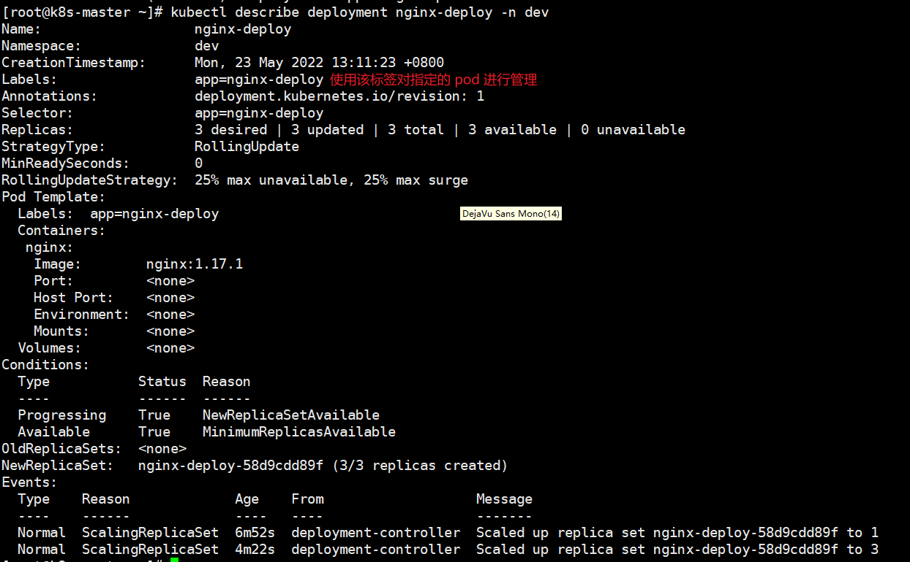

# Kubernetes 

> 学习目标：对于开发来说会使用 K8S 部署项目即可，对于运维，这篇文章并不适合

## 介绍


### 项目部署不同阶段的演变


1. 传统部署：多个应用一起部署在一个服务器上，由于没有做隔离，可能就会导致一个崩其他几个也崩
2. 虚拟化部署
   - 在一个物理机上，通过虚拟化技术开多个虚拟机，不同应用部署在不同虚拟机上
   - 但每个虚拟机之间都是一个**操作系统**，浪费了部分资源

3. 容器化：
   - 与虚拟化类似，但是**共享了操作系统**
   - 可以保证每个容器拥有自己的文件系统，CPU，内存，进程空间等
   - 运行应用程序需要的资源被容器包装，并和底层基础结构解耦
   - ?容器化应用程序可以跨云服务商，跨 Linux 系统发行版进行部署

容器化存在的问题：

- 一个容器故障停机后，如何自动让另外一个容器启动实现替补停机的容器
- 当并发访问量大的时候，怎么样做到横向扩展容器数量

为了解决上述问题 -> **容器编排系统：** 

- Swarm: Docker 官方的编排工具
- Mesos: Apache 提供的，需要和 Marathon 使用
- K8S: Google 开源

Swarm / Kubernetes  前者适合在服务器不多(例如就五六台)的情况下使用，而后者就适合服务器超过10台以上的环境中使用

- 编：将多个相同微服务容器集中管理
- 排：可以动态的扩缩容(例如使用一个命令就可以多启动一个相同的微服务模块容器)

### 简介


- Kubernets 是本质是**一组服务器集群**，可以在集群的每个节点上运行时特定的程序，来对节点中的容器进行管理
- 目的就是实现**资源管理的自动化**
- 主要功能
  1. 自动修复：一旦某一个程序崩溃，能够迅速的启动新的容器
  2. 弹性伸缩：可以根据需求，自动对集群中正在运行的容器数量进行调整
  3. 服务发现：服务可以通过自动发现的形式找到它需要的依赖
  4. 负载均衡：如果一个服务启动了多个容器，能够自动实现请求的负载均衡
  5. 版本回退：如果新发布的程序版本有问题，可以立即回退到原来的版本
  6. 存储编排：根据容器自身的需求自动创建存储卷


总结：Kubernetes 提供了一个**可弹性运行**的分布式系统框架，Kubernetes 会满足你扩展的要求 / 故障转移 / 部署模式 等。例如 Kuberntes 可以轻松管理系统的 Canary(金丝雀，也成为灰度) 部署

### 组件

> 介绍

- 一个 Kubernetes 集群主要是由 **控制节点(master)** & **工作节点(worker)** 构成，每个节点上都会安装不同组件


- **master：集群的控制平面，负责集群的决策**

  - ApiServer：资源操作的唯一入口，接受用户输入的命令，提供认证，授权，API注册和发现等机制

  - Scheduler: 负责集群资源调度，按照预定的调度策略将 **Pod** 调度到相应的 node 节点上

  - ControllerManager: 负责维护集群的状态，比如：程序部署安排，故障检测，自动扩展和滚动更新等

  - Etcd：负责存储集群中各种资源对象的信息

- worker：集群的数据平面，负责为容器提供运行环境

  - Kubelet:  负责维护容器的生命周期，即通过 Docker，来创建，更新，销毁容器
  - KubeProxy：负责提供集群内部的服务发现和负载均衡
  - Docker：容器运行时环境


> 举个栗子：K8S 部署一个 Nginx

1. 首先需要明确，一旦 Kubernetes 环境启动之后，master 和 node 都会将自身的信息存储到 **etcd数据库** 中。
2. 一个 Nginx 服务的安装请求首先会被发送到 **master 节点上的 API Server** 组件。
3. API Server 组件会调用 **Scheduler** 组件来决定到底应该把这个服务安装到那个 node 节点上。此时，它会从 etcd 中读取各个 node 节点的信息，然后按照一定的算法进行选择，并将结果告知 API Server 。
4. API Server **调用 Controller-Manager 去调用 Node 节点安装 Nginx 服务**。
5. **kubelet 接收到指令**后，会通知 Docker ，然后由 **Docker 来启动一个 Nginx 的 Pod**（Pod 是 Kubernetes 的最小操作单元，容器必须跑在 Pod 中)
6. 一个 Nginx 服务就运行了，**如果需要访问 Nginx ，就需要通过 kube-proxy 来对 Pod 产生访问的代理**，这样，外界用户就可以访问集群中的 Nginx 服务了。

> 补充概念

- Master：集群控制节点，每个集群至少有一个 Master 节点来负责集群的管理
- Node：工作负载节点，由 Master 分配容器到这些 Node 工作节点上，然后 Node 节点上的 Docker 负责容器的运行
- Pod：**K8S 的最小控制单元，容器都是运行在 Pod 中的，一个 Pod 中可以有一个或多个容器**
- Controller：控制器，通过它来**实现对 Pod 的管理**，比如启动 Pod 、停止 Pod 、伸缩 Pod 的数量等等
- Service：**Pod 对外服务的统一入口**，其下面可以**维护同一类的多个 Pod**
- Label：标签，用于**对 Pod 进行分类**，同一类 P CCCod 会拥有相同的标签
- NameSpace：命名空间，用来**隔离 Pod 的运行环境。**

## 环境搭建

### 规划

#### 集群类型

Kubernetes 的集群一般分为两种：**一主多从** 和 **多主多从**

- 一主多从：一台 Master + N 台 Node 节点，搭建简单，但是有单机故障风险，适合用于测试环境
- 多主多从：多态 Master + 多态 Node 节点，搭建麻烦，安全性高，适合用于生产环境


tips：这里主要是面向开发人员，学习如何使用 K8S 部署项目，搭建的就选择一主多从就好了(运维的同学就需要自己找找其他的文档咯)

#### 安装方式

1. minikube：快速搭建单节点的 K8S
2. **kubeadm**：快速搭建集群的 K8S
3. 二进制包：从官网上下载每个组件的二进制包，依次去安装，此方式对于理解kubernetes组件更加有效(开发同学不需要管，运维同学可以在学完之后回来搞)

#### 主机规划

| 角色   | IP地址          | 操作系统                   | 配置                    |
| ------ | --------------- | -------------------------- | ----------------------- |
| Master | 192.168.102.100 | CentOS7.8+，基础设施服务器 | 2核CPU，2G内存，50G硬盘 |
| Node1  | 192.168.102.101 | CentOS7.8+，基础设施服务器 | 2核CPU，2G内存，50G硬盘 |
| Node2  | 192.168.102.102 | CentOS7.8+，基础设施服务器 | 2核CPU，2G内存，50G硬盘 |

需要在每台服务器上都安装 Docker（18.06.3）、kubeadm（1.18.0）、kubectl（1.18.0）和kubelet（1.18.0）。

### 环境初始化

> **三台机器都要**，先跟着操作，具体细节之后就懂了

1. 关闭防火墙(生产环境禁止)

   ```shell
   systemctl stop firewalld
   systemctl disable firewalld
   ```

2. 设置主机名

   ```shel
   hostnamectl set-hostname 主机名
   ```

3. 设置主机名解析(企业中推荐使用内部的 DNS 服务器)

   ```shell
   cat >> /etc/hosts << EOF
   192.168.18.100 k8s-master
   192.168.18.101 k8s-node1
   192.168.18.102 k8s-node2
   EOF
   ```

   ip 地址记得改

4. 时间同步

   ```shel
   yum install ntpdate -y
   ntpdate time.windows.com
   ```

5. 关闭 selinux

   ```shel
   setenforce 0
   sed -i 's/enforcing/disabled/' /etc/selinux/config
   ```

6. 关闭 Swap 分区(也可以不关闭，但需要额外配置，要自己查咯)

   ```shel
   sed -ri 's/.*swap.*/#&/' /etc/fstab
   ```

7. 将桥接的IPv4流量传递到iptables的链

   ```shel
   cat > /etc/sysctl.d/k8s.conf << EOF
   net.bridge.bridge-nf-call-ip6tables = 1
   net.bridge.bridge-nf-call-iptables = 1
   net.ipv4.ip_forward = 1
   vm.swappiness = 0
   EOF
   ```

   ```she
   # 加载br_netfilter模块
   modprobe br_netfilter
   ```

   ```shel
   # 查看是否加载
   lsmod | grep br_netfilter
   ```

   ```shel
   # 生效
   sysctl --system
   ```

8. 开启 ipvs：

   在 kubernetes 中 service 有两种代理模型，一种是基于 iptables，另一种是基于 ipvs 的。ipvs的性能要高于iptables的，但是如果要使用它，需要手动载入ipvs模块。

   ```shel
   yum -y install ipset ipvsadm
   ```

   ```shel
   cat > /etc/sysconfig/modules/ipvs.modules <<EOF
   #!/bin/bash
   modprobe -- ip_vs
   modprobe -- ip_vs_rr
   modprobe -- ip_vs_wrr
   modprobe -- ip_vs_sh
   modprobe -- nf_conntrack_ipv4
   EOF
   ```

   ```shel
   chmod 755 /etc/sysconfig/modules/ipvs.modules && bash /etc/sysconfig/modules/ipvs.modules
   ```

   ```shel
   lsmod | grep -e ip_vs -e nf_conntrack_ipv4
   ```

   

9. 重启

   ```shell
   reboot
   ```

### 准备基础环境

> 三台服务器都要

#### Docker

1. 使用镜像源下载 docker

   ```shel
   wget https://mirrors.aliyun.com/docker-ce/linux/centos/docker-ce.repo -O /etc/yum.repos.d/docker-ce.repo
   ```

2. 指定版本安装 Docker

   ```shel
   yum -y install docker-ce-18.06.3.ce-3.el7
   ```

3. 启动并设计开机自启

   ```shel
   systemctl enable docker && systemctl start docker
   ```

4. 设置 Docker 镜像加速器

   ```shel
   sudo mkdir -p /etc/docker
   sudo tee /etc/docker/daemon.json <<-'EOF'
   {
     "exec-opts": ["native.cgroupdriver=systemd"],	
     "registry-mirrors": ["https://du3ia00u.mirror.aliyuncs.com"],	
     "live-restore": true,
     "log-driver":"json-file",
     "log-opts": {"max-size":"500m", "max-file":"3"},
     "storage-driver": "overlay2"
   }
   EOF
   ```

5. 重启

   ```shel
   sudo systemctl daemon-reload
   ```

   ```she
   sudo systemctl restart docker
   ```

#### Kubeadm, Kubelet, Kubectl

1. 切换为阿里云的 YUM 软件源

   ```shell
   cat > /etc/yum.repos.d/kubernetes.repo << EOF
   [kubernetes]
   name=Kubernetes
   baseurl=https://mirrors.aliyun.com/kubernetes/yum/repos/kubernetes-el7-x86_64
   enabled=1
   gpgcheck=0
   repo_gpgcheck=0
   gpgkey=https://mirrors.aliyun.com/kubernetes/yum/doc/yum-key.gpg https://mirrors.aliyun.com/kubernetes/yum/doc/rpm-package-key.gpg
   EOF
   ```

2. 指定版本号安装

   ```shel
   yum install -y kubelet-1.18.0 kubeadm-1.18.0 kubectl-1.18.0
   ```

3. 为了实现 Docker 使用的 cgroup drvier 和 kubelet 使用的 cgroup drver 一致，建议修改"/etc/sysconfig/kubelet"文件的内容

   ```shel
   vim /etc/sysconfig/kubelet
   ```

   ```she
   KUBELET_EXTRA_ARGS="--cgroup-driver=systemd"
   KUBE_PROXY_MODE="ipvs"
   ```

4. 设置开启自启(先不用启动，由于没有生成配置文件，集群初始化后自动启动)

   ```shel
   systemctl enable kubelet
   ```

   ```shel
   kubeadm init \
     --apiserver-advertise-address=192.168.102.100 \
     --image-repository registry.aliyuncs.com/google_containers \
     --kubernetes-version v1.18.0 \
     --service-cidr=10.96.0.0/12 \
     --pod-network-cidr=10.244.0.0/16
   ```

### 部署 K8S 的 Master 节点

> 只需要在 Master 节点上运行

```shel
# 由于默认拉取镜像地址 k8s.gcr.io 国内无法访问，这里需要指定阿里云镜像仓库地址
kubeadm init \
  --apiserver-advertise-address=192.168.102.100 \
  --image-repository registry.aliyuncs.com/google_containers \
  --kubernetes-version v1.18.0 \
  --service-cidr=10.96.0.0/12 \
  --pod-network-cidr=10.244.0.0/16
```

其中 `--apiserver-advertise-address` 的值修改为当前 Master 服务器的 ip


根据提示消息。在 Master 节点上添加 **kubectl** 工具的配置文件

```shel
mkdir -p $HOME/.kube
sudo cp -i /etc/kubernetes/admin.conf $HOME/.kube/config
sudo chown $(id -u):$(id -g) $HOME/.kube/config
```

### 部署 K8S 的 Node 节点

将在 Master 节点上获取到的命令拿到 Node 节点上运行

```shel
kubeadm join 192.168.102.100:6443 --token mmeohm.z3l655i4ee1ufh6w \
    --discovery-token-ca-cert-hash sha256:9a2bf7f423194b9ddaf47c8b587af9b2abc654d808f3775ceb7ffef1fe7ae876
```

如果令牌过期了

```shel
kubeadm token create --print-join-command
```

在主节点上可以看到 K8S 集群信息

```shel
kubectl get nodes
```


### 网络环境搭建

> 只用在 Master 节点上操作

- K8S 支持多种网络插件(flannel/calico/canal等)，任选一种即可，这里使用 fiannel -> 获取[flannel配置文件](https://lark-assets-prod-aliyun.oss-cn-hangzhou.aliyuncs.com/yuque/0/2021/yml/513185/1609860138490-0ef90b45-9b0e-47e2-acfa-0c041f083bf9.yml?OSSAccessKeyId=LTAI4GGhPJmQ4HWCmhDAn4F5&Expires=1653204747&Signature=hrm8NMt2ECqBcVUv7C1xpf%2FWy6k%3D&response-content-disposition=attachment%3Bfilename*%3DUTF-8%27%27kube-flannel.yml)

- 使用配置文件启动 flannel

  ```shel
  kubectl apply -f kube-flannel.yml
  ```

- 查看部署 CNI 网络进度

  ```shel
  kubectl get pods -n kube-system
  ```

  

- 查看集群状态

  ```shell
  kubectl get nodes
  ```

   

- 查看 Master 节点组件健康状态

  ```shell
  kubectl get cs
  ```

  

- 查看集群健康状态

  ```shel
  kubectl cluster-info
  ```

  

### 环境测试

> 启动一个 Nginx

1. 部署 Nginx

   ```shell
   kubectl create deployment nginx --image=nginx:1.14-alpine
   ```

2. 暴漏端口

   ```shell
   kubectl expose deployment nginx --port=80 --type=NodePort
   ```

3. 查看服务状态

   ```shell
   kubectl get pods,service
   ```

   

4. 访问任意节点的 **32282** 端口

   

### Kubectl 命令自动补全

```shel
yum install -y bash-completion
source /usr/share/bash-completion/bash_completion
source <(kubectl completion bash)
echo “source <(kubectl completion bash)” >> ~/.bashrc
```

## 资源管理

> 在线 yaml to json：https://www.json2yaml.com/

### 简介

- 在 K8S 中，所有的内容都抽象为资源，用户需要**通过操作资源来管理K8S**
  - K8S 本质是一个集群系统，用户可以在集群中部署各种服务(就是在 K8S 集群中运行容器，并将指定的程序跑在容器中)
  - K8S 的最小管理单元**是 Pod 而不是容器**，所以只能将**容器放在 Pod 中**，而 K8S 一般也不会直接管理 Pod，而是通过 **Pod 控制器** 来管理 Pod
  - K8S 提供了 **Service** 来实现对 Pod 中的服务进行访问
  - 当然，如果 Pod 中程序的数据需要持久化，K8S 还提供了相关**存储系统**


学习 K8S 的核心，就是学习如何对集群中的 **Pod/Pod控制器/Service/存储** 等各种资源进行操作

### YAML

#### 介绍

- YAML是一个类似于 XML、JSON 的标记性语言。它强调的是以“数据”为中心，并不是以标记语言为重点。因而YAML本身的定义比较简单，号称是“一种人性化的数据格式语言”。
- YAML的语法比较简单，主要有下面的几个：
  - 大小写敏感。

  - 使用缩进表示层级关系。

  - 缩进不允许使用tab，只允许空格（低版本限制）。

  - 缩进的空格数不重要，只要相同层级的元素左对齐即可。

  - `# ` 表示注释。

- YAML支持以下几种数据类型：
  - 常量：单个的、不能再分的值。

  - 对象：键值对的集合，又称为映射/哈希/字典。
  - 数组：一组按次序排列的值，又称为序列/列表


#### 语法示例

常量

```yaml
#常量，就是指的是一个简单的值，字符串、布尔值、整数、浮点数、NUll、时间、日期
# 布尔类型
c1: true
# 整型
c2: 123456
# 浮点类型
c3: 3.14
# null类型
c4: ~ # 使用~表示null
# 日期类型
c5: 2019-11-11 # 日期类型必须使用ISO 8601格式，即yyyy-MM-dd
# 时间类型
c6: 2019-11-11T15:02:31+08.00 # 时间类型使用ISO 8601格式，时间和日期之间使用T连接，最后使用+代表时区
# 字符串类型
c7: haha # 简单写法，直接写值，如果字符串中间有特殊符号，必须使用双引号或单引号包裹
c8: line1
    line2 # 字符串过多的情况可以折成多行，每一行都会转换成一个空格
```

对象

```yaml
# 对象
# 形式一（推荐）：
xudaxian:	
	name: 许大仙
	age: 16
# 形式二（了解）：
xuxian: { name: 许仙, age: 18 }
```

数组

```yaml
# 数组
# 形式一（推荐）：
address:
	- 江苏
	- 北京
# 形式二（了解）：
address: [江苏,上海]
```

### 资源管理方式

#### 分类

1. 命令式对象管理：直接使用 **命令** 操作 K8S 的资源

   ```shell
   kubectl run nginx-pod --image=nginx:1.17.1 --port=80
   ```

2. 命令式对象配置：通过 **命令+配置文件** 的方式操作 K8S 的资源

   ```shell
   kubectl create -f nginx-pod.yaml
   ```

3. 声明式对象配置：通过 **apply命令+配置文件** 的方式操作 K8S 的资源(只能创建/更新pod)

   ```shell
   kubectl apply -f nginx-pod.yaml
   ```

| 类型           | 操作 | 适用场景 | 优点           | 缺点                               |
| -------------- | ---- | -------- | -------------- | ---------------------------------- |
| 命令式对象管理 | 对象 | 测试     | 简单           | 只能操作活动对象，无法审计、跟踪   |
| 命令式对象配置 | 文件 | 开发     | 可以审计、跟踪 | 项目大的时候，配置文件多，操作麻烦 |
| 声明式对象配置 | 目录 | 开发     | 支持目录操作   | 意外情况下难以调试                 |

#### 命令式对象管理 

##### Kubectl 命令

- Kubectl 是 K8S 集群的命令行工具，通过它能对集群本身进行管理，也能在集群上进行容器化应用的安装和部署

  ```shell
  kubectl [command] [type] [name] [flags]
  ```

  - `command`: 要对资源执行的操作(craete/get/delete等)
  - `type`: 指定资源的类型(deployment/pod/service等)
  - `name`: 指定资源的名称(大小写敏感)
  - `flags`: 额外的可选参数

- 示例：查看所有的 pod

  ```shell
  kubectl get pods
  ```

- 示例：查看一个具体的 pod

  ```shell
  kubectl get pod nginx-55f8fd7cfc-czf64
  ```

- 示例：查看某个 pod，以 yaml 格式显示其信息

  ```shell
  kubectl get pod nginx-55f8fd7cfc-czf64 -o yaml
  ```

##### 操作类型

K8S 允许你对资源进行多种操作，可以通过 `--help` 查看

经常使用的有：

- 基本命令

  | 命令    | 翻译 | 命令作用     |
  | ------- | ---- | ------------ |
  | create  | 创建 | 创建一个资源 |
  | edit    | 编辑 | 编辑一个资源 |
  | get     | 获取 | 获取一个资源 |
  | patch   | 更新 | 更新一个资源 |
  | delete  | 删除 | 删除一个资源 |
  | explain | 解释 | 展示资源文档 |

- 运行和调试

  | 命令      | 翻译     | 命令作用                   |
  | --------- | -------- | -------------------------- |
  | run       | 运行     | 在集群中运行一个指定的镜像 |
  | expose    | 暴露     | 暴露资源为Service          |
  | describe  | 描述     | 显示资源内部信息           |
  | logs      | 日志     | 输出容器在Pod中的日志      |
  | attach    | 缠绕     | 进入运行中的容器           |
  | exec      | 执行     | 执行容器中的一个命令       |
  | cp        | 复制     | 在Pod内外复制文件          |
  | rollout   | 首次展示 | 管理资源的发布             |
  | scale     | 规模     | 扩（缩）容Pod的数量        |
  | autoscale | 自动调整 | 自动调整Pod的数量          |

- 高级命令

  | 命令  | 翻译 | 命令作用               |
  | ----- | ---- | ---------------------- |
  | apply | 应用 | 通过文件对资源进行配置 |
  | label | 标签 | 更新资源上的标签       |

- 其他命令

  | 命令         | 翻译     | 命令作用                     |
  | ------------ | -------- | ---------------------------- |
  | cluster-info | 集群信息 | 显示集群信息                 |
  | version      | 版本     | 显示当前Client和Server的版本 |

##### 资源类型

- K8S 中的所有内容都抽象为资源，可以通过 `api-resources` 查看

- 经常使用的资源：

  - 集群级别资源

    | 资源名称   | 缩写 | 资源作用     |
    | ---------- | ---- | ------------ |
    | nodes      | no   | 集群组成部分 |
    | namespaces | ns   | 隔离Pod      |

  - Pod 资源

    | 资源名称 | 缩写 | 资源作用 |
    | -------- | ---- | -------- |
    | Pods     | po   | 装载容器 |

  - Pod 资源控制器

    | 资源名称                 | 缩写   | 资源作用    |
    | ------------------------ | ------ | ----------- |
    | replicationcontrollers   | rc     | 控制Pod资源 |
    | replicasets              | rs     | 控制Pod资源 |
    | deployments              | deploy | 控制Pod资源 |
    | daemonsets               | ds     | 控制Pod资源 |
    | jobs                     |        | 控制Pod资源 |
    | cronjobs                 | cj     | 控制Pod资源 |
    | horizontalpodautoscalers | hpa    | 控制Pod资源 |
    | statefulsets             | sts    | 控制Pod资源 |

  - 服务发现资源

    | 资源名称 | 缩写 | 资源作用        |
    | -------- | ---- | --------------- |
    | services | svc  | 统一Pod对外接口 |
    | ingress  | ing  | 统一Pod对外接口 |

  - 存储资源

    | 资源名称   | 缩写 | 资源作用 |
    | ---------- | ---- | -------- |
    | configmaps | cm   | 配置     |
    | secrets    |      | 配置     |

##### 应用实例

> 创建&删除 namespace&pod

1. 创建一个 `namespace`

   ```shell
   kubectl create ns dev
   ```

2. 查看一个 `ns(namesapce)` 

   ```shell
   kubectl get ns dev
   ```

3. 在刚刚创建的 `ns` 中创建一个 `pod`

   ```shell
   kubectl run nginx --image=nginx:1.14-alpine -n dev
   ```

4. 查看 `ns` 中 `pod` 的信息

   ```shell
   kubectl get pod nginx -n dev
   ```

5. 删除 `ns` 中的 `pod`

   ```shell
   kubectl delete pod nginx -n dev
   ```

6. 删除 `ns`

   ```shell
   kubectl delete ns dev
   ```

#### 命令式对象配置

- 命令式对象配置：通过 **命令+配置文件** 的方式操作 K8S 的资源

> 应用示例：创建&查看&删除 ns&pod

1. 创建一个 `nginx-pod.yaml`(先用着，里面的配置后面都会学)

   ```yaml
   apiVersion: v1
   kind: Namespace
   metadata:
     name: dev
   ---
   apiVersion: v1
   kind: Pod
   metadata:
     name: nginxpod
     namespace: dev
   spec:
     containers:
       - name: nginx-containers
         image: nginx:1.14-alpine
   ```

2. 执行 `craete` 命令，创建资源(命令+配置文件)

   ```shell
   kubectl create -f nginx-pod.yaml
   ```

3. 执行 `get` 命令，查看配置文件中声明的资源

   ```shell
   kubectl get -f nginx-pod.yaml
   ```

4. 执行 `delete` 命令。删除配置文件中声明的资源

   ```shell
   kubectl delete -f nginx-pod.yaml
   ```

配置文件中就是声明命令需要的各种参数

#### 声明式对象配置

##### 概述

- 通过 `apply`命令+配置文件去操作 K8S 的资源
- 和命令式对象配置类似，只不过它只有一个 `apply` 命令
- `apply` = `create`/`patch`

##### 应用示例

````shell
kubectl apply -f nginx-pod.yaml
````


#### 使用方式推荐

- 创建/更新资源 - 声明式对象配置 - `kubectl apply -f xxx.yaml`
- 删除资源 - 命令式对象管理 - `kubectl delete -f xxx.yaml`
- 查询资源 - 命令式对象管理 - `kubectl get(describe) 资源 `

#### 扩展：在 Node 节点上运行 Kubectl

kubectl的运行需要进行配置，它的配置文件是$HOME/.kube，如果想要在Node节点上运行此命令，需要将Master节点的.kube文件夹复制到Node节点上，即在Master节点上执行下面的操作：

```shell
scp -r $HOME/.kube node节点ip:$HOME
```

## 实战入门

### NameSpace

#### 概述

- 主要作用：实现 `多套系统的资源隔离` / `多租户的资源隔离`
- 默认情况下，K8S 的集群中所有的 Pod 都是可以相互访问的，但我们可以通过将不同的 Pod(资源) 划分到不同的 NameSpace 中，形成逻辑上的"组"，以方便不同的组的资源进行隔离使用和管理
- 可以通过 K8S 的授权机制，将不同的 NS 交给不同的租户进行管理，实现多租户的资源隔离，此时还能结合 **K8S 的资源配额机制**，限定不同租户能占用的资源(CPU,内容使用量等)，来实现对租户可用资源的管理


- K8S 集群在启动之后，会默认创建几个 namesapce

  ```shell
  kubectl get ns
  ```

  

  > default： 所有未指定 NS 的资源都会被分配到该 NS 中
  >
  > kube-node-lease: 集群节点之间的心跳维护(1.13中引入)
  >
  > kube-public: 此命名空间的资源可以被所有用户访问(包括未认证)
  >
  > kube-system: 所有由 K8S系统 创建的资源都处于这个命名空间

#### 使用

- 查看所有的命名空间

  ```shell
  kubectl get namesapce
  ```

   

- 查看指定的命名空间

  ```shell
  kubectl get namespace default
  ```

   

- 指定命名空间的输出格式

  ```shell
  kubectl get namespace default -o yaml/json/wide
  ```

  

- 查看命名空间的详情

  ```shell
  kubectl describe namespace default
  ```

  ```shell
  [root@k8s-master ~]# kubectl describe namespace default
  Name:         default
  Labels:       <none>
  Annotations:  <none>
  Status:       Active  #Active: 命名空间正在使用; Terminating: 正在删除命名空间
  
  No resource quota.	  #针对命名空间做的资源限制
  
  No LimitRange resource. #针对命名空间的每个组件做的资源限制
  ```

- 创建命名空间

  ```shell
  kubectl create namesapce dev
  ```

- 删除命名空间

  ```shell
  kubectl delete ns dev
  ```

- 使用命令式对象配置

  - 新建一个 `ns-dev.yaml`

    ```yaml
    apiVersion: v1
    kind: Namespace
    metadata:
      name: dev
    ```

  - 创建命名空间

    ```shell
    kubectl craete -f ns-dev.yaml
    ```

  - 删除命名空间

    ```shell
    kubectl delete -f ns-dev.yaml
    ```

### Pod

#### 概述

- Pod 是 K8S 集群管理的**最小单元**，程序必须部署到容器中，而容器必须部署在 Pod 中

- Pod 可以认为对容器的封装，一个 Pod 中可以存在一个或多个容器

   

- K8S 在集群启动之后，集群中的各个组件也是以 Pod 方式运行的

  ```shell
  kubectl get pods -n kube-system
  ```

   

#### 使用

- 语法：创建并运行 Pod

  ```shell
  kubectl run (Pod的名称) [参数]
  # --image 指定Pod的镜像
  # --port 指定端口
  # --namespace 指定namespace
  ```

- 在名称为 `dev` 的 namesapce 下创建一个 Nginx 的 Pod

  ```shell
  kubectl run nginx --image=nginx:1.14-alpine --port=80 --namespace=dev
  ```

- 查看指定命名空间下的所有的 Pod

  ```shell
  kubectl get pod -n dev
  ```

   

- 查看 Pod 的详细信息

  ```shell
  kubectl describe pod pod的名称 [-n 命名空间名称]
  ```

  ```shell
  kubectl describe pod nginx -n dev
  ```

  

- 访问 Pod 中的容器

  ```shell
  # 获取 pod 的 ip(现在只能对内范围且不是固定的)
  kubectl get pod -n dev -o wide
  ```

  

  ```shell
  # 访问 pod 中的容器
  curl 10.244.1.9:80
  ```

  

- 删除指定的 Pod

  ```shell
  kubectl detele pod nginx -n dev
  ```

- 命令式对象配置

  - 新建一个 `pod-nginx.yaml`

    ```yaml
    apiVersion: v1
    kind: Pod
    metadata:
      name: nginx
      namespace: dev
    spec:
      containers:
      - image: nginx:1.14-alpine
        name: pod
        ports: 
        - name: nginx-port
          containerPort: 80
          protocol: TCP
    ```

  - 创建一个 Pod

    ```shell
    kubectl create -f pod-nginx.yaml
    ```

  - 删除一个 Pod

    ```shell
    kubectl delete -f pod-nginx.yaml
    ```

### Label

#### 概述

- 作用：为资源添加标识，用来对它们进行区分和选择

- 特点：

  1. 一个 Label 会以 key/value 键值的形式附加到各种对象上，如 Node/Pod/Service 等
  2. 一个资源对象可以定义任意数量的 Label，同一个 Label 也可以被添加到任意数量的资源对象上去
  3. Label 通常在资源对象定义时确定，当然也可以在对象创建后动态的添加和删除

- 可以通过Label实现资源的多纬度分组，以便灵活、方便地进行资源分配、调度、配置和部署等管理工作

  > 一些常用的Label标签示例如下：
  >
  > - 版本标签：“version”:”release”,”version”:”stable”
  >
  > - 环境标签：“environment”:”dev”,“environment”:”test”,“environment”:”pro”
  >
  > - 架构标签：“tier”:”frontend”,”tier”:”backend”

- 需要通过 Label Selector 对标签进行选择：
  - Label 用于对某个资源定义标识
  - Label Selector 用于查询和筛选拥有某些标签的资源对象
- 当前有两种Label Selector

- - 基于**等式**的 Label Selector。
    - `name=slave`：选择所有包含 Label 中的 key=“name” 并且 value=“slave” 的对象。

- - - `env!=production`：选择所有包含 Label 中的 key=“env” 并且 value!=“production” 的对象。

- - 基于**集合**的 Label Selector。

- - - `name in (master,slave)`：选择所有包含 Label 中的 key=“name” 并且 value=“master” 或 value=“slave” 的对象。

- - - `name not in (master,slave)`：选择所有包含 Label 中的 key=“name” 并且 value!=“master” 和 value!=“slave” 的对象。

- 标签的选择条件可以使用多个，此时将多个Label Selector进行组合，使用**逗号（,）**进行分隔即可。

- - name=salve,env!=production。

- - name not in (master,slave),env!=production。

#### 使用

- 为资源动态添加标签

  ```shell
  kubectl label 资源类型 具体资源 [-n 命名空间] label.key=lavbel.value
  ```

  ```shell
  kubectl label pod nginx -n dev version=1.0
  ```

- 查看资源的标签

  ```shell
  kubectl get pod nginxpod -n dev --show-labels
  ```

   

- 更新资源的标签(一个资源不允许拥有两个 key 相同的 label)

  ```shell
  kubectl label pod nginxpod -n dev version=2.0 --overwrite
  ```

  

- 筛选标签

  ```shell
  kubectl get 资源类型 -l 筛选条件 [-n 命名空间] --show-labels
  ```

  ```shell
  kubectl get pod nginxpod -n dev --show-labels
  ```

  

- 删除标签

  ```shell
  kubectl label 资源类型 具体资源 [-n 命名空间] label.key-
  ```

  ```shell
  kubectl label pod nginx -n dev version-
  ```

   

- xl使用命令式对象配置

  - 修改 `pod-nginx.yaml`

    ```yaml
    apiVersion: v1
    kind: Pod
    metadata:
      name: nginx
      namespace: dev
      # 设置标签
      labels:
        version: "3.0"
        env: "test"        
    spec:
      containers:
      - image: nginx:1.17.1
        imagePullPolicy: IfNotPresent
        name: pod
        ports: 
        - name: nginx-port
          containerPort: 80
          protocol: TCP
    ```

  - 执行创建

    ```shell
    kubectl apply -f pod-nginx.yaml
    ```

  - 查看标签

    

### Deployment

#### 概述

- 在 K8S 中，Pod 是最小的控制单元，但一般 K8S 都是通过 **Pod控制器** 完成对 Pod 的控制

- Pod 控制器用于 Pod的管理，确保Pod资源符合预期的状态，当Pod的资源出现故障时，会尝试进行重启/重建Pod

- 在 K8S 中的 Pod控制器 种类有很多，这里先介绍一种：Deloyment

   

#### 使用

- 创建指定名称的 `deployment`

  ```shell
  kubectl create deployment 名称 [-n 命名空间]
  ```

  ```shell
  # 需要通过 --image 指定 pod 中需要运行的容器
  kubectl create deployment nginx-deploy --image=nginx:1.17.1 -n dev
  ```

- 对指定的 `deployment` 创建指定数量的 pod

  ```shell
  kubectl scale deployment xxx [--replicas=正整数] [-n 命名空间]
  ```

  ```shell
  kubectl scale deployment nginx-deploy --replicas=3 -n dev
  ```

- 查看 `deploy` && `pods`

  ```shell
  kubectl get deploy,pod -n dev
  ```

   

- 查看 `deploy` 的详细信息

  ```shell
  kubectl get deployment nginx-deplpy -n dev
  ```

   

  ```shell
  kubectl describe deploy nginx-deploy -n dev
  ```

  

- 删除 `deploy`

  ```shell
  kubectl delete deployment nginx-deploy -n dev
  ```

- 命令式对象配置

  - 创建一个 `deploy-nginx.yaml`

    ```yaml
    apiVersion: apps/v1
    kind: Deployment
    metadata:
      name: nginx
      namespace: dev
    spec:
      # pod 的数量
      replicas: 3
      selector:
        # 需要匹配的 pod 的 label
        matchLabels:
          run: nginx
      template:
        metadata:
          # 为生成的 pod 添加一个标签
          labels:
            run: nginx
        spec:
          # 指定 pod 中运行的容器
          containers:
          - image: nginx:1.17.1
            name: nginx
            ports:
            - containerPort: 80
              protocol: TCP
    ```

### Service

#### 概述

- 通过 Deploy 可以一组 Pod 来提供具体高可用性的服务，虽然每个 Pod 都会分配一个单独的 IP 地址，但是存在以下问题

  - Pod 的 IP 会随着 Pod 的重建产生变化

    

  - Pod 的 IP 仅仅是就请你内部可见的虚拟 IP，**外部无法访问**

    

- Service 可以看作是**一组同类的Pod**对外的访问接口，借助 Service，应用可以方便的实现**服务发现和负载均衡**

   

#### 使用

- 创建集群内部访问的 Service

  ```shell
  kubectl expose deploy xxx --name=服务名 --type=ClusterIP --port=对外暴漏端口 --target-port=指向集群中的Pod的端口 [-n 命名空间]
  ```

  ```shell
  kubectl expose deploy nginx --name=svc-deploy-nginx --type=ClusterIp --port=80 --target-port=80 -n dev
  ```

- 查看 Service

  ```shell
  kubectl get svc -n dev
  ```

  

- 创建集群外部访问的 Service

  ```shell
  kubectl expose deployment nginx --name=svc-deploy-nginx2 --type=NodePort --port=80 --target-port=80  -n dev
  ```

  

  

- 删除 Service

  ```shell
  kubectl delete service svc-deploy-nginx -n dev
  ```

- 命令式对象配置

  - 新建一个 `svc-nginx.yaml`

    ```yaml
    apiVersion: v1
    kind: Service
    metadata:
      name: svc-nginx
      namespace: dev
    spec:
      clusterIP: 10.109.179.231
      ports:
      - port: 80
        protocol: TCP
        targetPort: 80
      selector:
        run: nginx
      type: ClusterIP
    ```

  - 创建

    ```shell
    kubectl create -f svc-nginx.yaml
    ```

  - 删除

    ```shell
    kubectl delete -f svc-nginx.yaml
    ```

    
